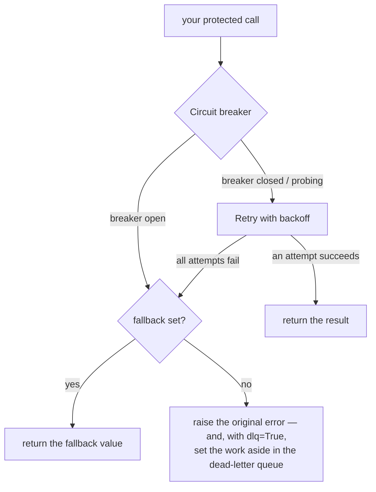

# How `@baldur.protected` composes circuit breaker, retry, and fallback

> One Python decorator layers circuit breaker, retry, fallback, and a dead-letter queue into a single pipeline — in the order that keeps them working together instead of against each other.

## What is it?

Each self-healing pattern handles one kind of failure. A **circuit breaker** stops calling a
dependency that is already down. A **retry** rides out a fleeting blip. A **fallback** returns a
safe answer when a call cannot succeed. A **dead-letter queue** sets aside work that must not be
lost. Each is useful on its own, but in practice you rarely want just one, and the order you
combine them in changes how they behave.

Wiring them by hand means nesting several wrappers around every call, in exactly the right order,
in every project. Get the order wrong and they undercut each other.

`@baldur.protected` is Baldur's **facade**: a single decorator (with a `baldur.protect()` function
form for wrapping a callable inline) that composes these patterns into one pipeline around your
function. You declare *"protect this call"* once and opt individual patterns in by keyword; Baldur
owns the layering.

```python
import baldur


@baldur.protected("charge-customer", retry=True, fallback=lambda: {"status": "unavailable"})
def charge(order_id: str) -> dict:
    return payment_gateway.charge(order_id)
```

## Why it matters

The patterns only protect you if they are layered in the right order, and the right order is not
obvious:

- **Retry must sit *inside* the circuit breaker.** If you retry on the outside, you keep hammering
  a dependency the breaker has already judged to be down, burning your retry budget and piling
  load onto a failing service. With the breaker outside retry, an open breaker stops the retries
  before they run.
- **Fallback is the *last* resort — retry gets its chance first.** A fallback must never pre-empt a
  retry: a one-off blip that the very next attempt would have survived should not be served the
  degraded answer. So retry runs its full budget first, and the fallback catches only what the
  inner chain could not save — a genuine exhaustion, a timeout, or an open breaker. It is the
  *outermost* layer precisely *because* it is the last thing to run.

`@baldur.protected` fixes this order once, correctly, so every protected call in your codebase gets
the same proven layering. You never re-derive the nesting, and you reason about one entry point
instead of several hand-rolled wrappers.

## How it works in Baldur

A protected call runs through the patterns from the outside in. The fallback wraps everything as
the last resort; inside it the breaker is checked and can short-circuit the retry; retry rides out
transient blips; and a final failure can be copied into the dead-letter queue on the way out.



Because the fallback is outermost, it is the single safety net for **every** error the inner chain
raises. And because the breaker still sits outside retry, an open breaker short-circuits *fast* —
it never burns retry attempts against a dependency already known to be down — but instead of
raising, it degrades to the fallback when you set one.

#### What routes to the fallback

| Outcome | Without a fallback | With a fallback |
|---------|--------------------|-----------------|
| An attempt succeeds | returns the value | returns the value |
| All retries fail (exhaustion) | raises the last error | serves the fallback |
| Timeout — the wall-clock bound is hit | raises `TimeoutPolicyError` | serves the fallback |
| CB-open — the breaker rejects the call | raises `CircuitBreakerOpenError` | serves the fallback |

Two outcomes get past the fallback. A blocked idempotency duplicate raises
`IdempotencyDuplicateError`, so the caller knows the work did not run a second time. And an error
your client *returns* instead of raising, such as a response object carrying a 503 or a 429, comes
back to you untouched: the breaker counts it as a failure, but retry, the fallback, and the
dead-letter queue all see a call that returned. When you want those layers to act on error
statuses, have the protected function raise on them (call `response.raise_for_status()` inside it,
for example).

### What's on by default

The bare `@baldur.protected("name")` gives you the **circuit breaker only**. Every other pattern is
something you opt into; Baldur stays a thin facade rather than turning on machinery you did not ask
for:

| Pattern | On by default? | How you control it |
|---------|----------------|--------------------|
| Circuit breaker | **Yes** | `circuit_breaker=False` to turn it off |
| Retry with backoff | No | `retry=True` |
| Fallback | No | pass `fallback=<callable>` |
| Dead-letter queue | No | `dlq=True` |
| Timeout (wall-clock bound) | No | pass `timeout=<seconds>` |
| Idempotency (dedup) | No | pass `idempotency_key=...` |

So the full pipeline from the diagram is simply what you get once you opt the pieces in:

```python
@baldur.protected("charge-customer", retry=True, fallback=give_up, dlq=True)
def charge(order_id: str) -> dict:
    ...
```

### One name ties it together

The first argument, the `name`, is the call's identity across Baldur. It is the circuit
breaker's key, the retry domain, and the label your metrics are grouped under. Keep it **stable and
one-per-downstream** (`"charge-customer"`, `"inventory-lookup"`) so the breaker state and the
dashboards line up with the dependency they describe.

### Decorator or function

`@baldur.protected` decorates a function and auto-detects whether it is sync or async. When you
would rather wrap a callable inline (or protect only one call inside a larger function), use the
`baldur.protect()` function form:

```python
result = baldur.protect(
    "charge-customer", lambda: payment_gateway.charge(order_id), retry=True
)
```

Both take the same protection keywords. If you need to inspect the outcome (was the fallback used?
how many attempts?) without catching an exception, reach one level down for
`from baldur.protect_facade import protect_with_meta, aprotect_with_meta`: they return a
`ProtectResult` instead of raising.

### Caveats and finer control

- **Retry does not make your call safe to repeat.** A retry runs your function again, side effects
  and all, so a retried charge can charge twice, and `idempotency_key=` does not change that. The
  key deduplicates whole calls (a double-submit, a redelivered message) and is checked once, before
  the pipeline starts, so it never sees the attempts retry makes inside it. Turn `retry=` on only
  for work that is safe to repeat on its own, for example a charge that sends the payment
  provider's own idempotency key. Baldur will not silently assume it is. See
  [Idempotency](../oss/idempotency.md) for the duplicate calls the key does block.
- **`dlq=True` captures the final failure on either tier, with or without `retry=`.** A call that
  raised, that exceeded its `timeout=`, or that an open breaker rejected is recorded. On the
  decorator the entry carries a snapshot of the function's plain-value arguments, which is what a
  replay re-runs; the `baldur.protect()` form has no arguments to read, so its entry holds only
  what you pass as `context=`. With `retry=` the capture happens once retry gives up, so pair the
  two only when the client does not already retry; an SDK's built-in retries stay where they are.
  The `@dlq_protect` preset pins both on, which is the setting you want when losing the work is not
  an option. The backlog is browsable in the web console, and entries can be retried once the
  dependency recovers, with no PRO required. A replay runs the work again, so the safe-to-repeat
  rule above applies to it as well. PRO adds the operate-at-scale surface: one-click batch replay,
  adaptive pacing, and archive/purge retention.
  Limits: a second capture layer that fires for the same failure records its own entry as well —
  the Django middleware on the resulting 5xx, the Celery signal hook on the attempt Celery gives up
  on, or an enclosing call with `dlq=True` around another `dlq=True` call, where each site parks
  its own entry for the same work. The Celery hook and an enclosing `dlq=True` call skip only a
  breaker rejection an inner site already parked, so use one layer per failure. Inside a task that Celery retries itself, each execution's
  failure is parked, so one task can leave several entries for the same work. A sync call the
  bound cut off may still be running when it is parked, and when it is replayed; on the sync path
  `idempotency_key=` does not refuse that replay, because the key is released at the timeout (see
  [Idempotency](../oss/idempotency.md#how-it-works-in-baldur)). See
  [what reaches the queue and how a replay re-runs it](dlq-replay.md).
- **The fallback runs *outside* the timeout clock, so keep it cheap and local.** The timeout bounds
  the inner call; when it fires, the fallback is what runs *next*, so it cannot be bounded by the
  same clock. Serve something fast — a cached value, a static default — not a second network call.
- **A fallback can branch on the failure.** Give it one parameter and it receives the exception that
  triggered it, so it can serve a stale read on a timeout but re-raise on an auth error:

  ```python
  def fb(error: Exception):
      if isinstance(error, baldur.TimeoutPolicyError):
          return cached_snapshot()
      raise error  # decline the fallback — let the original error propagate
  ```

  Match the `timeout=` bound on `baldur.TimeoutPolicyError`: it is not a subclass of Python's
  built-in `TimeoutError`, so a check for the built-in never sees it. A zero-argument `fallback()`
  still works unchanged. (For outcome-level conditions beyond the error type, the lower-level
  builder in `baldur.resilience.policies` exposes a `predicate=` on its `FallbackPolicy`; the
  facade covers the common case through the error-aware callable above.)
- **On `async def` functions**, the whole pipeline composes with the same guarantees as sync —
  circuit breaker, retry, fallback, dead-letter, idempotency, and timeout — in the same order (the
  fallback outermost, then the breaker, then timeout, then retry). A given `name` shares one breaker
  across both call styles, so failures counted on a sync call and on an async call open the same
  circuit. `@baldur.protected` detects whether the function is sync or async and dispatches
  automatically; reach for `aprotect()` / `@baldur.aprotected` when you want the async path explicit
  at the call site. The one thing the async path will not do silently: if you hand `retry=` a
  hand-rolled sync policy object (anything other than a tenacity bridge, which Baldur auto-converts
  to its async twin), it raises a clear error rather than run it unawaited — the framework's rule is
  to say so loudly instead of failing silent.

## Configuration

You configure the facade **per call**, through the keyword arguments shown above. A per-call keyword
takes precedence over the framework-wide default, and keeping the switches at the call site means
the protection a function has is visible right where it is defined.

The patterns the facade composes each carry their own settings — the circuit breaker's thresholds,
retry's backoff, idempotency's storage — documented in their own guides and listed in the
[environment variable reference](../../reference/env-vars.md).

## See also

- [Getting Started](../../getting-started/index.md) — get a protected endpoint running with no infrastructure to set up
- [What is self-healing?](self-healing.md) — the bigger picture this fits into
- [Circuit Breaker](../oss/circuit-breaker.md) — the one layer on by default, and a good first read
- [Retry](../oss/retry.md) — the retry-with-backoff stage
- [Idempotency](../oss/idempotency.md) — stop a duplicate call from running its side effect twice
- [DLQ + Replay](dlq-replay.md) — where `dlq=True` sets a final failure aside, and how it replays
- [Facade API reference](../../reference/baldur/facade.md) — every option and signature
