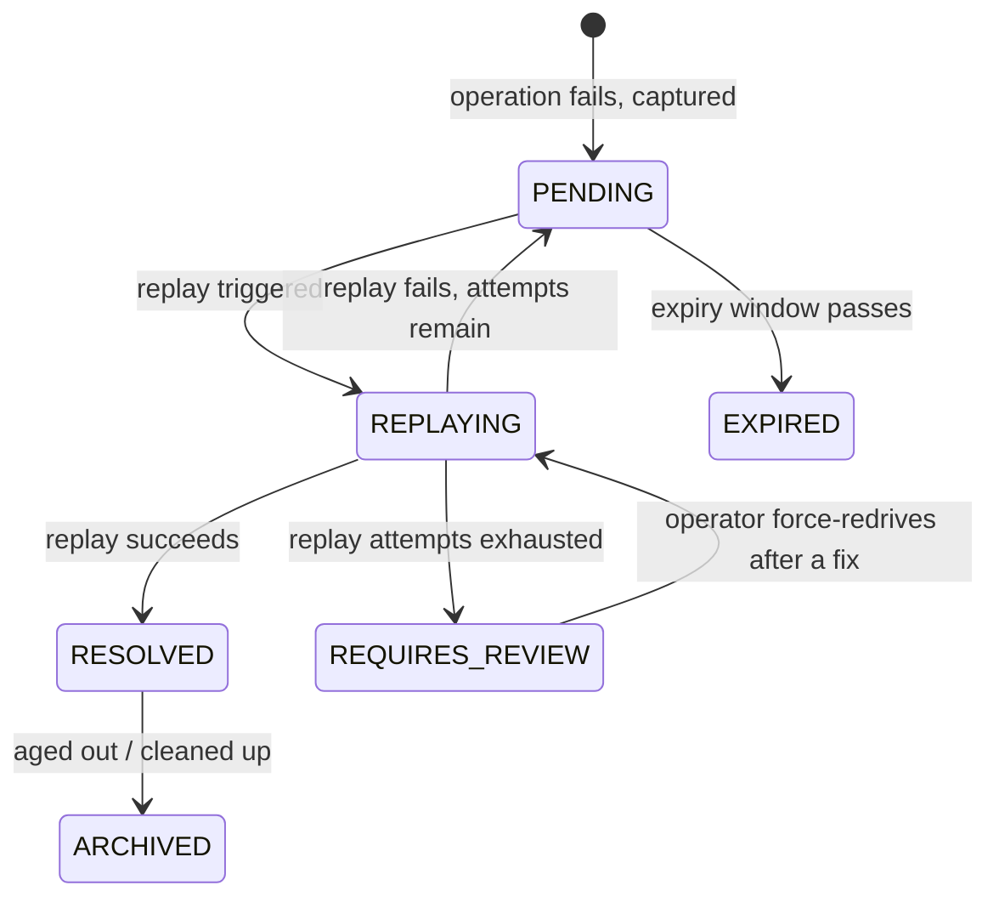

# DLQ + Replay

> Catches every operation that fails because a dependency was down, with the context needed to run it again, so nothing is silently lost — and once the dependency recovers, the backlog replays.

## What is it?

When an operation in your app fails because something it relies on is unavailable (a database
timeout, a payment provider returning 503, a webhook endpoint that won't answer), that unit of work
usually just disappears. The request errors out, maybe a line lands in a log file, and the actual
work (the payment, the job, the message) is lost.

A **dead letter queue** (DLQ) is the standard name for a holding area where failed work is parked
instead of thrown away. Think of the "undeliverable mail" bin at a post office: a letter that
couldn't be delivered isn't shredded; it's set aside so it can be looked at and sent again later.
**Replay** is the act of taking that parked work and running it again. In Baldur these two halves
are a single feature: **DLQ + Replay**.

## Why it matters

Without a dead letter queue, an outage doesn't only cause errors *while* it is happening — it causes
**permanent data loss**. Every payment, job, or message that failed during the outage is gone, and
recovering it means digging through logs and reconstructing the work by hand, if it can be recovered
at all.

DLQ + Replay turns that permanent loss into a recoverable backlog:

- **No silent loss.** Every failed operation is captured together with the forensic context (what
  was being done, the request data, the failure reason, the per-attempt retry history) needed to
  understand and re-run it.
- **Recover on your schedule.** When the dependency comes back, replay the backlog instead of
  rebuilding lost work from log files.
- **Catch-up is automatic.** Baldur replays queued work the moment a tripped circuit breaker for
  that dependency recovers, so the backlog drains itself without an operator watching the clock.
- **Even repeat failures aren't a dead end.** A failure that keeps failing isn't replayed forever or
  silently dropped. Once it exhausts its replay budget it is parked for review instead of looping.
  After you fix the underlying cause you can deliberately re-drive it, so even a "poison-pill" failure
  is recoverable rather than lost.
- **The queue protects itself.** Size limits (overall and per-domain) plus an overflow strategy
  keep a failure storm from filling your storage and dragging the rest of the system down with it.

## How it works in Baldur

When an operation Baldur is protecting fails, it is captured as an **entry** in the dead letter
queue, recording the context needed to replay it later. Capturing a failure is designed to stay off
the request's critical path, so recording a failure doesn't add latency to the call that already
failed. If the queue's storage backend is itself unreachable at capture time, the entry falls back
to a local on-disk record (and, as a last resort, to the process's error stream) instead of being
silently lost. Each entry then moves through a lifecycle you can watch in the Web Console DLQ panel
or query over the REST API:



You have three ways to replay the queued work:

- **Targeted replay.** Pick a single entry and retry it from the Web Console or the REST API, useful
  when you want to confirm a fix before draining everything. The same single-entry surface also lets
  you resolve an entry by hand, or force-redrive one that is parked for review.
- **Batch replay by failure type.** Replay everything of a given failure type at once from code,
  using the replay API (`batch_replay_by_failure_type`): for example, every database-timeout failure
  after the database recovers. A batch started from the replay service can also run in an
  **adaptive** mode (`replay_batch(..., use_adaptive=True)`, off by default): instead of a
  fixed batch size, Baldur watches the success rate of each batch and adjusts the next one, shrinking
  the batch when too many replays are still failing and growing it again after several clean batches,
  staying between a floor and a ceiling you set. With PRO active, batch replay is also a one-click
  Web Console action and a REST endpoint, and drains through a throttled replay queue that applies
  rate limits and backpressure.
- **Automatic on recovery.** When a dependency's circuit breaker closes again after an outage, Baldur
  sweeps that dependency's queued failures and replays them, so recovery and catch-up happen
  together.

When a failure can't be replayed successfully (the dependency is still down, or the work itself is
broken), Baldur retries it up to a configurable budget. An entry that exhausts that budget is neither
retried forever nor discarded: it converges to a terminal **needs-review** state, where it stays
queryable so an operator can investigate. Once the root cause is fixed, an operator can deliberately
**force-redrive** the parked entry, an audited, admin-level action that grants it a fresh replay
budget and sends it back through replay. If the underlying problem still isn't fixed, the entry simply
returns to the needs-review state, so a force-redrive can never turn a poison-pill into an endless loop.

| What you observe | When it happens |
|------------------|-----------------|
| A failed operation appears in the queue with its failure reason and request data | a protected operation fails |
| You retry, resolve, or force-redrive a single entry | an operator action from the Web Console DLQ panel or the REST API |
| A whole failure type replays in one call | `batch_replay_by_failure_type` from code, or the console/REST batch replay (**PRO**) |
| Queued work drains on its own | a dependency's circuit breaker recovers and an automatic replay sweep runs |
| A batch replay grows or shrinks batch by batch | adaptive batch sizing was opted in (`use_adaptive=True`) and the recent replay success rate changes |
| An entry stops being retried and is parked in a needs-review state | its replay attempts are exhausted |
| Old entries age out — expiring, then archiving | **PRO** — scheduled archive/purge retention is active |
| New failures displace the oldest entries, or are rejected | the queue hits its size limit and the overflow strategy applies |

When the queue reaches its size limit, the **overflow strategy** decides what gives:

- `drop_oldest` evicts the oldest entries to make room for new failures (the default; the eviction
  happens synchronously, at capture time).
- `reject` refuses new entries so nothing already queued is displaced.
- `compress_oldest` (**PRO**) summarizes the oldest entries into a compact record before evicting
  them, so an aggregate trace of what failed survives even after the raw entries are gone. These
  summaries are grouped by failure type and stay queryable over the REST API, and they age through
  their own lifecycle (`ACTIVE`, then `STALE`, then `ARCHIVED`) so old aggregates clean themselves up
  over time instead of accumulating forever. Without PRO, configuring `compress_oldest` logs a
  one-time warning and falls back to `drop_oldest`.

By default the queue lives in your configured storage backend, and capture flows through a
non-blocking in-memory outbox that keeps it off the request hot path. The outbox watches its own
pressure in every tier: it records how long entries wait before being written (the leading sign of
a buffer under stress) and raises a warning, with a matching metric and event, when its drop rate
crosses a threshold, so you learn the outbox is shedding instead of discovering it after the fact.
With PRO active, two things change for deployments that cannot tolerate losing even
queued-but-not-yet-written work across a process crash: the outbox gains a disk-durable mode, and
the liveness of its background drain worker is watched separately, so a stalled drain is detected
rather than silently backing up.

### Trace continuity: from the original failure to its replay

When you run distributed tracing (OpenTelemetry into Jaeger, Datadog, Tempo, and the like),
the DLQ sits across a deliberate gap in time: an operation fails *now*, is parked, and is replayed
*later* — sometimes seconds later, sometimes weeks. Baldur links the two ends so that "original
failure → DLQ capture → replay" reads as one connected story instead of two unrelated traces.

**How the link is made.** At capture time Baldur records the failing request's trace on the entry
(its `origin_trace_id`, plus the full W3C trace/span ids when an OpenTelemetry span is active). When
that entry is later replayed — by any path: a targeted retry, a batch, an automatic on-recovery
sweep, or a force-redrive — Baldur re-attaches that origin:

- when OpenTelemetry is active and the entry carries its origin span ids, every replay path wraps
  the replay in a `dlq.replay` span carrying a **span link** back to the original failure's span,
  plus a searchable `baldur.dlq.origin_trace_id` attribute,
- the log lines reporting the replay carry an `origin_trace_id` field, and
- the replay paths that write an audit record (a batch replay, the automatic sweep, a
  force-redrive) record the origin trace there too; a targeted single-entry retry keeps its trail
  in the log line and the span instead of a per-entry audit record.

The link is **additive**: the replay keeps its own trace (the operator request or circuit-breaker
recovery that triggered it) as its primary trace, and the origin is attached alongside. The two
answer different questions — *"under what request did this replay run?"* versus *"what failure is this
replay recovering?"* — so both are kept rather than one overwriting the other.

**Finding the connection in your tools.**

- *In an OpenTelemetry backend (Jaeger/Datadog/Tempo):* open the `dlq.replay` span and follow its
  span link to jump to the original failure's trace. You can also search spans by the
  `baldur.dlq.origin_trace_id` attribute.
- *Without OpenTelemetry (plain structured logs):* the origin id is stored on the entry itself and
  stamped on the replay's log lines, so an `origin_trace_id=<id>` query across your logs returns
  the replay activity for that failure; the entry's detail view (console or REST) is the
  capture-side record. Note that a bare `trace_id=<origin>` search will **not** match the replay lines — because
  the replay keeps its own trigger trace, the origin rides the separate `origin_trace_id` field.
  Search that field, not `trace_id`.

**Expected limits.** Both of the following are inherent to store-and-forward tracing, not defects:

- *Mixed-mode capture.* If a failure was captured while OpenTelemetry was **not** producing a span,
  only the display `origin_trace_id` is stored — there is no full span id to build an OTEL span link
  from at replay time. Nothing is lost: an operation with no capture-time span had no origin span to
  link to in the first place. Replaying such an entry creates no `dlq.replay` span either; the
  origin id still travels in the replay's log line and audit record.
- *APM retention mismatch.* Because the DLQ can outlive any trace-retention window by design, an entry
  replayed weeks later may link to an origin trace your APM store has already aged out (Jaeger/Datadog
  typically keep ~14–30 days). The span link then resolves to an expired trace — an orphan span or a
  "Trace Not Found" in the UI. The `origin_trace_id` remains recorded on the entry and in the
  logs/audit regardless.

Entries captured **before** this linkage existed, and captures that had no active trace, simply
replay without an origin link — the absence is the normal state, not an error.

## Why capture is opt-in per call

`@baldur.protected` does not send a call's final failures to the dead letter queue unless the call
site asks for it with `dlq=True` (the `@dlq_protect` preset pins it on, together with retry and the
circuit breaker). The queue itself is ready with no wiring — storage resolves to your configured
backend or the in-memory fallback — so the flag is not about infrastructure. It is about what gets
stored.

To be replayable, an entry has to carry the work itself: capture records a snapshot of the failing
call's arguments — the request data a replay re-runs. That snapshot is your domain data: order ids,
amounts, user ids. Sensitive-looking fields are masked by rule-based patterns, but no generic rule
set can know which of *your* values are sensitive, so domain values survive masking by design.
Persisting that data is therefore a decision Baldur leaves to you, made explicitly per call site,
rather than something an upgrade switches on silently.

There is deliberately no "capture without the payload" middle ground. Replay re-runs the captured
request data, so an entry that lost its payload (for example, cut off by the write-side size cap)
is refused replay rather than re-run half-blind — a payload-less capture would demote the queue
from a work queue to a log. For call sites that should record the failure but must not snapshot
arguments (say, a password-verification path), keep `dlq=True` and pass `context_from=False`: the
failure is still captured, without the auto-extracted argument payload — accepting that such
entries need an operator (or a custom replay handler with its own data source) rather than
hands-off replay.

`BALDUR_DLQ_ENABLED` (below) is a different switch: it governs whether the capture service accepts
entries at all. It defaults to on so that every `dlq=True` call site just works — it does not put
any call into the queue by itself.

## Configuration

The knobs an operator sets most often. The full list lives in the API reference.

| Env Var | Default | What it controls |
|---------|---------|------------------|
| `BALDUR_DLQ_ENABLED` | `true` | Whether failed operations are captured into the dead letter queue at all |
| `BALDUR_DLQ_MAX_SIZE` | `100000` | Maximum total entries the queue holds before the overflow strategy applies |
| `BALDUR_DLQ_OUTBOX_ENABLED` | `true` | Capture failures through a non-blocking outbox so recording a failure stays off the request hot path |
| `BALDUR_REPLAY_AUTOMATION_ON_RECOVERY_ENABLED` | `true` | Automatic replay of queued failures when a circuit breaker recovers |
| `BALDUR_REDIS_URL` | `redis://localhost:6379/0` | The Redis backend the queue is stored in (shared by Baldur's Redis consumers) |

If you don't use automatic replay, turn it off rather than leaving it half-configured: with
`BALDUR_REPLAY_AUTOMATION_ON_RECOVERY_ENABLED=false`, recovery events skip the replay dispatch
entirely, and the per-recovery WARNING about a missing replay worker disappears with it (the arming
surface reports `disabled`).

### Closing the loop — making automatic replay actually drain

Automatic replay on circuit-breaker recovery is on by default, but it only *drains*
your backlog once four prerequisites are in place. Until they are, a recovery leaves the entries
parked — captured and safe, but not replayed. The Web Console DLQ panel and the
`GET /dlq/cleanup/stats/` payload report an **armed / disarmed** state and name the first missing
prerequisite, so you can tell at a glance whether the loop is live:

1. **Register a replay handler per domain.** Baldur captures the failed work, but only *your* code
   knows how to re-run it. Register a handler for each domain you want replayed:

    ```python
    from baldur.services.replay_service import register_replay_handler, ReplayHandler, ReplayResult

    class PaymentReplayHandler(ReplayHandler):
        @property
        def domain(self) -> str:
            return "payment"

        def can_replay(self, failed_op) -> tuple[bool, str]:
            return True, ""

        def replay(self, failed_op) -> ReplayResult:
            # re-run the captured work; return succeeded/failed
            return ReplayResult.succeeded(failed_op.id, "reprocessed")

    register_replay_handler(PaymentReplayHandler())
    ```

    Without a registered handler, every replay for that domain fails per-entry and the entry ends
    up parked for review once its replay budget is spent. The arming surface reports
    `handler_missing`.

2. **Map recovered services to their failure types.** When a circuit breaker closes, Baldur needs to
   know *which* captured entries the recovered dependency is responsible for. Configure that mapping
   with `BALDUR_REPLAY_AUTOMATION_SERVICE_FAILURE_TYPE_MAP` (see
   [Environment Variables](../../reference/env-vars.md)). An empty mapping is surfaced as a
   blocked-with-signal event on recovery, not a silent no-op; the arming surface reports
   `map_unconfigured`.

3. **Run a Celery worker on the `dlq_processing` queue.** On-recovery replay execution is dispatched to Celery.
   A worker must be consuming the `dlq_processing` queue for the dispatched replay to run:

    ```bash
    celery -A your_app worker -Q dlq_processing
    ```

    If Baldur is running without Celery available, the recovery logs a WARNING naming this
    remediation, and the arming surface reports `celery_missing` (Celery itself is absent) or
    `worker_missing` (Celery is present but no worker is consuming the queue). You can still drain
    the backlog manually with the single-entry **Retry** action.

4. **Keep on-recovery replay enabled.** `BALDUR_REPLAY_AUTOMATION_ON_RECOVERY_ENABLED` is `true` by default; the
   arming surface reports `disabled` when it is turned off.

**Recommended alert:** because a dispatched replay only runs when a worker is actually consuming
`dlq_processing`, alert on the depth of that queue (broker-side) in addition to the
`baldur_dlq_auto_replay_armed` gauge. A queue that grows without draining means the dispatch is
succeeding but no worker is consuming it.

## What belongs in automatic replay — and what doesn't

Replay re-runs the original operation, so it is a recovery tool for work that is **safe to run
again** and a hazard for work that isn't. The same caution governs [retries](../oss/retry.md). Two
properties of the captured work decide whether it belongs in the automatic on-recovery path.

**Is it safe to repeat?** A replayed operation executes a second time, so replaying one that can't
safely repeat may double its effect: a second charge, a duplicate shipment, a repeated email. Map a
failure type into automatic replay only when re-running it is a no-op once the work has already
completed. The handler's `can_replay(failed_op)` check refuses unsafe entries on the operator-driven
paths — the single-entry retry and force-redrive actions, and the console/REST batch replay
(**PRO**) — but neither the automatic on-recovery sweep nor batch replay from code consults it, so
on those paths the guard is `replay()` itself: detect work that has already completed and report
success without re-running it. Making an operation safe to repeat is a separate guarantee Baldur provides
(see [Idempotency](../oss/idempotency.md)), and money-equivalent operations should anchor their dedup
on a database uniqueness constraint rather than a cache. The
[what-belongs-in-Baldur-vs-your-database boundaries](https://github.com/baldurhq/baldur/blob/main/docs/runbooks/data-consistency-boundaries.md)
runbook covers where that line sits.

**Is anyone still waiting on it?** Automatic replay fires minutes or hours after the failure, long
after the original caller has gone. That fits backend work whose goal is simply to finish: settling a
payment the gateway already accepted, writing an order your database rejected, delivering a webhook,
reconciling state. It does not fit a synchronous, user-facing action such as a checkout
authorization. A customer who abandoned a failed payment should not be charged when the dependency
recovers an hour later. Protect that path with the circuit breaker, which fails fast so the user gets
an immediate retry instead of a hang, and with idempotency, so the user's own retry can't
double-act. Replay is not the tool for that path.

This is why the failure types you map to on-recovery replay are the transient, your-side ones: a
database timeout, a dropped connection, a dependency returning 503, where the work is sound and only
the infrastructure faltered. A business rejection such as a declined card is not one of them. It will
fail again on replay, so it does not belong in the mapping.

## Tier behavior

DLQ + Replay runs in every tier. Capture and recovery are the OSS core; PRO layers the
operate-at-scale surface on top.

- **In OSS**: the full failure-preservation loop — capture with forensic context, the non-blocking
  outbox with its own pressure signals (write-wait latency and the drop-rate warning), the local
  on-disk fallback when the store is unreachable, size limits with the
  `drop_oldest` / `reject` overflow strategies, the Web Console DLQ panel and the read REST
  endpoints (list, detail, facet counts, cleanup stats), the single-entry actions (retry, resolve,
  force-redrive), batch replay by failure type from code with opt-in adaptive
  (success-rate-driven) batch sizing, and automatic replay on circuit-breaker
  recovery with the armed/disarmed surface.
- **With PRO active**: batch replay becomes a one-click console action and REST endpoint, replay
  gains a throttled replay queue, the
  `compress_oldest` overflow strategy and its compressed summaries become available, evictions move
  off the capture path to a background water-level worker, the outbox gains its disk-durable mode
  and separate drain-worker liveness monitoring, scheduled archive/purge retention ages old
  entries out, and test entries can be created for replay drills.

## See also

- [Circuit Breaker](../oss/circuit-breaker.md) — the recovery signal that triggers automatic replay
- [Idempotency](../oss/idempotency.md) — the dedup guard that makes an operation safe to replay
- [Which operations are safe to auto-replay (vs. need an ACID store)](https://github.com/baldurhq/baldur/blob/main/docs/runbooks/data-consistency-boundaries.md) — the data-consistency boundaries runbook
- [Capturing failures that happen before your view runs (Django)](https://github.com/baldurhq/baldur/blob/main/docs/runbooks/dlq-two-layer-activation.md) — `dlq=True` captures what the wrapped function raises; failures that occur earlier in the request (database connection setup, middleware-stage errors) reach the queue only once the Django middleware layer is configured as well
- [Web Console](web-console.md) — the admin console where the DLQ panel lives
- [Environment Variables](../../reference/env-vars.md) — the complete operator-tunable list
- [Replay service API](../../reference/services/access.md) — the OSS `ReplayService`: single-entry, batch-by-failure-type, and on-recovery replay
- [Dead-letter queue API (PRO)](../../reference/pro/dlq.md) — batch replay and management operations
- [Replay queue API (PRO)](../../reference/pro/replay.md) — throttled replay options
- [Getting Started](../../getting-started/index.md) — set it up
