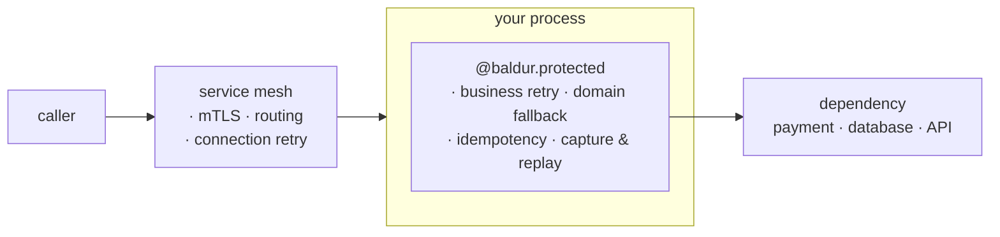

# Baldur and your service mesh

> If you run a service mesh, this is where Baldur fits: the mesh protects the network between your services, and Baldur protects the logic inside each one — they are built to run together.

## What is it?

A **service mesh** (Istio, Linkerd, Consul, or a cloud equivalent) is infrastructure that manages
the *network* between your services. It runs a small proxy (a "sidecar") next to each service and
takes over the traffic: encrypting connections (mTLS), routing requests, enforcing timeouts, and
retrying calls that drop at the connection level. You get all of that without touching application
code.

Baldur is not a mesh, and not a competitor to one. It is a **library that runs inside your
application process**, wrapping individual calls with circuit breaker, retry, fallback, and
capture of failed work for later replay. The mesh works on the wire, *between* processes; Baldur
works in the code, *inside* one.

So the relationship is simple: **your mesh secures the network; Baldur makes the code survive
failure.** They overlap a little and complement a lot.

## Why it matters

If you already run a mesh, it is fair to ask: *the mesh already does retries, timeouts, and circuit
breaking — why add anything in the app?*

The answer is structural. A sidecar sits **beside** your process, on the network path. It sees the
bytes flowing past (TCP connections, HTTP methods, status codes) but it cannot see *into* the call
it is proxying. It does not know which exception your function raised, whether two requests are the
same logical operation, what a sensible fallback value would be, or that work it failed to deliver
should be kept for later. Those facts exist only **inside the process**, in your code's own types
and state.

That boundary is exactly where the failures that hurt the most live:

- A retry at the network layer re-sends a request blind, so a retried charge can **bill the customer
  twice**, because the wire has no idea the two attempts are the same payment.
- When a call fails for good, the sidecar can return a 503 or route elsewhere, but it cannot hand the
  caller a **useful domain answer**: a cached price, an "unavailable, try again" status.
- Once a request is gone, it is gone: the mesh keeps **no memory** of work it failed to deliver, so
  there is nothing to replay when the dependency comes back.

A mesh closes the network-shaped gaps. Baldur closes the code-shaped ones.

## How it works in Baldur

Both layers wrap the same request at different points. The mesh wraps the **network hop** between
processes; Baldur wraps the **call** inside the process.



The mesh owns everything the network needs — encryption, service-to-service auth, load balancing,
and re-establishing a dropped connection. Baldur owns four things a sidecar structurally cannot
reach, because they exist only inside your process:

| The sidecar can't reach this (it sits on the network) | Baldur supplies it (it runs in your code) |
|--------------------------------------------------------|-------------------------------------------|
| **Visibility** — a proxy sees an HTTP status, not your call. It can't tell a retryable error from a fatal one, or know which order this request is for. | Baldur sees the exception your code actually raised, so a retry can be limited to the types worth repeating and a fallback can branch on the failure. The decorator also copies the call's business identifiers into a `PolicyContext` from its arguments automatically (`order_id`, `user_id`, and every other plain-valued argument), which the idempotency key reads and a dead-letter entry records. |
| **Semantics** — the wire retries a request blind; it has no idea two attempts are the *same* operation, so a retried charge double-charges. | Idempotency keyed to *your* business identifier, so a repeat of an operation that is still running, or that succeeded within the dedup window, is refused instead of run again. |
| **Action** — on failure a proxy can only error out or reroute; it can't compute a domain answer. | A fallback returns a safe, domain-specific value, so the caller still gets a useful response. |
| **State** — a proxy is stateless per request: once a call fails for good, the work is gone. | At a `dlq=True` call site, a call that fails for good (it still raised after any retries, or an open breaker refused it) is captured into a dead-letter queue with the context needed to run it again, so it can be replayed once the dependency recovers. One a `fallback=` answered is not captured, nor is one another [stated rule](dlq-replay.md#how-it-works-in-baldur) excludes. |

Two of them, idempotency and the fallback, come from the same decorator you would use anyway, and
both are opt-in:

```python
import baldur


@baldur.protected(
    "charge-customer",
    retry=True,
    idempotency_key="order_id",
    fallback=lambda: {"status": "unavailable"},
)
def charge(order_id: str) -> dict:
    return payment_gateway.charge(order_id)
```

`idempotency_key="order_id"` makes the dedup key *your* order id, the thing the network can't see.
A second request for the same order while the first is still running, or within the dedup window
(30 minutes by default) after it succeeded, is refused with `IdempotencyDuplicateError` instead of
charging again. A mesh retry of a request that already went through is exactly that second
request, and the mesh may route it to another replica: it is refused there only when the replicas
share one key ledger, such as Redis through `BALDUR_REDIS_URL` (which `baldur.init()` requires in
production). The key deduplicates callers, not attempts: `retry=True`
re-runs the charge inside the one call the key let through, so if an attempt can charge and still
fail, the gateway call itself must be safe to repeat (pass the order id on as the gateway's own
idempotency key).

`fallback=` hands the caller a domain answer when the charge still raises after its retries, or
the breaker refuses it: `unavailable`, so the caller retries, rather than a promise to charge them
later. A failure the gateway *returns* as a value instead of raising reaches the caller unchanged;
the retry does not repeat it and the fallback does not replace it.

Capturing and replaying failed work is the [dead-letter queue](dlq-replay.md), reached from the
same decorator with `dlq=True`. It suits work that should still finish after the outage, not a
user-facing charge like this one: a customer who was told `unavailable` should not be charged by a
replay an hour later. A call the fallback answered is not captured in any case. Replaying anything
takes a replay handler you register, since only your code knows how to run the work again, and
replay on recovery also takes a Celery worker and, for most failures, a map of which ones to
replay: [what automatic replay needs before it drains on its own](dlq-replay.md).

### Running both, without fighting

The one place a mesh and Baldur can step on each other is **retries**: if the mesh retries 3× and
Baldur retries 3× on the *same* failure, one logical call can hit the dependency 9 times. The fix is
a single principle, **one signal, one owner**:

- Let the **mesh** retry **network-level** failures (a dropped connection, a TCP reset) that never
  reach your code.
- Let **Baldur** retry **application-level** failures (a specific exception, a business error) that
  the mesh can only see as an opaque 5xx.

Set up this way the two layers add rather than multiply: the mesh keeps the connection healthy,
Baldur keeps the call meaningful, and neither duplicates the other's work. The same split applies to
circuit breaking — trip on connection health in the mesh, trip on business-error rate in Baldur.

## See also

- [What is self-healing?](self-healing.md) — the problem Baldur exists to solve
- [Composing with @baldur.protected](composition.md) — the one decorator these patterns live behind
- [Idempotency](../oss/idempotency.md) — make a retried operation safe to repeat, by business key
- [DLQ + Replay](dlq-replay.md) — capture-and-replay for failed work, the mesh's missing memory
- [Getting Started](../../getting-started/index.md) — protect an endpoint in five minutes
