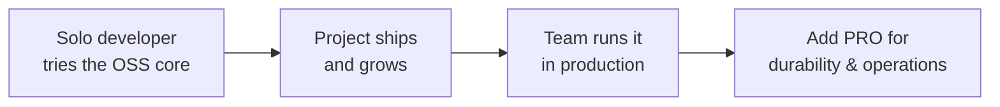

# OSS vs PRO: which tier do you need?

> Baldur comes in two tiers — a free open-source core and a paid PRO package for production teams. You start free and upgrade only when you actually need to, without rewriting anything.

## What is it?

Baldur ships in **two tiers**:

- **OSS.** The free, open-source core. Run `pip install baldur-framework`, `import baldur`, and
  you have the resilience building blocks: circuit breaker, retry, idempotency, health checks,
  graceful shutdown, and more. No license, no sign-up, no cost.
- **PRO.** A paid package you add on top of the OSS core once you run Baldur in production with a
  team. It adds the heavier operational machinery: an audit trail, coordinated emergency controls,
  alert routing, and at-scale operation of the failure backlog.

That is the whole model: two tiers, OSS and PRO. Both are the *same* library with the *same*
`@baldur.protected` API; PRO unlocks additional capability behind that API rather than replacing it.

## Why it matters

A lot of reliability tooling forces a decision before you have any context: pick a plan, commit,
integrate. Baldur inverts that. The OSS tier is meant to be **good enough to get hooked** — you
adopt it as an individual developer because it solves a real problem today, for free. You only reach
for PRO once the project is load-bearing enough that a team operates it in production and the
cost of *being blind to a failure* — or of working a growing failure backlog by hand — has become
real.

That keeps the choice honest:

- **You don't pay to evaluate.** Build on OSS, ship it, and see if it earns its place — at no cost.
- **You reach for PRO when production starts to hurt.** The trigger is a problem you can already
  feel — a dead-letter backlog too big to work one entry at a time, an incident you only hear about
  after it's over — not a plan you committed to up front. The need pulls you in; nothing pushes you.
- **Upgrading is not a migration.** PRO is the same framework. You add a package and a license key;
  your existing `@baldur.protected` code keeps working and the PRO capabilities become available
  behind it.

## How it works in Baldur

Adoption runs bottom-up: a developer picks up the free core, the project grows, and PRO joins when
the team is running it in production.



### What the OSS core gives you

The free tier is the **resilience patterns themselves** — everything a single service needs to
survive a dependency failing, with zero infrastructure to start:

- [Circuit Breaker](../oss/circuit-breaker.md), [Retry](../oss/retry.md), and
  [Idempotency](../oss/idempotency.md) — handle a failing or flaky dependency without making it
  worse, and turn away a duplicate request before it charges a customer twice.
- [Bulkhead](bulkhead.md) isolation — give each dependency a fixed slice of concurrency (semaphore
  and async variants, via the `@bulkhead` decorator), so one slow dependency cannot exhaust every
  worker.
- [Health Check](../oss/health-check.md) and [Graceful Shutdown](../oss/graceful-shutdown.md) — tell
  a load balancer the truth and drain in-flight work cleanly when the process restarts.
- [DLQ + Replay](dlq-replay.md) — at a `dlq=True` call site, a call that raises and fails for good
  is captured with the context needed to run it again, unless a `fallback=` answered it or Baldur's
  own `timeout=` cut it off mid-retry. With a replay handler registered for that work, the backlog
  can be replayed once the dependency recovers, automatically when its on-recovery prerequisites
  (a Celery worker among them) are in place.
- [Metrics](../oss/metrics.md), [System Control](../oss/system-control.md), and
  [Precomputed Cache](../oss/precomputed-cache.md) — see what's happening and switch protection on
  or off at runtime.

This is enough to make a real service meaningfully more resilient. What it is *not* is everything you
need to **operate** that service across a team, at scale.

### What PRO adds

PRO is about running Baldur in production — durability, visibility, and coordinated control that a
team depends on. It leads with the operational problem each capability removes:

| Production need | PRO capability |
|-----------------|----------------|
| Operate the failure backlog at scale, not one entry at a time | [DLQ at scale](dlq-replay.md) — batch replay from the console, archive/purge, an opt-in disk-durable outbox |
| Prove what changed, and what triggered it | [Audit trail](../pro/audit.md) |
| Route incident alerts to the right channel instead of watching a dashboard | [Unified notification](../pro/unified-notification.md) |
| Shed load and shrink the blast radius under stress | [Emergency mode](../pro/emergency-mode.md) · [Bulkhead thread-pool isolation](bulkhead.md) · [Throttle](../pro/throttle.md) |
| Roll config changes out safely and gate risky automation | [Canary recovery](../pro/canary-recovery.md) · [Governance](../pro/governance.md) |
| Notice when Baldur itself gets stuck | [Meta-Watchdog](../pro/meta-watchdog.md) — detects the stall and escalates to a human |

A PRO subscription includes every PRO feature — capabilities are not sold or unlocked one at a time.

### Graduating without a rewrite

Because both tiers are one framework, moving to PRO does not touch your application code. The
dead-letter queue shows the shape. On an OSS install you write:

```python
@baldur.protected("charge-customer", retry=True, dlq=True)
def charge(order_id: str) -> dict:
    return payment_gateway.charge(order_id)
```

and the capture is already real: a charge that still raises once retry gives up is set aside with
the context needed to run it again, you can browse the backlog in the web console, and entries
retry there one at a time through a replay handler you register. What changes with PRO is how you
*operate* that backlog. Add the PRO package and a license key and the **exact same code** gains
one-click batch replay and archive/purge retention in the console, plus a disk-durable outbox you
can switch on: the difference between working a large backlog one entry at a time in the console
and clearing it in one action. On either tier, a retried or replayed call executes the work again,
so give `retry=` and `dlq=True` only to operations
[safe to run a second time (a charge that must not double needs a dedup guard first)](dlq-replay.md).

## Configuration

OSS needs no configuration to install. PRO is the OSS install plus the PRO package and a license,
supplied through one of these:

| Env Var | What it controls |
|---------|------------------|
| `BALDUR_LICENSE_KEY` | The PRO license, provided inline as a value |
| `BALDUR_LICENSE_FILE` | Path to a file that holds the PRO license |

Individual PRO features carry their own settings, documented in their own guides and the
[environment variable reference](../../reference/env-vars.md). If the PRO package or a valid license
is absent, PRO-only knobs are simply inert — an OSS install never breaks because a PRO setting was
left in place.

## See also

- [What is self-healing?](self-healing.md) — the problem both tiers exist to solve
- [Composing with @baldur.protected](composition.md) — the one API that is identical across tiers
- [Getting Started](../../getting-started/index.md) — install the OSS core and protect an endpoint
- [Environment Variables](../../reference/env-vars.md) — the full operator-tunable list, with PRO entries marked
