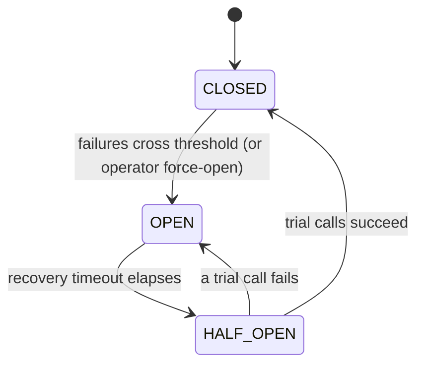

# Circuit breaker for Python

> Stops your Python app from hammering a failing dependency, so one slow service can't drag the rest down with it.

## What is it?

When a service you depend on (a payment gateway, a database, an external API) starts failing,
the worst thing your app can do is keep calling it. Every doomed request ties up a thread or a
connection while it waits to time out, and those pile up until your own app grinds to a halt. The
failure spreads upward instead of staying contained.

A **circuit breaker** borrows the idea from household electrical wiring: when it detects trouble, it
"trips" and cuts the connection. While the breaker is tripped, calls fail instantly instead of
hanging, which gives the struggling dependency room to recover and keeps your app responsive. After a
cool-down it cautiously tests whether the dependency is healthy again, and only then restores normal
traffic. In Baldur this is the **Circuit Breaker**, the most fundamental of the resilience patterns.

## Why it matters

The failure a circuit breaker prevents is **cascading failure**: the domino effect where one unhealthy
dependency exhausts your app's threads and connection pool, which then makes *your* service look
unhealthy to *its* callers, and so on up the chain. A breaker turns a slow, resource-draining failure
into a fast, contained one:

- **Fail fast.** Once the breaker is open, calls return immediately instead of blocking on a timeout.
- **Give the dependency room.** Pausing traffic lets an overloaded service catch up instead of being
  kept underwater by retries.
- **Recover automatically.** The breaker probes for recovery on its own and reopens at the first sign
  the dependency is still broken, so you don't have to babysit it.

## How it works in Baldur

You wrap a call with the `@baldur.protected` facade (which combines the breaker with retry and
fallback) or the `circuit_breaker` decorator directly — both work the same on synchronous and
`async` calls, since each detects the call style and dispatches automatically. From then on,
Baldur tracks that call's health and moves the breaker through three observable states:

- **CLOSED** is the normal state: calls flow straight through.
- **OPEN** is the tripped state: calls are rejected instantly, without reaching the dependency.
- **HALF_OPEN** is the probing state: after the cool-down, a few trial calls are allowed through to
  test the waters.

| What you observe | When it happens |
|------------------|-----------------|
| Calls pass straight through | **CLOSED** — the dependency is healthy |
| Calls are rejected instantly, without touching the dependency | **OPEN** — failures crossed the threshold (or an operator forced it open) |
| A handful of trial calls are let through | **HALF_OPEN** — the recovery timeout elapsed and Baldur is probing whether the dependency recovered |
| Normal traffic resumes | a trial call succeeds enough times → back to **CLOSED** |
| The breaker snaps back to rejecting | a single trial call fails → straight back to **OPEN** |
| Nothing changes state on its own, while your forces still take effect | **Emergency Level 3** is active (PRO): every breaker holds where it is, see [below](#when-the-whole-system-is-in-lockdown-pro) |

How the breaker decides to trip comes with a couple of wrinkles:

- **Low-traffic services won't trip on rate alone.** The failure-rate trigger waits until the window
  holds a minimum number of calls, so one bad response on a barely-used endpoint can't flip it. The
  consecutive-failure count is traffic-independent and applies whatever the volume.
- **A rate-limit answer is a failure too.** A dependency answering HTTP 429 (Too Many Requests) is
  refusing the call, so Baldur records it as a failure like any other, and a run of them trips the
  breaker through the same two triggers. Storms that arrive interleaved with successes have a trigger
  of their own, and how Baldur spots a 429 in the first place is
  [its own section](#when-a-dependency-answers-429).

### When a dependency answers 429

Baldur watches for a 429 at the point where the protected call is made, on every framework and in
both call styles: `@baldur.protected` and `@baldur.aprotected`, `protect()` and `aprotect()`, and
the `circuit_breaker` decorator on a `def` or an `async def`. Nothing has to be wired by hand. Both
shapes a client can deliver a 429 in are recognised: an exception whose message or type names the
rate limit, and a returned response object whose integer status code is on the rate-limit list, so a
`requests` call that hands the 429 back without raising is caught as well.

Each sighting does three things. It records a breaker failure, so the consecutive count and the
failure rate move as they would for any exception. It feeds the **rate-limit cascade**, the trigger
for storms interleaved with successes: with the defaults, ten 429s inside a minute open the breaker
once they make up at least a tenth of the calls made in that minute and the minute holds at least
twenty of them, counted per worker process. And it starts the cooldown that Baldur's retry stage
waits out before its next attempt, sized from the provider's `Retry-After` when the answer carried
one, so a retry does not land while the dependency is still asking for room.

Composed with retry, the breaker sits outside the retry ladder and would ordinarily see only the
sequence's final outcome. Baldur counts each attempt instead, so a storm the retries eventually
overcome still reaches the breaker as the run of 429s it was, not as one success. The async retry
stage is the exception: under `aprotect(retry=True)` the breaker sees only the sequence's final
outcome, so an async storm the ladder survives never reaches it as a 429 at all, and one the ladder
gives up on reaches it as a single 429. That ladder does not wait out the cooldown either; only the
synchronous retry stage does.

A breaker the cascade opens is an ordinary automatic OPEN. It recovers through the recovery timeout
and HALF_OPEN probing exactly like a breaker tripped by failures. Three warnings mark the event: one
names the storm with the 429 count and rate it fired on, the one logged when the breaker opens
names the cascade as its trigger, and a third confirms the auto-open for that service.

Returned error responses get the same treatment on the failure side. A protected call that returns
a response with a status on the failure list (the 5xx codes by default) records a breaker failure
rather than a success. The value is still handed back to your code unchanged: a returned response
never raises and never triggers the fallback.

Two things deliberately do not count. A call Baldur itself declined to make, because the retry stage
was waiting out a cooldown, is never a breaker failure and never enters the rate: the dependency was
not contacted. And an exception type you told the breaker to ignore (`ignore_exceptions`) is ignored
for the cascade as well, with one limit: the synchronous retry stage classifies each attempt on its
own and does not read that list, so a `circuit_breaker` decorator wrapping a retried call still sees
the retried 429s counted.

Which statuses count is set by two lists, `BALDUR_MIDDLEWARE_CB_STATUS_CODES` (failures,
`500,502,503,504` by default) and `BALDUR_MIDDLEWARE_RATE_LIMIT_CODES` (`429` by default). The prefix
is historical: the same two lists govern this outbound path and the inbound middleware. They are not
exclusive either. List `503` in both and an upstream that sheds load with 503s records a failure and
feeds the cascade at once.

The inbound side is watched too. In a Django app the middleware classifies every response a view
returns against the same two lists and files it against a breaker named for the request path's
domain: the path-substring mapping in the `BALDUR_DOMAIN_MAPPING` Django setting, with every unmapped
path sharing one breaker. A 429 relayed from upstream records a failure and feeds the cascade, so
five relayed 429s in a row trip that breaker like any other run of failures. A 429 that carries
`X-RateLimit-*` headers is left out, since it came from a limiter in your own app; Baldur's own
rate-limit middleware labels its 429s that way, while the 429 its DRF throttle bridge raises carries
no such header and is recorded like a relayed one. The Flask and FastAPI middlewares do the same once you give them a service
name, leaving out only the 429s Baldur itself rejected with; without a service name they record
nothing. A 429 that reaches your code outside any protected call can still be reported by hand with
`record_rate_limit(service_name)`.

### Taking manual control

Crossing a threshold is not the only way a breaker changes state. Force one open
(`force_open_circuit`) to pull a dependency out of rotation for a maintenance window, force it closed
(`force_close_circuit`) once you know it has recovered, or hand control back to automatic mode
whenever you like. A force carries a lifetime as well, so one you forget about lapses on its own
rather than pinning the breaker forever.

For as long as a force is in place it outranks Baldur's own judgement, in both directions. Hold a
breaker open and the recovery probe leaves it alone, so no trial call slips through and closes it
behind your back. Hold one closed and neither accumulated failures nor a rate-limit storm will trip
it. That second half is what makes a forced-closed window useful, and it is also the trade you accept
with it: Baldur will keep sending traffic to a dependency that is answering 429 until you release the
force or its lifetime runs out.

What a force outranks is Baldur's *automatic* judgement about that breaker. Two PRO features can
still lift one, and both stay off until you switch them on. The Meta-Watchdog's automatic recovery
reads a breaker that has been open for five minutes as stuck, then force-closes the breakers it finds
open without asking whether an operator put them there; what you get back is not automatic protection
but a forced-closed window of its own, running for the manual-override lifetime below. Cluster state propagation is the
narrower case: a peer worker that closes its own breaker publishes that CLOSED, and the worker
holding your force applies it locally and starts letting traffic through again. **If you need a block
to hold, leave both of those off.**

A force takes effect in the process that receives it, and a process that starts afterwards picks it up
when it loads shared state. A worker that was already running when you pressed the button keeps
deciding from its own view of the breaker until something makes it consult the shared record. A trip
is one such moment: when your workers share a Redis store and a running worker's failures
cross the threshold, the store refuses to let that trip overwrite your force. The worker adopts the
force instead, enforces it from its next request, and logs a warning (`circuit_breaker.trip_blocked`)
so the failure burst your force just swallowed still shows up in the logs. Baldur's routine background
state sync declines to touch a forced breaker's shared record in the same way. None of this makes the
pickup immediate: between your button press and that worker's next trip attempt, it still answers from
its own view, and a worker that cannot reach the shared store falls back to its own local judgement,
trips included. **When a force has to hold for every request from the first moment, which is usually
the point of a maintenance window, run a single web worker.**

!!! warning "Dry-run mode accepts a force but never rejects traffic"
    Under [dry-run (observe-only) mode](system-control.md) Baldur reports what it *would* have done
    and lets every protected call through, a forced-open breaker included. The force is applied and
    logged, so the console shows the breaker held open while requests carry on reaching the
    dependency. Turn dry-run off before you rely on a force to actually cut traffic.

### When the whole system is in lockdown (PRO)

One more thing outranks a breaker's automatic judgement, and unlike a force it applies to every
breaker at once. PRO's [Emergency Mode](../pro/emergency-mode.md) has four levels; at the most
severe, **Level 3**, Baldur treats the incident as system-wide and every circuit breaker holds
whatever state it is in. Nothing trips, nothing probes, nothing closes on its own. A CLOSED breaker
keeps passing calls even as its failure count crosses the threshold, an OPEN breaker keeps
rejecting after its recovery timeout has run out, a HALF_OPEN breaker lets no trial call through,
and a rate-limit storm is still noted but no longer opens anything. The reasoning matches Emergency
Mode's own recovery gate: in the middle of a fleet-wide incident, dozens of breakers probing and
flipping on their own add load and noise at exactly the moment you want the system to stand still.

The hold is on Baldur's *automatic* decisions only. Your forces work unchanged during Level 3: force
a breaker closed once you know its dependency is back, or open to take it out of rotation, and the
change lands as it would at any other time. **Force-close is your exit for one dependency while the
lockdown lasts.** One interaction with force lifetimes is worth knowing: a forced-open breaker whose
lifetime lapses during Level 3 stays open until the level drops, because lifting the force is itself
an automatic step toward HALF_OPEN. Force it closed if that dependency needs traffic before then.

While the hold is on, this is what you can see:

- a request that an OPEN breaker rejects because the freeze is holding it is counted under a
  `frozen` reason on the circuit-breaker blocked-requests metric, beside the usual open and
  half-open-full reasons, so you can tell a held breaker from one still inside its recovery timeout;
- each recovery sweep logs one warning (`circuit_breaker.recovery_sweep_blocked`) with the number of
  OPEN breakers it would otherwise have moved to HALF_OPEN;
- on a CLOSED breaker, failures are still recorded; only the transition is withheld. Once the level drops, the next
  failure trips a breaker whose count is already over the threshold, and a success in between resets
  that count as it always does.

The level lives in the shared state Emergency Mode writes. On the default file backend that state is
per host; with the Redis backend it spans the cluster. Each process re-reads it on a short cache,
thirty seconds by default, so a worker can still decide a transition in the seconds before it learns
of Level 3, and its peers then mirror that decision. What the hold guarantees is that no *new*
automatic decision is taken while Level 3 holds; a worker catching its local copy up to a decision
already taken elsewhere is not one. A worker whose read of the shared state fails logs a warning and
carries on with the last level it read; one that has never managed to read a level runs unfrozen,
and a Level 3 it is still holding expires on its own schedule. An unreadable emergency state must not
stop a breaker from protecting its caller.

Without PRO there is no Emergency Mode, so none of this applies: the breakers never hold, and
everything above this section describes them completely.

A PRO install can also declare Level 3 by itself when the fleet is collapsing. Turned on, a scheduled
check reads breaker state from the shared store every ten seconds, and when the store holds at least
three registered breakers and at least 70% of them are OPEN on two consecutive checks, Baldur
activates Emergency Level 3 for the automatic-activation duration, thirty minutes by default, and the
hold above takes effect. After a freeze ends it keeps judging the ratio but declares nothing again
until Emergency Mode's stabilization period has passed, which gives the breakers time to leave OPEN.
This lane is **off by
default**, is switched on through an advanced setting that is not on the public tunable list yet, and
judges the fleet from the shared breaker store, Redis in any deployment with more than one worker: a
store it cannot read declares nothing and logs a warning instead.

### Get notified when it trips

Set a Slack webhook URL and Baldur posts to your channel the moment a breaker
opens, then again when it recovers: a 🔴 when traffic is cut and a 🟢 when it is
restored. This is the one notification the OSS tier delivers on its own, and it
works on the most minimal install, with no message broker or background worker
running. Set `BALDUR_META_WATCHDOG_SLACK_WEBHOOK_URL` to turn it on; the URL
lives under the self-monitoring namespace, but on OSS the circuit-breaker push is
what reads it. Leave it unset and the open and close events are still logged,
just not posted.

The OSS push is deliberately plain: one message per transition, with no grouping
or rate-limiting, so a breaker that flaps posts every time. Deduplication,
cooldown, multi-channel routing, and on-call escalation belong to [Unified
Notification](../pro/unified-notification.md) on PRO. The [OSS vs PRO tier
model](../foundations/tier-model.md) lays out the full split.

### Across a cluster (PRO)

By default each worker (or pod) keeps its own breaker. If a dependency starts
failing, every worker has to independently rack up failures before its breaker
trips, so the struggling dependency keeps taking doomed traffic from each worker
that hasn't caught up yet, and the cluster protects itself unevenly.

On PRO, with the event bus running on its Redis backend, the moment one worker's
breaker opens that OPEN is broadcast to every peer worker, which applies it to its
own breaker within a fraction of a second. The matching CLOSED fans out the same
way on recovery. Peers flip without crossing their own failure threshold, so the
whole cluster stops hammering the dependency together instead of one worker at a
time. What propagation shares is the *decision*, not the failure counts: the first
worker still has to reach its own threshold before anything trips, and only then
does that OPEN fan out, so it makes the cluster react together once a breaker
trips, it does not make that first trip arrive any sooner. It is opt-in: set
`BALDUR_CB_CLUSTER_STATE_PROPAGATION_ENABLED=true` on each worker. One thing to
weigh before you do: a peer's CLOSED is applied without checking whether this
worker is holding an operator's force, so
[a manual block can be lifted while you still need it](#taking-manual-control).
That makes propagation the one automatic path that does not defer to a force. A
peer's *trip* is the contrast case: it meets your force in the shared store, is
declined, and that peer adopts the force instead.
This coordinates the *same* breaker across workers; coordinating
*different* breakers (so an open downstream breaker tightens the upstream ones)
is outside the scope of the OSS circuit breaker.

## Configuration

The most common knobs an operator sets. The full list lives in the API reference.

| Env Var | Default | What it controls |
|---------|---------|------------------|
| `BALDUR_CB_FAILURE_THRESHOLD` | `5` | How many *consecutive* failures trip the breaker from CLOSED to OPEN — a success resets the count |
| `BALDUR_CB_FAILURE_RATE_THRESHOLD` | `50.0` | Failure percentage over the recent-call window that also trips the breaker. `0` turns the rate trigger off |
| `BALDUR_CB_SLIDING_WINDOW_SIZE` | `100` | How many recent calls the failure rate is measured over, per worker process |
| `BALDUR_CB_MINIMUM_CALLS` | `10` | Calls the window needs before the rate is trusted. Gates the rate trigger only — the consecutive-failure trigger always applies |
| `BALDUR_CB_RECOVERY_TIMEOUT` | `60` | Seconds the breaker stays OPEN before letting trial calls through |
| `BALDUR_CB_HALF_OPEN_MAX_CALLS` | `3` | How many trial calls are allowed through while probing for recovery |
| `BALDUR_MIDDLEWARE_CB_STATUS_CODES` | `[500,502,503,504]` | Response statuses recorded as a breaker failure, both by the inbound middleware and when a protected call *returns* a response instead of raising |
| `BALDUR_MIDDLEWARE_RATE_LIMIT_CODES` | `[429]` | Response statuses read as a rate-limit answer: a failure that also feeds the cascade. Not exclusive with the list above |
| `BALDUR_CB_MANUAL_OVERRIDE_TTL_MINUTES` | `90` | How long a force lasts when you do not give it a lifetime of its own, up to `1440` (24 h). Every force expires, so one you forget lapses instead of pinning the breaker |
| `BALDUR_EVENT_LOGGING_CB_LOG_LEVEL` | `WARNING` | Log level for the circuit open, close, and manual-force events; the automatic step to HALF_OPEN logs at a fixed level |
| `BALDUR_META_WATCHDOG_SLACK_WEBHOOK_URL` | _(unset)_ | Slack incoming-webhook URL for the open/close push; unset means the events are logged, not posted |

## See also

- [Getting Started](../../getting-started/index.md) — set it up
- [Emergency Mode](../pro/emergency-mode.md) — the PRO incident levels; at Level 3 every breaker holds its state
- [Circuit Breaker API Reference](../../reference/services/circuit_breaker.md) — full options and signatures
- [Environment Variables](../../reference/env-vars.md) — the complete operator-tunable list
