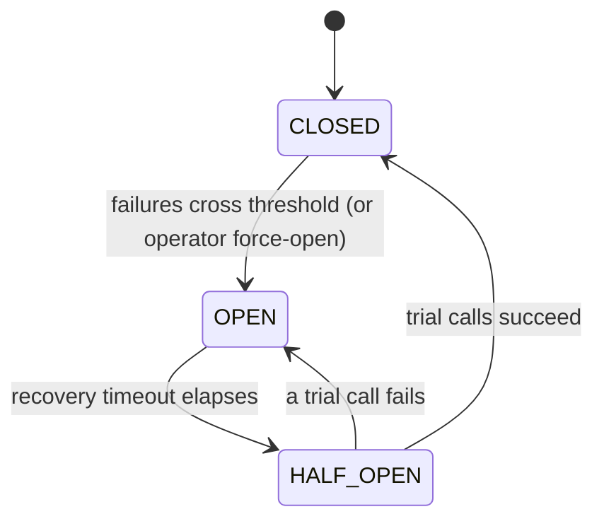

# Circuit breaker for Python

> Stops your Python app from hammering a failing dependency, so one slow service can't drag the rest down with it.

## What is it?

When a service you depend on (a payment gateway, a database, an external API) starts failing,
the worst thing your app can do is keep calling it. Every doomed request ties up a thread or a
connection while it waits to time out, and those pile up until your own app grinds to a halt. The
failure spreads upward instead of staying contained.

A **circuit breaker** borrows the idea from household electrical wiring: when it detects trouble, it
"trips" and cuts the connection. While the breaker is tripped, calls fail instantly instead of
hanging, which gives the struggling dependency room to recover and keeps your app responsive. After a
cool-down it cautiously tests whether the dependency is healthy again, and only then restores normal
traffic. In Baldur this is the **Circuit Breaker**, the most fundamental of the resilience patterns.

## Why it matters

The failure a circuit breaker prevents is **cascading failure**: the domino effect where one unhealthy
dependency exhausts your app's threads and connection pool, which then makes *your* service look
unhealthy to *its* callers, and so on up the chain. A breaker turns a slow, resource-draining failure
into a fast, contained one:

- **Fail fast.** Once the breaker is open, calls return immediately instead of blocking on a timeout.
- **Give the dependency room.** Pausing traffic lets an overloaded service catch up instead of being
  kept underwater by retries.
- **Recover automatically.** The breaker probes for recovery on its own and reopens at the first sign
  the dependency is still broken, so you don't have to babysit it.

## How it works in Baldur

You wrap a call with the `@baldur.protected` facade (which combines the breaker with retry and
fallback) or the `circuit_breaker` decorator directly — both work the same on synchronous and
`async` calls, since the facade detects the call style and dispatches automatically. From then on,
Baldur tracks that call's health and moves the breaker through three observable states:

- **CLOSED** is the normal state: calls flow straight through.
- **OPEN** is the tripped state: calls are rejected instantly, without reaching the dependency.
- **HALF_OPEN** is the probing state: after the cool-down, a few trial calls are allowed through to
  test the waters.

| What you observe | When it happens |
|------------------|-----------------|
| Calls pass straight through | **CLOSED** — the dependency is healthy |
| Calls are rejected instantly, without touching the dependency | **OPEN** — failures crossed the threshold (or an operator forced it open) |
| A handful of trial calls are let through | **HALF_OPEN** — the recovery timeout elapsed and Baldur is probing whether the dependency recovered |
| Normal traffic resumes | a trial call succeeds enough times → back to **CLOSED** |
| The breaker snaps back to rejecting | a single trial call fails → straight back to **OPEN** |

How the breaker decides to trip comes with a couple of wrinkles:

- **Low-traffic services won't trip on rate alone.** The failure-rate trigger waits until the window
  holds a minimum number of calls, so one bad response on a barely-used endpoint can't flip it. The
  consecutive-failure count is traffic-independent and applies whatever the volume.
- **Rate-limit storms trip it too.** A burst of HTTP 429 (Too Many Requests) responses from a
  dependency is treated as a failure signal and can open the breaker, so your app stops amplifying the
  overload.

### Taking manual control

Crossing a threshold is not the only way a breaker changes state. Force one open
(`force_open_circuit`) to pull a dependency out of rotation for a maintenance window, force it closed
(`force_close_circuit`) once you know it has recovered, or hand control back to automatic mode
whenever you like. A force carries a lifetime as well, so one you forget about lapses on its own
rather than pinning the breaker forever.

For as long as a force is in place it outranks Baldur's own judgement, in both directions. Hold a
breaker open and the recovery probe leaves it alone, so no trial call slips through and closes it
behind your back. Hold one closed and neither accumulated failures nor a rate-limit storm will trip
it. That second half is what makes a forced-closed window useful, and it is also the trade you accept
with it: Baldur will keep sending traffic to a dependency that is answering 429 until you release the
force or its lifetime runs out.

What a force outranks is Baldur's *automatic* judgement about that breaker. Two PRO features can
still lift one, and both stay off until you switch them on. The Meta-Watchdog's automatic recovery
reads a breaker that has been open for five minutes as stuck, then force-closes the breakers it finds
open without asking whether an operator put them there; what you get back is not automatic protection
but a forced-closed window of its own, running for the manual-override lifetime below. Cluster state propagation is the
narrower case: a peer worker that closes its own breaker publishes that CLOSED, and the worker
holding your force applies it locally and starts letting traffic through again. **If you need a block
to hold, leave both of those off.**

A force takes effect in the process that receives it, and a process that starts afterwards picks it up
when it loads shared state. A worker that was already running when you pressed the button keeps
deciding from its own view of the breaker until something makes it consult the shared record. A trip
is one such moment: when your workers share a store (Redis or SQL) and a running worker's failures
cross the threshold, the store refuses to let that trip overwrite your force. The worker adopts the
force instead, enforces it from its next request, and logs a warning (`circuit_breaker.trip_blocked`)
so the failure burst your force just swallowed still shows up in the logs. Baldur's routine background
state sync declines to touch a forced breaker's shared record in the same way. None of this makes the
pickup immediate: between your button press and that worker's next trip attempt, it still answers from
its own view, and a worker that cannot reach the shared store falls back to its own local judgement,
trips included. **When a force has to hold for every request from the first moment, which is usually
the point of a maintenance window, run a single web worker.**

!!! warning "Dry-run mode accepts a force but never rejects traffic"
    Under [dry-run (observe-only) mode](system-control.md) Baldur reports what it *would* have done
    and rejects nothing, a forced-open breaker included. The force is applied and logged, so the
    console shows the breaker held open while requests carry on reaching the dependency. Turn dry-run
    off before you rely on a force to actually cut traffic.

### Get notified when it trips

Set a Slack webhook URL and Baldur posts to your channel the moment a breaker
opens, then again when it recovers: a 🔴 when traffic is cut and a 🟢 when it is
restored. This is the one notification the OSS tier delivers on its own, and it
works on the most minimal install, with no message broker or background worker
running. Set `BALDUR_META_WATCHDOG_SLACK_WEBHOOK_URL` to turn it on; the URL
lives under the self-monitoring namespace, but on OSS the circuit-breaker push is
what reads it. Leave it unset and the open and close events are still logged,
just not posted.

The OSS push is deliberately plain: one message per transition, with no grouping
or rate-limiting, so a breaker that flaps posts every time. Deduplication,
cooldown, multi-channel routing, and on-call escalation belong to [Unified
Notification](../pro/unified-notification.md) on PRO. The [OSS vs PRO tier
model](../foundations/tier-model.md) lays out the full split.

### Across a cluster (PRO)

By default each worker (or pod) keeps its own breaker. If a dependency starts
failing, every worker has to independently rack up failures before its breaker
trips — so the struggling dependency keeps taking doomed traffic from each worker
that hasn't caught up yet, and the cluster protects itself unevenly.

On PRO, with the event bus running on its Redis backend, the moment one worker's
breaker opens that OPEN is broadcast to every peer worker, which applies it to its
own breaker within a fraction of a second. The matching CLOSED fans out the same
way on recovery. Peers flip without crossing their own failure threshold, so the
whole cluster stops hammering the dependency together instead of one worker at a
time. What propagation shares is the *decision*, not the failure counts: the first
worker still has to reach its own threshold before anything trips, and only then
does that OPEN fan out — so it makes the cluster react together once a breaker
trips, it does not make that first trip arrive any sooner. It is opt-in — set
`BALDUR_CB_CLUSTER_STATE_PROPAGATION_ENABLED=true` on each worker. One thing to
weigh before you do: a peer's CLOSED is applied without checking whether this
worker is holding an operator's force, so
[a manual block can be lifted while you still need it](#taking-manual-control).
That makes propagation the one automatic path that does not defer to a force. A
peer's *trip* is the contrast case: it meets your force in the shared store, is
declined, and that peer adopts the force instead.
This coordinates the *same* breaker across workers; coordinating
*different* breakers — so an open downstream breaker tightens the upstream ones —
is outside the scope of the OSS circuit breaker.

## Configuration

The most common knobs an operator sets. The full list lives in the API reference.

| Env Var | Default | What it controls |
|---------|---------|------------------|
| `BALDUR_CB_FAILURE_THRESHOLD` | `5` | How many *consecutive* failures trip the breaker from CLOSED to OPEN — a success resets the count |
| `BALDUR_CB_FAILURE_RATE_THRESHOLD` | `50.0` | Failure percentage over the recent-call window that also trips the breaker. `0` turns the rate trigger off |
| `BALDUR_CB_SLIDING_WINDOW_SIZE` | `100` | How many recent calls the failure rate is measured over, per worker process |
| `BALDUR_CB_MINIMUM_CALLS` | `10` | Calls the window needs before the rate is trusted. Gates the rate trigger only — the consecutive-failure trigger always applies |
| `BALDUR_CB_RECOVERY_TIMEOUT` | `60` | Seconds the breaker stays OPEN before letting trial calls through |
| `BALDUR_CB_HALF_OPEN_MAX_CALLS` | `3` | How many trial calls are allowed through while probing for recovery |
| `BALDUR_CB_MANUAL_OVERRIDE_TTL_MINUTES` | `90` | How long a force lasts when you do not give it a lifetime of its own, up to `1440` (24 h). Every force expires, so one you forget lapses instead of pinning the breaker |
| `BALDUR_EVENT_LOGGING_CB_LOG_LEVEL` | `WARNING` | Log level for circuit state-change events |
| `BALDUR_META_WATCHDOG_SLACK_WEBHOOK_URL` | _(unset)_ | Slack incoming-webhook URL for the open/close push; unset means the events are logged, not posted |

## See also

- [Getting Started](../../getting-started/index.md) — set it up
- [Circuit Breaker API Reference](../../reference/services/circuit_breaker.md) — full options and signatures
- [Environment Variables](../../reference/env-vars.md) — the complete operator-tunable list
