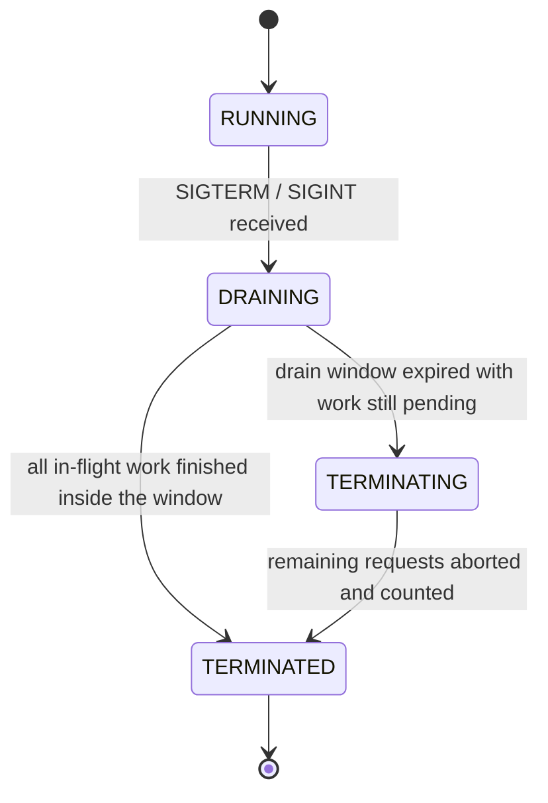

# Graceful Shutdown

> When your platform tells the app to stop, Baldur finishes the requests already in flight,
> lets its own subsystems flush their work, and only then lets the process exit — so a deploy
> never drops a user mid-request.

## What is it?

Every deployment, scale-down, or node rotation ends the same way: the platform tells your
process to stop. On Kubernetes that is a `SIGTERM`, followed after a grace period by a hard
kill. A process that exits the instant it is told drops whatever it was doing — requests in
flight turn into errors, and buffered work (audit records, queued events) simply vanishes.

Think of closing a restaurant: you lock the front door first, let the seated guests finish
their meals, and only then turn off the lights. **Graceful shutdown** is that sequence for a
server process: stop accepting new work, finish the work already started, then exit. In Baldur
this is the **Graceful Shutdown** feature: a coordinator that runs the whole sequence for your
HTTP requests *and* for Baldur's own background subsystems at the same time.

## Why it matters

Without coordination, every deploy is a small, self-inflicted incident:

- **Dropped requests.** In-flight requests die mid-transaction, so users see errors exactly as
  often as you ship. "We deploy on Fridays" becomes a reliability statement.
- **Lost work.** Buffered audit records and pending events never get flushed if nothing waits
  for them before exit.
- **Killed mid-cleanup.** A health check that goes dark during shutdown tells the orchestrator
  the pod is dead, which triggers the hard kill, interrupting the very cleanup that was
  in progress.

Baldur's coordinator removes all three at once:

- **Zero-downtime deploys.** Existing requests run to completion, and on Django new traffic is
  turned away in the meantime with an explicit "retry shortly" answer.
- **One sequence for everything.** Your requests and Baldur's own subsystems (background
  workers, the dead-letter queue's outbox, audit logging, event dispatch) stop in one
  coordinated sequence, so nothing is forgotten.
- **Bounded, never hung.** The drain has a hard time limit. If something refuses to finish,
  Baldur force-terminates anyway and reports how many tracked requests were cut off, instead
  of hanging until the orchestrator kills it blind.

## How it works in Baldur

The coordinator starts together with Baldur itself and registers handlers for `SIGTERM` and
`SIGINT`, so the platform's stop signal is the trigger, with no extra wiring outside gunicorn
(see below). You can also start a drain programmatically through the coordinator returned by
`get_shutdown_coordinator()`; a drain started that way does not end the process. From there the
process moves through four observable phases:

| What you observe | When it happens |
|------------------|-----------------|
| New requests get `503` with a `Retry-After` header and `Connection: close` | The drain has begun, on Django with Baldur's middleware installed (see *On Django* below). `Retry-After` carries the remaining drain time, and `Connection: close` makes load-balancer pools stop reusing the worker's connections |
| Baldur's liveness and ping endpoints keep answering `200` | The same middleware exempts them: draining is a normal lifecycle phase, not a failure, and keeping liveness green prevents Kubernetes from hard-killing the pod mid-drain. Other paths, readiness included, get the `503`, so new traffic routes elsewhere. Point the liveness probe at Baldur's endpoint, not one of your own |
| The process stays up while in-flight requests finish | The coordinator re-checks every half-second until every tracked request and every participating subsystem reports done. Standalone, it then re-delivers `SIGTERM` the conventional way and the process exits. Where a handler already owned the signal (uvicorn's, your own, or Python's `Ctrl+C` handler, which raises `KeyboardInterrupt` at once), Baldur starts the drain and passes the signal on, and that handler decides when the process exits; under gunicorn, the worker lifecycle does |
| `baldur_shutdown_phase` metric moves `0 → 1 → 3` | A clean drain: running, draining, terminated — nothing was lost |
| `baldur_shutdown_phase` reaches `2` | The drain window (30 seconds by default) expired with work still pending, and the drain was forced. `baldur_shutdown_aborted_requests_total` grows by the number of tracked requests still in flight at the deadline; a drain held open only by a subsystem adds nothing to it |
| `baldur_shutdown_drain_duration_seconds` histogram records the drain | Every shutdown reports how long it actually took — worth an alert if it creeps toward the window limit |

The metrics in the table are exported when the `prometheus` extra is installed
(`pip install "baldur-framework[prometheus]"`); without it the drain behaves the same and exports
nothing. A few operational details:

- **The drain is bounded on purpose.** A clean drain loses nothing; a forced one tells you how
  many tracked requests it cut off (`baldur_shutdown_aborted_requests_total`, plus the count of
  requests that finished inside the window in `baldur_shutdown_drained_requests_total`). An
  unbounded "wait until done" would just trade dropped requests for a pod the orchestrator
  eventually kills blind.
- **Subsystems drain too.** Baldur's background workers and the dead-letter queue's outbox
  register as drain participants, so the drain waits for them inside the same window as the
  requests. Audit logging flushes its buffered records once the drain ends, clean or forced,
  and event dispatch finishes its queued events after a clean drain.
- **On Django**, the rejection and request-tracking middleware are installed by
  `configure_baldur()`, called at the bottom of your settings module. Adding the app to
  `INSTALLED_APPS` alone does not install them, and a drain then neither answers `503` nor
  waits for the Django requests in flight. The Flask integration and FastAPI's
  `BaldurMiddleware` track their requests for the drain but send no `503` of their own.
- **On Kubernetes**, set the pod's `terminationGracePeriodSeconds` comfortably above the drain
  window, so the platform's hard kill never lands before Baldur's own deadline does.
- **Under gunicorn**, the master process owns worker signals, so Baldur plugs into gunicorn's
  worker lifecycle instead of registering its own handlers. Wire the provided hooks in your
  gunicorn config (see the [gunicorn adapter reference](../../reference/adapters/gunicorn.md)),
  and keep gunicorn's `--graceful-timeout` above the drain window, with room for the teardown
  that follows it. Baldur logs an explicit warning when it detects gunicorn without the hooks,
  so a missed wiring is visible rather than silent.

## Configuration

The coordinator and its signal handlers start together with Baldur, and the drain window
defaults to 30 seconds. The wiring to add is framework-level: the `configure_baldur()` call on
Django and the hooks under gunicorn, both described above. There are no graceful-shutdown
variables in the operator-tunable allowlist, so there is nothing you need to set. The complete
operator-tunable list lives in the
[environment variables reference](../../reference/env-vars.md).

## See also

- [Getting Started](../../getting-started/index.md) — set it up
- [Health Check](health-check.md) — how liveness and readiness answer during a drain
- [Gunicorn adapter reference](../../reference/adapters/gunicorn.md) — wiring the worker-lifecycle hooks
- [Environment Variables](../../reference/env-vars.md) — the complete operator-tunable list
