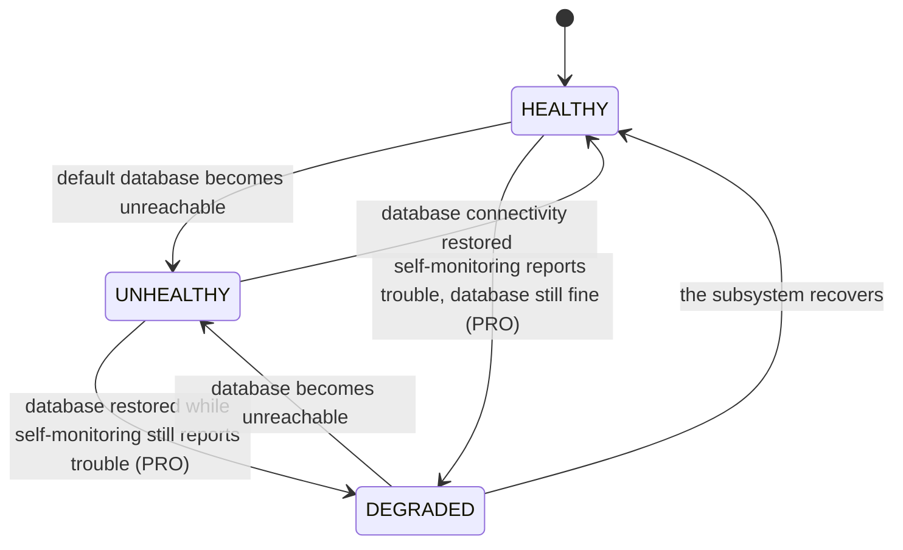

# Health Check

> Ready-made health endpoints that tell your load balancer and Kubernetes exactly when to send
> traffic to a pod — and when to stop.

## What is it?

Orchestrators and load balancers constantly ask every instance of your app two different questions:
*"are you alive?"* (should I restart you?) and *"are you ready?"* (should I send you traffic?).
Think of an aircraft: "is the engine running" and "is it cleared for passengers" are separate
checks with separate consequences: confusing them means either restarting a plane that just
needed a minute, or boarding passengers onto one that can't fly.

A **health check** endpoint answers those questions over HTTP, with the response code doing the
talking: `200` means "all good", `503` means "act on it". In Baldur this is the **Health Check**
feature, a set of pre-built endpoints that answer from what the self-healing layer knows:
database connectivity, whether self-healing is switched on, and, with PRO self-monitoring, the
health of its own subsystems.

## Why it matters

Most teams hand-roll a `/health` view, and it usually fails in one of two directions:

- **It checks too little.** It returns `200` unconditionally, so the load balancer keeps routing
  traffic to a pod whose database connection is gone.
- **It checks too much.** It runs expensive checks on every probe, so the health endpoint itself
  becomes a load source when a balancer polls it several times a second.

Baldur's Health Check removes both failure modes:

- **Correct routing decisions.** Only genuine unhealthiness (a severed database connection)
  returns `503` and takes the pod out of rotation. A pod that is degraded-but-serving stays in.
- **Cheap under polling.** The full health verdict is served from a precomputed cache, and an
  ultra-light ping endpoint answers without touching the database at all.
- **Debuggable incidents.** The response is structured, not a bare "down": the database's own
  verdict, whether the self-healing automation is switched on, and, with PRO self-monitoring, a
  verdict per watched component.

## How it works in Baldur

Baldur exposes five endpoints, each answering a different question. The table shows them under
the `/api/baldur/` prefix they get on Django once you mount Baldur's REST API (see
[Configuration](#configuration)). Every deployment, Django included, also gets the same checks
from Baldur's built-in admin server, which starts with `baldur.init()` and listens on loopback by
default, at `/health`, `/liveness`, `/readiness`, `/health/pool` and `/health/ping` (`/health`
asks for the viewer role once an operator key is configured).

| Endpoint | Question it answers | Response behavior |
|----------|--------------------|-------------------|
| `health/` | "What is the full picture?" | Overall status plus a breakdown. `200` for healthy/degraded, `503` for unhealthy |
| `health/live/` | "Is the process alive?" | Always `200` while the app runs, even during shutdown drain |
| `health/ready/` | "Can it serve traffic?" | `200` when every configured database is usable; `503` when one is not or, by default, has stalled past the probe budget |
| `health/pool/` | "Is the default database connection usable?" | `200` when it is; `503` when it is not or the check errors |
| `health/ping/` | "Fastest possible yes" | Always `200`, no database access — built for high-frequency load-balancer checks |

The overall verdict on `health/` moves through three observable statuses. Without PRO it is
binary, healthy or unhealthy: `degraded` appears only when PRO self-monitoring reports trouble.

| What you observe | When it happens |
|------------------|-----------------|
| `"status": "healthy"`, HTTP `200` | The default database is reachable and no self-monitored subsystem reports trouble |
| `"status": "degraded"`, HTTP `200` — the pod **stays in rotation** | PRO self-monitoring reports a struggling subsystem while the database is still fine. Degraded means "keep serving, but look into it" |
| `"status": "unhealthy"`, HTTP `503` — the load balancer depools the pod | The default database connection is unusable, or Baldur has no database to check (see [Configuration](#configuration)). This is the only verdict that takes the pod out of traffic |
| Readiness flips to `503` | Any configured database connection is down, or (by default) one stopped answering within the probe budget. On Django with Baldur's drain middleware installed, a graceful-shutdown drain flips it too, along with `health/` and `health/pool/`, so new traffic stops |
| Liveness and ping keep answering `200` during a drain | Draining is a normal lifecycle phase, not a failure: keeping liveness green prevents the orchestrator from killing the pod mid-drain. This is the `/api/baldur/` behavior; the admin server stops answering altogether once shutdown begins |

The endpoints differ in what they read, what they wait on and what they cache, which decides
where each probe should point:

- **Degraded never depools.** Only `unhealthy` maps to `503` on the main endpoint (two rare
  internal-failure statuses, `error` and `unavailable`, also map to `503`). A degraded pod that can
  still serve correctly is deliberately kept in rotation — depooling healthy capacity because a
  background subsystem hiccupped would make an incident worse, not better.
- **The payload is a diagnosis, not a verdict.** Beyond the status, `health/` reports the default
  database's verdict, whether the self-healing automation is switched on, and a timestamp; with
  PRO self-monitoring active it adds each watched component's state. The pool endpoint
  additionally carries the error message when its check fails.
- **Readiness answers within a budget, whatever the database does.** A database that refuses
  connections fails fast and readiness reports it. A database that accepts the connection and
  then never answers is the dangerous case: without a bound, the probe itself hangs, your
  orchestrator's probe timeout expires, and the pod is depooled by default (with a shared
  database, every pod at once). Baldur probes all configured databases in parallel under one
  deadline and reports a stalled one as `timed_out`, so the verdict arrives on time and names
  the culprit. Whether a stall depools the pod is yours to choose, via
  `BALDUR_HEALTH_CHECK_READINESS_TIMEOUT_FAIL_DIRECTION`. Only readiness has this bound: a fresh
  `health/` computation and every `health/pool/` call wait as long as the database driver does,
  so point orchestrator probes at `health/ready/` and `health/live/`.
- **Responses are cached on purpose.** The full verdict comes from a precomputed cache so that
  aggressive probe polling stays cheap. Readiness is cached too, briefly and for the same
  reason: probe cadence times pod count should not mean constant query load against a database
  that may already be struggling. Append `?nocache=true` to force a fresh computation on
  `health/`; the response then marks the cache as bypassed. Readiness has no such bypass; its
  cache window is short by design. With `BALDUR_REDIS_URL` set, the `health/` cache is one entry
  shared across the processes on that Redis, so a pod can answer with a verdict another pod
  computed moments earlier; `?nocache=true` gives this process's own.
- **PRO self-monitoring enriches the verdict.** When Baldur's PRO-tier self-monitoring
  (Meta-Watchdog) is active, its findings appear in the health payload and a struggling subsystem
  it detects is what moves the overall status to degraded.

## Configuration

Health Check has no switch to turn on: the admin-server checks start with `baldur.init()`. On
Django, the `/api/baldur/` endpoints appear once you mount Baldur's REST API in your `urls.py`
with `path("api/baldur/", include("baldur.api.django.urls"))`, which needs the
`baldur-framework[django-api]` extra. Flask and FastAPI get no `/api/baldur/` routes, so they use
the admin server. A drain flips readiness to `503` only where Baldur's drain middleware runs:
`configure_baldur()` from `baldur.adapters.django` installs it, while adding the app to
`INSTALLED_APPS` alone does not.

The checks look at the database Baldur can reach: on Django, the connections in `DATABASES`;
elsewhere, the one `BALDUR_SQL_DSN` names. With neither there is nothing to check, and the
endpoints disagree: readiness answers `200` with an empty check list, while `health/` reports
`unhealthy` and `health/pool/` reports `degraded`, both with `503`. Do not route traffic on those
two in that setup.

One variable is worth a decision rather than a default:
`BALDUR_HEALTH_CHECK_READINESS_TIMEOUT_FAIL_DIRECTION` picks what happens when a database stops
answering: depool the pod (`not_ready`, the default) or keep it in rotation (`ready`). Pods
that share a single database are the case for `ready`: depooling every one of them at once turns
a database stall into a full outage. The other runtime control is per-request: `?nocache=true`
on `health/` to bypass the cache. The complete operator-tunable list lives in the
[environment variables reference](../../reference/env-vars.md).

## See also

- [Getting Started](../../getting-started/index.md) — install Baldur; `baldur.init()` starts the admin server
- [Health & Pools API Reference](../../reference/interfaces/health_and_pools.md) — full options and signatures
- [Graceful Shutdown](graceful-shutdown.md) — the drain that flips readiness while liveness stays green
- [Environment Variables](../../reference/env-vars.md) — the complete operator-tunable list
