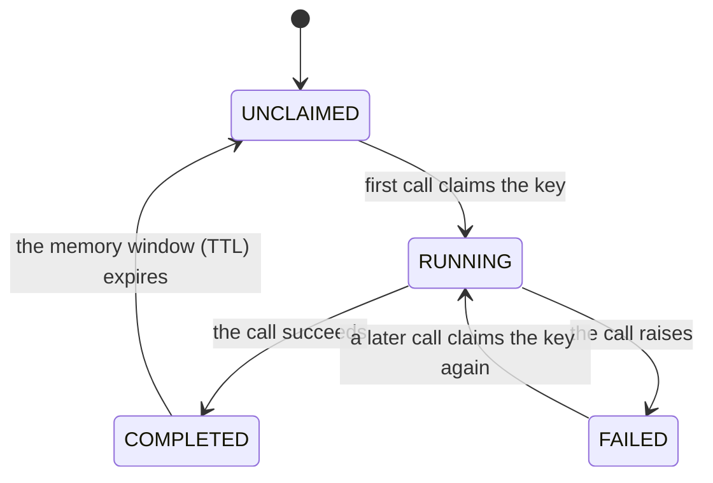

# Idempotency for Python services

> Makes "this must never happen twice" operations safe (a card charge, an email, a shipment) by remembering which requests have already run and blocking the repeats, even when a client retry, a double-click, or a duplicate webhook fires the same request again.

## What is it?

An operation is *idempotent* when running it twice has the same effect as running it once. An
elevator call button is idempotent: pressing it five times still summons one elevator. Most
real-world side effects are not naturally like that — charge a card twice and the customer pays
twice.

The problem is that distributed systems *will* deliver the same request more than once. A user
double-clicks "Pay". A webhook provider redelivers an event it isn't sure you received. A client
resends a request whose response was lost in transit even though the work itself succeeded. In Baldur,
**Idempotency** is key-based deduplication: you give each logical operation a key (such as the
order ID), Baldur remembers which keys it has already seen, and a second arrival of the same key is
blocked instead of executed again.

## Why it matters

- **At-least-once delivery becomes safe to receive.** Queues redeliver, webhook providers resend,
  and clients retry requests whose answer they never got. With a key on the operation, the repeat
  is recognized and the side effect does not run again. What the key does *not* cover is Baldur's
  own `retry=` on the same call: the key is checked once, when the call starts, so every attempt
  retry makes inside that call runs your function again. Turn `retry=` on only for work that is
  safe to repeat by itself (see the [Retry](retry.md) guide).
- **Double-submits and duplicate webhooks are blocked, even concurrent ones.** The key is claimed
  atomically, so two requests racing in at the same instant can't both win. There is no
  check-then-act window for a duplicate to slip through.
- **No hand-rolled dedup.** The homegrown "look it up, then insert" check is exactly the racy
  pattern that fails under concurrency. Baldur replaces it with an atomic claim plus an explicit,
  catchable duplicate error.
- **A failure doesn't poison the key.** If a call raises, its key is released so a later call can
  run the operation, and if several race for it, exactly one wins. The flip side: a call that
  raised *after* its side effect took hold (the charge went through, then the response timed out)
  releases the key too, so the repeat runs the charge again. The payment provider's own key is
  what covers that case (below).

## How it works in Baldur

You attach a key to the operation on whichever surface fits:

- **Composed with the rest of the pipeline.** Pass `idempotency_key=` to the `@baldur.protected`
  facade (or its call forms `protect` / `aprotect`). A string names a field on the call's context
  (e.g. `"order_id"`); a callable builds a composite key. The key is checked once when the call
  starts, before the circuit breaker and retry run, and marked once the call hands you its result
  or its error, so the retry attempts in between are not deduplicated. A call the `fallback=`
  rescued counts as finished: its key is marked completed, and a genuine repeat is then blocked for
  the memory window even though the work never ran. On work that must eventually happen, leave the
  fallback off, or give it an error parameter and re-raise, which releases the key. A sync call
  that `timeout=` cuts off hands you its error before your function has stopped: the sync path
  cannot kill the function's thread, so the key is released while the work may still be running,
  and a repeat that arrives then runs alongside it. The async path cancels the timed-out work
  instead.
- **Standalone decorator.** `@idempotent` wraps any sync or `async` function. Name the parameters
  that identify the request (`key_args=["order_id"]`) or supply a `key_fn=` for a custom key, and
  pick a domain to namespace it.
- **Programmatic.** `IdempotencyService` with `IdempotencyKey` gives you explicit
  check-then-mark control when a decorator doesn't fit (batch jobs, event consumers). Its
  contract is looser than the two surfaces above: a duplicate is reported in the returned
  result rather than raised, and because checking and marking are two separate steps, two
  callers racing on a not-yet-marked key can both pass the check. Reach for the facade or the
  decorator (or the service's distributed-lock helpers) when concurrent duplicates matter.

On the facade and decorator surfaces, the key's life is the same: the first call **claims** the
key atomically and runs. Success marks the key **completed**, and it is remembered for a memory
window (a TTL). A failure marks it **failed**, which releases it so a later call can claim it again.

| What you observe | When it happens |
|------------------|-----------------|
| The call runs normally | the key's first arrival, or a later arrival after a call that raised |
| The duplicate is blocked: `IdempotencyDuplicateError` with `decision` `"SKIP"` | the same key arrives again after a successful run, within the memory window |
| The duplicate is blocked: `IdempotencyDuplicateError` with `decision` `"ABORT"` | the same key arrives while the first call is still running (on a sync call cut off by `timeout=`, only until the timeout fires) |
| The call is blocked: `IdempotencyUnavailableError` | the dedup store could not be reached, under the default fail-closed posture |

Where the guarantee holds, and where it stops:

- **Blocked means a clear error, not a silent skip.** A duplicate raises
  `IdempotencyDuplicateError` (the same error type on the facade and the decorator alike), and
  its `decision` tells you whether the original already completed (`"SKIP"`) or is still in
  flight (`"ABORT"`). Baldur does *not* replay the original call's response — catch the error and
  treat it as "this work already happened."
- **Fail-closed by default.** Supplying a key is a "must not duplicate" signal, so if the dedup
  store can't be checked (say, a momentary network blip), the call is blocked with
  `IdempotencyUnavailableError` rather than risking a duplicate side effect. If availability
  matters more than the guarantee, you can opt a facade call into fail-open with
  `idempotency_fail_open=True` (or the whole service), letting the unverifiable call proceed.
- **Cluster-wide with Redis.** The seen-keys ledger lives in the cache `baldur.init()` wires, so
  with `BALDUR_REDIS_URL` set the same key is blocked across every worker and host. In production,
  `init()` refuses to start without it rather than let dedup shrink to per-worker memory: a dedup
  that only works within one process is a false promise. A process that never calls `init()` keeps
  its ledger in its own memory even in production, so call `init()` at startup wherever dedup
  matters.
- **The honest boundary.** Dedup is exactly-once for the duplicate and concurrent cases. If a
  process crashes *after* the side effect but *before* the completion mark, the key's claim
  eventually goes stale and a later call may run the operation again, an essential
  at-least-once limit of any external dedup ledger. True end-to-end exactly-once requires a
  transactional outbox in the same datastore as your own side effect.
- **Pair it with your payment provider's own key.** When the side effect is a call to an
  external payment API, the crash window above, a call that raised after the charge went
  through, and the attempts of Baldur's own `retry=` all have one practical fix: every major
  provider (Stripe, Adyen, PayPal, Toss Payments) accepts an idempotency key of its own and
  deduplicates on *its* side — and, unlike Baldur, replays the original response to a repeat.
  Derive that key deterministically from the business identifier (the order ID, never a
  random value generated per attempt), so every repeat sends the *same* key and the provider
  recognizes it. Baldur's dedup then covers your process (double-clicks, concurrent workers,
  duplicate webhooks), while the provider's key covers the in-doubt window Baldur cannot see.
- **Two windows, two knobs.** A key lives under two independent clocks. The *memory window* is
  how long a completed operation is remembered — how long duplicates stay blocked after success.
  It defaults to 30 minutes, is tunable globally with
  `BALDUR_IDEMPOTENCY_GATE_MEMORY_TTL_SECONDS`, and per call with `ttl=` on `@idempotent` or
  `idempotency_ttl=` on the facade. The *execution window* is how long a running claim is
  honored before a crashed attempt becomes retryable; it defaults to 30 minutes and is tuned
  per call with `execution_ttl=` / `idempotency_execution_ttl=`. Set the execution window to
  your operation's worst-case runtime, never to the dedup horizon, so a remember-for-hours key
  doesn't leave a crashed claim stuck for hours; a value *below* the true worst case risks a
  duplicate running concurrently once the claim goes stale. The programmatic check/mark API remembers for its own configurable TTL.
- **Keys are namespaced by operation.** On the decorator and the programmatic API, a domain
  (`external_service`, `event`, `async_task`, and friends) keeps the same order ID in two domains
  from colliding, and within a domain a `key_args=` key includes the decorated function's
  module-qualified name, so two different functions sharing `key_args=["order_id"]` and the same
  order ID each get their own verdict: charging order 1 never blocks shipping order 1. The facade
  has no domain; its field-name form prefixes the protected name instead (`charge-customer` plus
  the order ID), which keeps two protected operations apart the same way. A custom key gets
  neither: a `key_fn=` result is used as-is behind the domain, and a callable `idempotency_key=`
  result is used as-is, so two operations whose custom keys can come out equal block each other
  unless the key itself names the operation. On the decorator, when
  two entry points really are one logical operation (an HTTP handler and a worker guarding the
  same charge), give both the same explicit `operation=` label. One caveat follows from the
  default being derived from the function's name: renaming or moving the function resets that
  operation's dedup memory at the deploy, so set `operation=` explicitly for correctness-critical
  operations to make the identity rename-proof.

## Configuration

The most common knobs an operator sets. The full list lives in the API reference.

| Env Var | Default | What it controls |
|---------|---------|------------------|
| `BALDUR_IDEMPOTENCY_ENABLED` | `true` | Master switch — when `false`, every surface passes calls through with no dedup check |
| `BALDUR_IDEMPOTENCY_GATE_MEMORY_TTL_SECONDS` | `1800` | Default memory window (in seconds) on the decorator and facade surfaces — how long a completed operation keeps blocking duplicates when no per-call `ttl` is given |
| `BALDUR_IDEMPOTENCY_DEFAULT_CACHE_TTL` | `60` | How long (in seconds) the programmatic check/mark API remembers a processed operation |
| `BALDUR_REDIS_URL` | `redis://localhost:6379/0` | Points the seen-keys ledger at a shared Redis, so a duplicate key is blocked across all workers and hosts; leave it unset and the ledger stays in process memory (the default address is not dialed for it) and production `init()` refuses to start |

## See also

- [Retry](retry.md) — the companion pattern: retry re-runs the work inside one call, which the key does not deduplicate
- [Composing with @baldur.protected](../foundations/composition.md) — where the key sits in the pipeline, next to retry and the fallback
- [Circuit Breaker](circuit-breaker.md) — the other resilience guard composed under `@baldur.protected`
- [Decorators API Reference](../../reference/decorators.md) — `@idempotent` and friends, full signatures
- [Environment Variables](../../reference/env-vars.md) — the complete operator-tunable list
- [Getting Started](../../getting-started/index.md) — set it up
