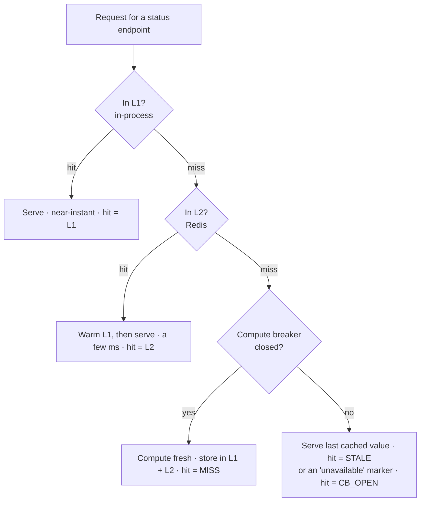

# Precomputed Cache

> Baldur answers its own health check (and, with PRO, its error-budget status) from a fast cache that is kept warm in the background, so monitoring traffic stays cheap and your app stays fast even when those endpoints are hit constantly.

## What is it?

Some endpoints are cheap to *call* but expensive to *answer*. Baldur's health check gathers live
data that can take tens to a couple hundred milliseconds to assemble. Paying that once is fine. But
load balancers, uptime monitors, and Kubernetes probes hammer a health endpoint every few seconds,
and recomputing the answer on every single request adds up fast.

A **precomputed cache** answers the question *before it is asked*. Instead of recomputing the status
fresh each time, Baldur keeps a recent answer ready and serves that, quietly recomputing it in the
background. It's the difference between cooking a meal to order and having it already plated when the
guest sits down.

Baldur calls this its **Precomputed Cache**: a three-tier cache (in-process → Redis → direct
compute) that keeps its observability endpoints answering in well under the time the raw computation
would take.

In OSS, the cache serves the **health check**. The **error-budget status** endpoint is a PRO
feature: when PRO is active it rides this same cache for its default `availability` SLO (a request
for any other SLO is computed live). Baldur's connection-pool health endpoint is not served from
this cache; it computes its answer on every call.

## Why it matters

This is the "your monitoring gets cheaper" payoff: out of the box, Baldur's health check answers
from a warm cache in a millisecond or two, so health probes and dashboards stop competing with your
real traffic for database connections and CPU, with no caching code on your side.

- **Status endpoints stay fast under constant polling.** The health-check response comes back from
  a warm cache in a millisecond or two instead of the tens-to-hundreds of milliseconds a fresh
  computation costs, keeping the overhead low even when a load balancer probes it every second.
- **Monitoring traffic stops being expensive.** Probes and dashboards that hit these endpoints no
  longer each trigger a full recompute, so they don't compete with real user traffic for database
  connections and CPU.
- **A failing check doesn't make every probe re-run it.** When the work behind an endpoint fails,
  Baldur's computation reports the failure in its answer (an `"error"` or `"unhealthy"` status,
  which the health check returns as HTTP 503), and that answer is cached like any other. A flood of
  probes sees the outage without each one repeating the failing work.
- **No extra moving parts.** The background refresh runs on a lightweight in-process timer — no
  Celery, no separate worker process, no new dependency to operate.
- **It fails open.** If a refresh fails, Redis is down, or the cache layer is unavailable, the
  endpoints still answer, computing directly when no tier holds an answer. An unreachable Redis is
  the one case that costs you: it slows these endpoints down (see *It degrades gracefully* below).

## How it works in Baldur

Three cache tiers are checked in order, fastest first, falling through to a direct computation only
when both caches are cold:

- **L1 (in-process).** An in-memory cache local to the process, with no network hop at all. Entries
  are held for a couple of seconds. This is the near-instant path.
- **L2 (Redis).** A pre-serialized JSON copy shared across every process and pod, answered in a
  millisecond or two. Entries live for about fifteen seconds. A hit here also warms L1 so the next
  request on this process skips Redis. With no Redis configured, this tier is an in-process store
  instead, so each process keeps its own copy.
- **L3 (direct compute).** The real work. Only runs when both caches are cold; the fresh answer is
  then written back into L1 and L2 so the following requests are fast again.

Because answers sit in these tiers, a response can describe the system as it was up to about fifteen
seconds earlier. Call the health check with `?nocache=true` when you need a live reading.

**Responses are tagged with how they were served.** Each response that goes through the cache
carries a small cache tag: its `hit` value names the tier that answered and its `latency_ms` reading
says how long that took, so you can see the cache working straight from the endpoint output:

| `hit` value in the response | What it means |
|-----------------------------|---------------|
| `"L1"` | Served from the in-process cache — the fastest path |
| `"L2"` | Served from the shared tier (Redis, or the in-process store when no Redis is configured); the in-process cache was cold and has now been warmed |
| `"MISS"` | Both caches were cold, so the answer was computed fresh and cached |
| `"DEDUP"` | Another request was already computing the same answer; this caller shared that result instead of recomputing |
| `"STALE"` | The compute breaker is open, so the last answer this process cached was served |
| `"CB_OPEN"` | The compute breaker is open and this process had no earlier answer to fall back on, so a clear "unavailable" marker was returned |
| `"ERROR"` | Producing a fresh answer raised before the breaker had opened, so the failure was returned directly rather than a cached answer |
| `"BYPASSED"` | The health check was called with `?nocache=true`, so the answer was computed live and not cached |

**A background worker keeps the cache warm.** Baldur runs a lightweight background loop that
recomputes its snapshots (the health check and a connection-pool snapshot, plus the error-budget
status when PRO is installed) on a short interval, shorter than the Redis entries' lifetime, so a
real request almost always lands on a warm tier instead of paying for a computation. Only a
stress-test endpoint meant for test environments reads the pool snapshot. The loop adds a small
random offset to its schedule so that many instances starting at once don't all recompute in
lockstep, and if a whole cycle fails (every computation raises, or the compute breaker is open) it
backs off with growing, jittered delays before trying again. Even without this worker the cache
still fills itself on demand (the first request to a cold endpoint computes and caches the answer,
and the requests behind it ride the warm tiers), so the worker is an optimization that keeps things
warm proactively, not a prerequisite for caching to work.

**A circuit breaker guards computations that raise.** While the background worker runs, a fresh
computation on the request path goes through a circuit breaker. After a few consecutive
computations raise, the breaker opens, and while it's open Baldur skips computing: it serves the
last answer this process cached (tagged `STALE`) if it has one, or a clear `"unavailable"` marker
(tagged `CB_OPEN`) if it doesn't. A failing health check does not open it. Baldur's own status
computations catch their errors and return them as an answer with an `"error"` or `"unhealthy"`
status, and that answer is cached and served like any other, replacing the earlier good one, so a
failing check reports the failure instead of a stale success.

**It watches for drift between the tiers.** Because the same answer lives in both the in-process
cache and Redis, the worker periodically compares the two copies for each endpoint. If they disagree
it logs a warning and, with the Prometheus extra installed, counts the drift and updates a
consistency-ratio gauge, so a cache-coherence problem surfaces instead of hiding.

**It degrades gracefully.** With no Redis configured, the shared tier runs in process, as described
above. If Redis is configured but unreachable, a failed Redis read counts as a miss, a failed write
is skipped, and the answer is computed directly, but not for free: a request that misses the
in-process tier first waits for its Redis read and write to fail, and logs each failure at ERROR, so
while Redis is down these endpoints answer more slowly than they would with no Redis at all. If the
optional fast-JSON library isn't installed, Baldur uses the standard library instead. And if the
background worker can't start, it doesn't block your application from booting; the endpoints fill
the cache on demand instead.

## Configuration

Precomputed Cache is on by default and needs no setup to start working. It has no variables in the
operator-tunable allowlist — its tier lifetimes, refresh interval, and circuit-breaker thresholds are
advanced settings with production-safe defaults.

The one related setting most operators touch is where the shared L2 cache lives: the Redis tier
connects through `BALDUR_REDIS_URL`, the same Redis routing variable the rest of Baldur uses. With no
Redis configured, which Baldur allows only outside production, the L2 tier is an in-process store,
so the cache still speeds up repeated requests within each process but shares nothing across them.

| Env Var | Default | What it controls |
|---------|---------|------------------|
| `BALDUR_REDIS_URL` | `redis://localhost:6379/0` | Redis connection used by the shared L2 cache tier (and by the rest of Baldur); leave it unset and L2 is an in-process store in each process (the default address is not dialed for it), and a production `baldur.init()` refuses to start |

The complete operator-tunable list lives in the
[environment variables reference](../../reference/env-vars.md).

## See also

- [Getting Started](../../getting-started/index.md) — set it up
- [Health Check](health-check.md) — one of the endpoints this cache keeps fast
- [Circuit Breaker](circuit-breaker.md) — the protection wrapped around the compute path
- [Environment Variables](../../reference/env-vars.md) — the complete operator-tunable list
