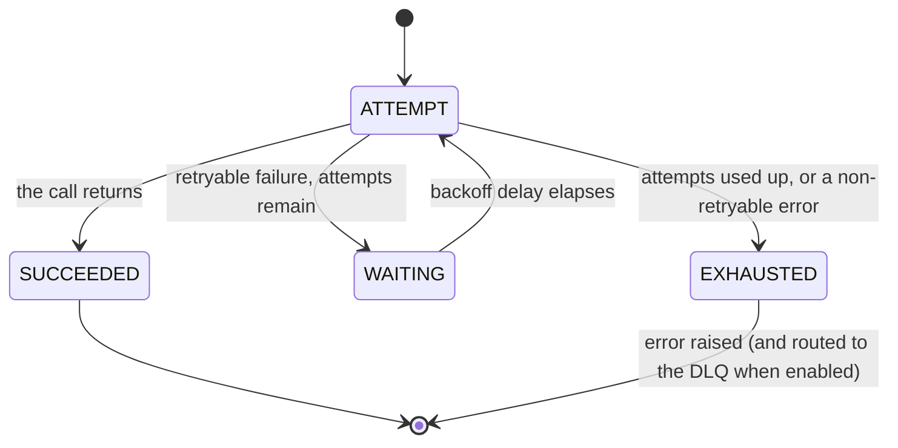

# Retry with exponential backoff in Python

> Automatically tries a failed operation again — with smart, growing pauses between attempts — so a brief hiccup doesn't turn into a user-facing error in your Python service.

## What is it?

Many failures aren't permanent. A network blip, a database that was busy for a moment, a
dependency that briefly returned "too many requests": the call failed not because the operation
was wrong, but because the world was busy for a second. The obvious fix is to just try again.

A naive "loop and retry immediately" makes things worse, though. It hammers an already-struggling
dependency at the worst possible moment and can turn a momentary slowdown into a full outage. The
standard answer in Python is **exponential backoff**: wait briefly before the first retry, then
longer before each attempt after that, so the struggling dependency gets room to recover instead of
a fresh wave of traffic. In Baldur this is **Retry**, paired with a backoff strategy that decides
how long each wait lasts.

## Why it matters

Retry removes the fragile, copy-pasted try/except/sleep/loop that ends up wrapped around every
flaky call in a Python codebase, and gets subtly wrong every time:

- **Recover without a human in the loop.** Most transient faults clear within a couple of attempts;
  the user never sees the blip and no one gets paged.
- Growing waits plus a touch of randomness ("jitter") stop a thousand simultaneously-failed
  requests from all retrying in the same instant and re-overloading the dependency the moment it
  comes back.
- **Know when *not* to retry.** A call the circuit breaker has already cut off fails fast instead of
  burning attempts, and you can name the errors that are permanent so they do the same.
- When every attempt is used up, the failure isn't swallowed. It surfaces as an error, and with the
  Dead Letter Queue enabled the operation is preserved for inspection or later replay.

## How it works in Baldur

Wrap the call with the `@baldur.protected` facade, which composes retry with the circuit breaker
and a fallback:

```python
import baldur

@baldur.protected("payments", retry=True)
def charge(order_id: str) -> Receipt:
    return gateway.charge(order_id)
```

From then on, when the wrapped call raises a *retryable* error, Baldur waits for a backoff delay and
tries again, up to a configured maximum number of attempts, each wait longer than the last. The same
decorator covers `async def` functions: it detects the call style and dispatches automatically, so
synchronous and asynchronous Python share one surface.

For a call that needs the retry ladder without the rest of the pipeline, apply the retry decorator
on its own. It dual-dispatches the same way, on a plain `def` and an `async def` alike:

```python
from baldur.decorators import retry

@retry(domain="payments", max_attempts=5)
def charge(order_id: str) -> Receipt:
    return gateway.charge(order_id)
```



That loop is the easy half. What decides whether retrying is *safe* is everything around it:

- **Backoff grows between attempts.** Under the default exponential curve each pause roughly doubles,
  so you don't hammer the dependency. Linear, constant, and decorrelated jitter are available too
  (constant holds the wait flat), and a random jitter is mixed in so failures that happen together
  don't all retry in lockstep.
- **Retryable vs. non-retryable.** The default is deliberately broad: every exception is retried
  except a circuit-breaker rejection, which stops the ladder at once (retrying a call the breaker
  has already cut off is the thing the breaker exists to prevent). Errors that cannot succeed on a
  second attempt, a validation failure being the usual one, keep costing attempts until you say
  otherwise. Name them with `non_retryable_exceptions=` on `@retry`, or narrow
  `retryable_exceptions=` to the transient set you actually want.
- A timeout bounds the whole sequence, not each attempt. When you add a timeout under
  `@baldur.protected` (or `protect()` / `aprotect()`), it wraps the entire retry sequence: the
  fallback sits outermost, the circuit breaker next, then the timeout, then retry. The clock covers
  every attempt plus the backoff waits between them, not each attempt individually. Baldur exposes
  no per-attempt timeout knob (identical in sync and async); to bound a single attempt, wrap that
  call yourself before handing it to retry. Know one thing before you put a timeout on a write: on
  the synchronous path the timeout hands control back to your caller but cannot stop the work,
  because the attempt runs on a worker thread Python cannot kill. The ladder keeps retrying against
  the dependency after you have already returned an error, so a side effect can still land
  afterwards. An `async def` call is cancelled properly.
- **A retry re-runs your function, so it must be safe to run twice.** Baldur calls the operation
  again. It does not undo a partial side effect, and it does not deduplicate its own attempts: if
  attempt 1 charges the card and then times out reading the response, attempt 2 charges it again.
  For money and messaging the operation itself has to be repeat-safe. Send the downstream provider
  an idempotency key of your own, or make the write conditional on state you check first.

  `idempotency_key=` solves the neighboring problem, one level up. It blocks a duplicate *call*
  from entering the pipeline at all: a double-submit, a redelivered queue message, a client that
  retried the request itself. The guard is evaluated once per call, before the retry stage runs, so
  it deduplicates callers rather than attempts.

  ```python
  @baldur.protected("payments", retry=True, idempotency_key="order_id")
  def charge(order_id: str) -> Receipt:
      return gateway.charge(order_id)
  ```

  Standalone, Baldur's separate `@idempotent` decorator applies that same call-level gate without
  the rest of the pipeline. Both honor `BALDUR_IDEMPOTENCY_ENABLED`, so turning it off removes the
  duplicate-call protection from money-path callsites as well.
- Exhaustion is not silent. When the last attempt fails, the failure surfaces to the caller as an
  error rather than being swallowed. `@retry` raises a clear "max retries exceeded" error, while
  `@baldur.protected` re-raises the original error (or runs your fallback, if you supplied one).
  With DLQ routing enabled, the failed operation is also preserved in the Dead Letter Queue (DLQ)
  for inspection or later replay.
- **DLQ routing is opt-in, not automatic.** Retry and backoff run on their own; the Dead Letter
  Queue captures an exhausted operation only where you asked for it (`dlq=True`). Without that flag,
  an exhausted retry still surfaces the error to the caller, and the operation simply isn't captured
  for replay. See [DLQ + Replay](../foundations/dlq-replay.md).

| What you observe | When it happens |
|------------------|-----------------|
| The call is retried after a growing pause | a retryable error was raised and attempts remain |
| The call fails immediately, with no retry | the circuit breaker rejected the call, or the error is one you declared non-retryable |
| An error is raised — and, when DLQ routing is enabled, the operation lands in the DLQ | every attempt was used up |
| The call succeeds with no error surfaced | a later attempt finally worked |

## Configuration

The most common knobs an operator sets. The full list lives in the API reference.

| Env Var | Default | What it controls |
|---------|---------|------------------|
| `BALDUR_RETRY_MAX_ATTEMPTS` | `3` | The maximum number of attempts before the operation is given up and the failure is raised |
| `BALDUR_RETRY_BASE_DELAY` | `1.0` | The starting backoff wait; later attempts wait progressively longer per the chosen strategy |
| `BALDUR_RETRY_BACKOFF_STRATEGY` | `exponential` | Which backoff curve the waits follow: `exponential`, `linear`, `constant` or `decorrelated_jitter` |
| `BALDUR_IDEMPOTENCY_ENABLED` | `true` | Master switch for duplicate-call blocking. Covers both `@idempotent` and `idempotency_key=` on the facade; set it to `false` and neither one checks anything |

## See also

- [Getting Started](../../getting-started/index.md) — set it up
- [Decorators API Reference](../../reference/decorators.md) — `@idempotent` and the other call-site gates that compose with retry
- [Circuit Breaker](circuit-breaker.md) — the resilience pattern retry composes with under `@baldur.protected`
- [Environment Variables](../../reference/env-vars.md) — the complete operator-tunable list
