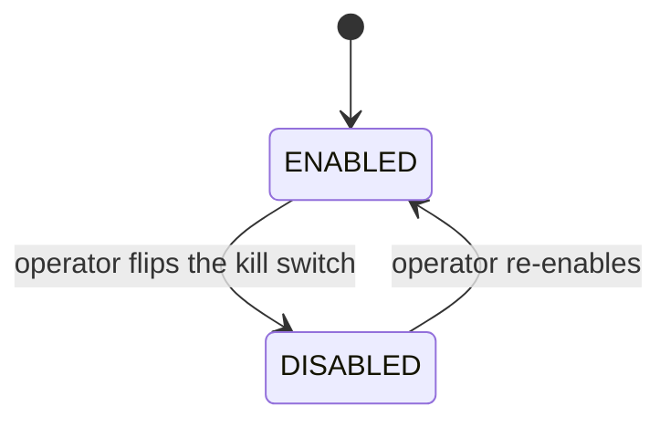
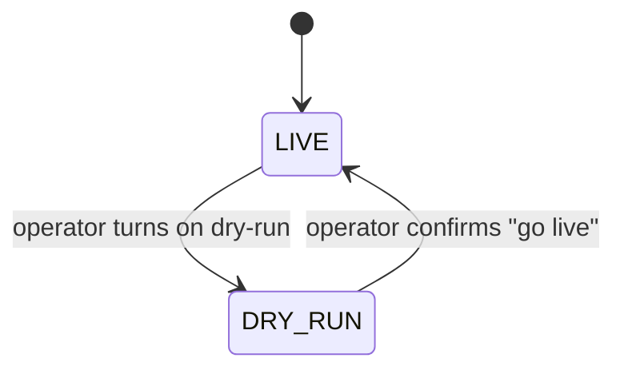

# System Control

> Two runtime safety controls for Baldur's self-healing: a kill switch that makes Baldur's automatic interventions step aside, and a dry-run mode that lets Baldur watch and report what it *would* do without acting. No redeploy, and every process sharing the state store picks up a flip within seconds.

## What is it?

When something goes wrong in production, automation that is normally helpful can occasionally make
an incident worse — retries pile onto an already-overloaded service, automated recovery fights the
human operator who is trying to stabilize things by hand. In those moments you want one thing: a big
red button that stops the automation *now*, without editing config files, redeploying, or restarting
the app.

**System Control** gives you two such runtime controls:

- A **kill switch**: a global on/off flag for Baldur's automation. Flip it off and Baldur steps
  aside wherever dry-run would hold it back: a protected call runs once, with no retry, no
  circuit-breaker recording or refusal and no dead-letter capture, while what you configured on the
  call itself (a fallback, a timeout, an idempotency key, a bulkhead) and a breaker an operator
  blocked stay in force. Flip it back on and Baldur acts again.
- A **dry-run (observe-only) mode**: a rehearsal switch. With dry-run on, Baldur keeps watching
  every protected call, but instead of retrying, recording breaker failures or writing to the
  dead-letter queue, it logs what it holds back. A fallback or a timeout you configured still
  applies.

Both settings are stored — in Redis when your deployment names one, otherwise in a local file — and
every process keeps its own copy, refreshed from the store every few seconds; see
[how far a flip reaches](#flipping-the-controls) below.

## Why it matters

The kill switch is an incident-response tool; dry-run mode is an adoption tool. Together they are
aimed at the two scariest moments of running automation in production: turning it on for the first
time, and turning it off in a hurry.

- **No deploy, no restart.** Flip either control at runtime through the admin console, a REST call,
  or a function call. The process that makes the flip acts on it at once, and every other process
  sharing the store follows within about five seconds.
- **It survives a restart that can read the store.** A restarted process reads the stored state
  before it serves anything, so after a crash or a restart it resumes the last state instead of
  silently re-arming automation. With the file store that holds only while the restarted process
  sees the same state directory: a replacement container with a fresh filesystem starts enabled and
  live.
- **It is shared through the store.** Every process reading the same store — every worker on a host
  with the file store, every server with Redis — applies the same state.
- **A flip says what happened.** A flip the store confirmed answers that it applies everywhere; one
  the store could not confirm answers with HTTP 503, and its `applies` field says where it does
  apply.
- **Flips are attributed.** Disabling from the console or the API requires a reason. Each flip is
  logged with the name of whoever made it, and the status view keeps who last disabled it, why and
  when. On OSS the admin console records that name as `anonymous`, and a durable audit-trail entry
  needs PRO.
- **Try before you trust.** Before you let Baldur act on real traffic, run it in dry-run against
  that same traffic and read back which interventions it held back: each suppressed retry or
  breaker record is logged with the service it applied to, and so is a dead-letter write on a call
  without a retry stage. Dry-run does not simulate the breaker, so that log never says a circuit
  would have opened.

## How it works in Baldur

System Control exposes two **independent** runtime controls — the kill switch and dry-run mode. They
are orthogonal: you can engage the kill switch, run live, or run live but observe-only.

### The kill switch

The kill switch has one piece of observable state (whether Baldur is **enabled** or **disabled**),
and operators move it between the two:

- **ENABLED** is the normal state: Baldur's self-healing runs as usual.
- **DISABLED** is the kill-switch state. Baldur's automatic interventions step aside exactly where
  dry-run holds them back:

| Where it comes from | While the kill switch is off |
|---------------------|------------------------------|
| `protect()`, `aprotect()`, `@protected`, `@retry`, `@dlq_protect` and the preset pipelines (`standard_pipeline()` and the others) | Your function runs once: no retry, no circuit-breaker record or refusal, no dead-letter capture. A `fallback=` still answers a failure, a `timeout=` still cuts a slow call, and an idempotency key and a bulkhead still apply |
| A Celery task that fails | No circuit-breaker record and no dead-letter capture; retries you set on the task in Celery itself still run |
| A breaker that opened automatically before the flip | Stops refusing calls while the switch is off and keeps its stored state; once you re-enable it picks up where it stood, refusing again or, if its recovery wait ran out meanwhile, letting a few trial calls through |
| A breaker an operator blocked (the console's Block, or a forced open in code) | Still refused, on the outbound path and in the web middleware — the Block is your instruction, not an automatic intervention |
| Forcing a breaker open or closed while the switch is off | Refused unless code passes `override_kill_switch=True`; resetting a breaker still goes through |
| Dead-letter replay | Refused with PRO active; on OSS alone, replay does not check the switch |

A few paths are not reached by the kill switch because dry-run does not reach them either: a
tenacity-bridge retry stage, the failures Baldur's web middleware records on a breaker from HTTP
responses (they keep counting and can trip a breaker that refuses once the switch is back on), the
Django connection-pool breaker, the preset pipelines' PRO error-budget guard, and your own direct
calls to `should_allow_request()`. `get_execution_mode()` reports `shadow` while the switch is off.
Emergency load shedding follows the emergency level, not the kill switch.

Unlike dry-run, the kill switch logs nothing per call: an incident at request rate would otherwise
write thousands of lines a second. The process that made the flip logs the flip itself, and every
other process logs `system_control.state_changed` at INFO once, when its copy picks up the change.

| What you observe | When it happens |
|------------------|-----------------|
| Self-healing runs normally | **ENABLED** — the default state |
| Protected calls run once with no retry, breaker record or dead-letter capture, while fallbacks, timeouts and blocked breakers still apply | **DISABLED** — an operator flipped the kill switch |
| A disable is rejected with `reason is required` (HTTP 400) | You disabled from the console or the API without a reason; a `disable()` call in code does not ask for one |
| Baldur comes back up still disabled after a restart | The restarted process read the stored state; with the file store that needs the same state directory |
| Another worker or server still behaves as enabled a few seconds after you disabled | It has not refreshed its copy yet; every process sharing the store applies the flip within about five seconds |

### Dry-run (observe-only) mode

Independently of whether Baldur is enabled, you can put it into **dry-run** mode. In dry-run, Baldur
still sees every protected call but suppresses its healing interventions (automated retries,
dead-letter writes, and the circuit breaker's recording and rejecting) and logs each one it held back
instead. A few things stay live because they answer the call in front of them rather than a failure
history: a `fallback=` still answers a failed call, and Baldur's own `timeout=` still cuts a slow one.

- **LIVE** is the normal state: when Baldur decides to intervene, it actually intervenes.
- **DRY_RUN** is observe-only. Each held-back intervention is logged at INFO as
  `execution_mode.intervention_suppressed`, naming the action (`retry`, `circuit_breaker_record`,
  `dlq_store` and so on) and the service, so you can review the "would-have" timeline before
  trusting it for real. On a call with a retry stage, such as `@dlq_protect`, the timeline stops at
  the held-back retry: the dead-letter write its exhausted retries would have made is not logged.
  On the protected call paths the breaker records nothing while dry-run is on, so that timeline
  shows the failures it would have counted, never a trip; the failures Baldur's web middleware
  records from HTTP responses are the exception and still count. A Block an operator forces stays
  in force during dry-run: a blocked breaker is refused as on a live system.

| What you observe | When it happens |
|------------------|-----------------|
| Baldur acts on its decisions | **LIVE** — the default |
| Baldur makes no retry, breaker record or dead-letter write and logs the ones it held back; fallbacks and timeouts still apply | **DRY_RUN** — observe-only mode is on |
| A "go live" request is rejected unless you confirm it | Leaving dry-run from the console or the API takes an explicit confirmation (`"confirm": true`); `disable_dry_run()` in code does not ask |

### Flipping the controls

Where you flip them, where the state lives, how far a flip reaches, and what a failure looks like:

- **Where you flip them.** The admin console has a System Control row with the current state and
  the enable/disable and dry-run controls. The admin server behind it answers the same actions as
  REST calls, and a Django app also gets them under its own API routes. The console and the admin
  server refuse every flip with a `403` until `BALDUR_ADMIN_UNLOCK=1` is set, so set it before an
  incident rather than during one. In code, `is_baldur_enabled()` and `is_dry_run()` (from
  `baldur.services.system_control`) read the state, and `get_system_control()` returns the object
  whose `enable()`, `disable()`, `enable_dry_run()` and `disable_dry_run()` flip it; each returns a
  `SystemControlChange` whose `persisted` and `applies` say what happened.
- **Where the state is stored.** Set `BALDUR_SYSTEM_CONTROL_BACKEND` to choose. When it is not set,
  Baldur uses **Redis** if a Redis URL is named — `BALDUR_SYSTEM_CONTROL_REDIS_URL`, or
  `BALDUR_REDIS_URL` as an environment variable or a Django setting — and a local **file** store
  otherwise. The file store lives in `BALDUR_SYSTEM_CONTROL_DIR` (default `logs/baldur_state`). A
  relative directory resolves against each process's working directory, so two processes started
  from different directories keep two separate stores: set an absolute path when yours do. The
  status response shows the directory each process resolved. (A memory-only backend exists for
  tests; it does not survive a restart.)
- **Moving to Redis leaves file state behind.** When the backend is chosen because a Redis URL is
  named and the file directory still holds state from before, that state is not copied: the process
  logs one warning naming the directory. Set `BALDUR_SYSTEM_CONTROL_BACKEND=file` to keep using it.
- **Every process keeps its own copy, refreshed every five seconds.** Each process reads the store
  once when Baldur starts (at `init()`, or the first time it reads the switch if it never calls
  `init()`) and then re-reads it every five seconds. After that first read, reading the switch never
  touches the store. A flip reaches the process that made it at once and every other process
  sharing the store within about five seconds, with no restart. A flip reversed within one refresh
  may never be seen by another process at all.
- **An unreachable store slows only a starting process.** If the store cannot be reached, or cannot
  be set up (Redis not answering, a file directory it cannot write), every process keeps acting on
  the last state it read, enabled and live if it never read one. Protected calls do not wait for
  the store, apart from the first calls of a process that is just starting, which can wait out one
  connection attempt. The process logs a `control_state.refresh_failed` warning once per outage,
  and the status response reports `store_reachable: false`, a growing `state_age_seconds` and the
  `last_store_error`; the `baldur_control_state_refreshed_timestamp_seconds` gauge stops advancing.
- **A flip the store could not confirm answers 503.** Every flip response carries `persisted`
  (`true` when the store holds it, `false` when it was not applied there, `null` when the outcome is
  unknown and is decided by the next successful read) and `applies`. A kill switch or a dry-run
  turned on that the store could not confirm is **held in the process that received it**
  (`applies: this_process`): that process acts on it and retries the write on every refresh, and
  the status response reports `persist_dirty: true` until the write lands. It lasts only as long as
  that process — a worker your server recycles drops it — and it is dropped, with a warning, when
  the store shows a change to the switch that process had not seen. A re-enable or a "go live" that
  the store could not confirm is in force nowhere (`applies: none`); in code it raises
  `SystemControlStoreError`. A flip that withdraws a change the same process was still holding says
  so (`withdrew_held_change: true`).

## Configuration

System Control is operated at **runtime**: you flip the kill switch and toggle dry-run from the admin
console, the API, or code. These settings decide where the state is kept and who may flip it; set
them before you need them.

| Env Var | Default | What it controls |
|---------|---------|------------------|
| `BALDUR_ADMIN_UNLOCK` | `false` | Set to `1` so the console and the admin server's REST calls can flip either control; until then they are refused with a `403` |
| `BALDUR_SYSTEM_CONTROL_BACKEND` | not set | Where the switch state is stored: `redis` or `file`. When not set, `redis` if a Redis URL is named (below), otherwise `file` |
| `BALDUR_SYSTEM_CONTROL_REDIS_URL` |  | Redis URL for the switch state; when empty, `BALDUR_REDIS_URL` is used |
| `BALDUR_REDIS_URL` | `redis://localhost:6379/0` | Redis connection used by the Redis store (and by the rest of Baldur); naming it selects the Redis store when no backend is set |
| `BALDUR_SYSTEM_CONTROL_DIR` | `logs/baldur_state` | Directory of the file store; a relative path resolves against each process's working directory |

The complete operator-tunable list lives in the
[environment variables reference](../../reference/env-vars.md).

## See also

- [Getting Started](../../getting-started/index.md) — set it up
- [Circuit Breaker](circuit-breaker.md) — what dry-run holds back on a breaker, and the manual Block/Allow
- [Environment Variables](../../reference/env-vars.md) — the complete operator-tunable list
