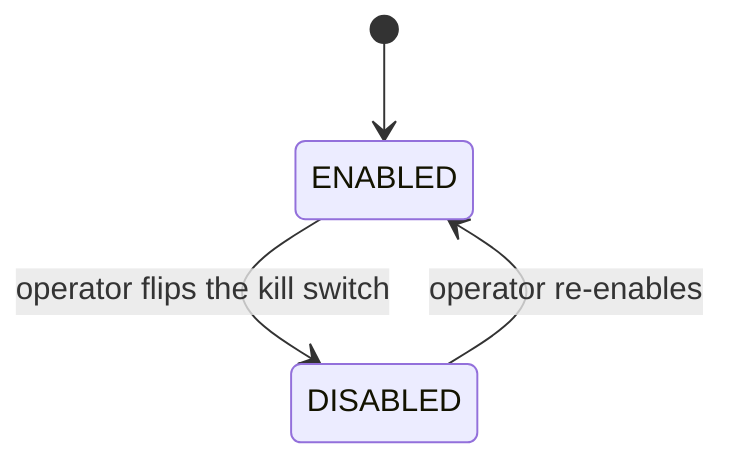
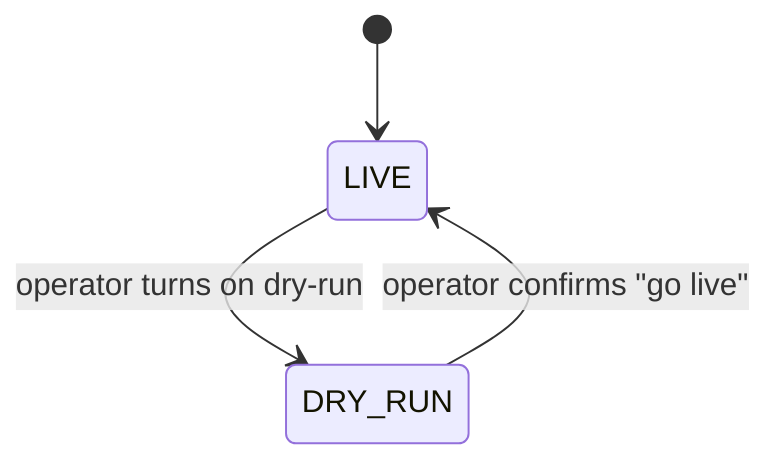

# System Control

> Two runtime safety controls for Baldur's self-healing: a kill switch that pauses the automation wired to check it, and a dry-run mode that lets Baldur watch and report what it *would* do without acting. No redeploy, and a restart that can read the stored state resumes it.

## What is it?

When something goes wrong in production, automation that is normally helpful can occasionally make
an incident worse — retries pile onto an already-overloaded service, automated recovery fights the
human operator who is trying to stabilize things by hand. In those moments you want one thing: a big
red button that stops the automation *now*, without editing config files, redeploying, or restarting
the app.

**System Control** gives you two such runtime controls:

- A **kill switch**: a global on/off flag for Baldur's automation. Flip it off and the parts of
  Baldur that check it hold back; flip it back on and they resume. Not every part checks it: calls
  protected with `protect()` or `@retry` keep retrying, and the section below lists what does stop.
- A **dry-run (observe-only) mode**: a rehearsal switch. With dry-run on, Baldur keeps watching
  every protected call, but instead of retrying, recording breaker failures or writing to the
  dead-letter queue, it logs what it *would have* done. A fallback or a timeout you configured still
  applies.

Both settings are stored (in a local file by default, or in Redis), so a process that restarts picks
them up again. A running process acts on its own copy, which matters as soon as you run more than
one; see [how far a flip reaches](#flipping-the-controls) below.

## Why it matters

The kill switch is an incident-response tool; dry-run mode is an adoption tool. Together they are
aimed at the two scariest moments of running automation in production: turning it on for the first
time, and turning it off in a hurry.

- **No deploy.** Flip either control at runtime through the admin console, a REST call, or a
  function call. The process that makes the flip acts on it at once; other processes pick it up
  later (see below).
- **It survives a restart that can read the store.** A restarted process reads the stored state
  before it acts, so after a crash or a restart it resumes the last state instead of silently
  re-arming automation. With the default file backend that holds only while the restarted process
  sees the same state directory: a replacement container with a fresh filesystem starts enabled and
  live.
- **It can be shared.** With the Redis backend every server reads and writes one stored state, so a
  server that restarts picks up a flip made on another. A running process still acts on the copy it
  last read.
- **Flips are attributed.** Disabling from the console or the API requires a reason. Each flip is
  logged with the name of whoever made it, and the status view keeps who last disabled it, why and
  when. On OSS the admin console records that name as `anonymous`, and a durable audit-trail entry
  needs PRO.
- **Try before you trust.** Before you let Baldur act on real traffic, run it in dry-run against
  that same traffic and read back which interventions it held back: each suppressed retry, breaker
  record or dead-letter write is logged with the service it applied to. Dry-run does not simulate
  the breaker, so that log never says a circuit would have opened.

## How it works in Baldur

System Control exposes two **independent** runtime controls — the kill switch and dry-run mode. They
are orthogonal: you can engage the kill switch, run live, or run live but observe-only.

### The kill switch

The kill switch has one piece of observable state (whether Baldur is **enabled** or **disabled**),
and operators move it between the two:

- **ENABLED** is the normal state: Baldur's self-healing runs as usual.
- **DISABLED** is the kill-switch state. The switch is a flag that parts of Baldur check before they
  act, so what stops depends on where a call or action comes from:

| Where it comes from | While the kill switch is off |
|---------------------|------------------------------|
| A pipeline built with `standard_pipeline()`, or your own `compose()` pipeline with a `KillSwitchGuard` added | Refused before it runs: the pipeline returns a rejected result and your function is not called |
| `protect()`, `@protected`, `aprotect()`, `@retry`, and the web and Celery integrations | Not checked: retries, circuit-breaker trips and dead-letter capture carry on as usual |
| Forcing a breaker open or closed (the console's Block and Allow, or code) | Refused unless code passes `override_kill_switch=True`; resetting a breaker still goes through |
| Dead-letter replay | Refused with PRO active; on OSS alone, replay does not check the switch |

On OSS alone, then, the switch does not pause Baldur's everyday protection: it stops the guarded
pipelines and manual breaker forcing.

| What you observe | When it happens |
|------------------|-----------------|
| Self-healing runs normally | **ENABLED** — the default state |
| Guarded pipelines refuse calls and manual Block/Allow is refused, while `protect()` calls keep retrying | **DISABLED** — an operator flipped the kill switch |
| A disable is rejected with `reason is required` (HTTP 400) | You disabled from the console or the API without a reason; a `disable()` call in code does not ask for one |
| Baldur comes back up still disabled after a restart | The restarted process read the stored state; with the file backend that needs the same state directory |
| Another worker or server still behaves as enabled after you disabled | That process holds the state it last read; it catches up when it restarts, flips a switch itself, or answers a status request |

### Dry-run (observe-only) mode

Independently of whether Baldur is enabled, you can put it into **dry-run** mode. In dry-run, Baldur
still sees every protected call but suppresses its healing interventions (automated retries,
dead-letter writes, and the circuit breaker's recording and rejecting) and logs each one it held back
instead. A few things stay live because they answer the call in front of them rather than a failure
history: a `fallback=` still answers a failed call, and Baldur's own `timeout=` still cuts a slow one.

- **LIVE** is the normal state: when Baldur decides to intervene, it actually intervenes.
- **DRY_RUN** is observe-only. Each held-back intervention is logged at INFO as
  `execution_mode.intervention_suppressed`, naming the action (`retry`, `circuit_breaker_record`,
  `dlq_store` and so on) and the service, so you can review the "would-have" timeline before
  trusting it for real. The breaker records nothing while dry-run is on, so that timeline shows the
  failures it would have counted, never a trip. A manual Block you force during dry-run is accepted
  but does not stop traffic ([Circuit Breaker](circuit-breaker.md) has the details).

| What you observe | When it happens |
|------------------|-----------------|
| Baldur acts on its decisions | **LIVE** — the default |
| Baldur logs each retry, breaker record or dead-letter write it would have made and makes none of them; fallbacks and timeouts still apply | **DRY_RUN** — observe-only mode is on |
| A "go live" request is rejected unless you confirm it | Leaving dry-run from the console or the API takes an explicit confirmation (`"confirm": true`); `disable_dry_run()` in code does not ask |

### Flipping the controls

Where you flip them, where the state lives, and how far a flip reaches:

- **Where you flip them.** The admin console has a System Control row with the current state and
  the enable/disable and dry-run controls. The admin server behind it answers the same actions as
  REST calls, and a Django app also gets them under its own API routes. The console and the admin
  server refuse every flip with a `403` until `BALDUR_ADMIN_UNLOCK=1` is set, so set it before an
  incident rather than during one. In code, `is_baldur_enabled()` and `is_dry_run()` (from
  `baldur.services.system_control`) read the state, and `get_system_control()` returns the object
  whose `enable()`, `disable()`, `enable_dry_run()` and `disable_dry_run()` flip it.
- **The backend decides where the state is stored.** By default it lives in a local file
  (`logs/baldur_state` under the working directory): no extra dependencies, and a restart that sees
  the same directory picks it up. Point Baldur at the **Redis** backend instead and every server
  reads and writes one shared state. (A memory-only backend exists for tests; it does not survive a
  restart.)
- **A running process keeps its own copy.** Each process reads the store the first time it checks
  the switch, and again only when it flips a switch itself or answers a status request. A flip
  therefore reaches the process that made it at once, while the other workers on the same host, and
  other servers, keep their old value until one of those happens. After a flip that has to reach
  every process, restart the application. With PRO active, the governance checks behind PRO's own
  automation re-read the shared store within their cache lifetime.
- **An unreachable store fails open, and slowly.** If the Redis backend cannot be reached when a
  process first uses the switch, Baldur's own checks treat the system as enabled and live, but each
  check tries the connection again first, so every protected call with a retry or a circuit breaker
  waits for a connection attempt until Redis is back. In that state `is_baldur_enabled()` raises
  instead of answering, and neither control can be flipped. If Redis goes away later, each process
  keeps the state it last read. A flip whose write to the store fails applies only to the process
  that made it, and the status response reports `persist_dirty: true` until a retry lands.

## Configuration

System Control is operated at **runtime**, not through environment variables: you flip the kill
switch and toggle dry-run from the admin console, the API, or code. There are no System-Control
variables in the operator-tunable allowlist, but two related settings have to be in place before you
need them.

The console and the admin server refuse every flip until `BALDUR_ADMIN_UNLOCK=1` is set. When you run
more than one server, the Redis-backed backend connects through `BALDUR_REDIS_URL`, the same Redis
routing variable the rest of Baldur uses. Selecting the Redis backend (instead of the default file
backend) and moving the file backend's state directory are advanced settings outside the
operator-tunable list.

| Env Var | Default | What it controls |
|---------|---------|------------------|
| `BALDUR_ADMIN_UNLOCK` | `false` | Set to `1` so the console and the admin server's REST calls can flip either control; until then they are refused with a `403` |
| `BALDUR_REDIS_URL` | `redis://localhost:6379/0` | Redis connection used by the Redis state backend (and by the rest of Baldur) |

The complete operator-tunable list lives in the
[environment variables reference](../../reference/env-vars.md).

## See also

- [Getting Started](../../getting-started/index.md) — set it up
- [Circuit Breaker](circuit-breaker.md) — what dry-run holds back on a breaker, and the manual Block/Allow the kill switch refuses
- [Environment Variables](../../reference/env-vars.md) — the complete operator-tunable list
