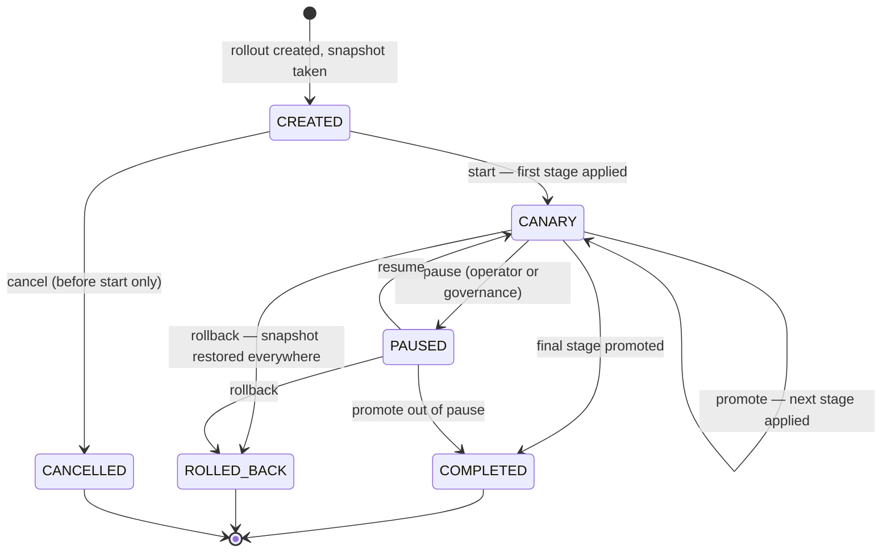

# Canary Recovery

> Rolls a configuration change out under staged supervision, watches it, and keeps the previous
> configuration ready to restore (one call to roll back; automatic when an escalating emergency
> pulls the brake) — so a bad config change becomes a contained incident instead of a fleet-wide
> one.

!!! info "PRO feature"
    Canary Recovery is a PRO-tier feature. It answers the production question every config change
    raises: *"what if this setting is wrong — and how fast can we get back?"*

## What is it?

Coal miners once carried a canary into the mine: the bird reacted to bad air before the miners
did, so trouble was discovered while it was still survivable. A **canary rollout** applies the
same idea to configuration changes: instead of switching the whole fleet to a new value at once,
you apply it to a small group first, watch how that group behaves, and only then widen the
change step by step.

In Baldur, a canary **rollout** is a first-class object: one configuration change (say, lowering
a circuit breaker's failure threshold) plus an ordered list of **stages**, each naming the
clusters it watches and how long to observe them before advancing. Applying it is a
configuration write through the same runtime-config surface a console edit uses, so it takes
effect in-process, without a redeploy — and on a single deployment that write reaches the whole
deployment at once. What the stages ration is not traffic but *supervision*: each stage is a
time-boxed observation window with pass criteria and gates that decide whether the rollout may
advance, stay put, or be taken back. The *recovery* half of the name is the other direction: at
creation time Baldur snapshots the configuration being replaced, and rolling back (manually; in
one panic action for everything at once; automatically when an escalating emergency pulls the
brake; or, if you opt in, when a rollout has sat stalled past a timer) restores that snapshot
through the same surface, again without restarting anything.

!!! note "Not the same as the circuit breaker's recovery"
    The OSS [circuit breaker](../oss/circuit-breaker.md) also *recovers* after
    tripping, but it is not a canary: it admits a bounded number of half-open
    probe calls and reverts to OPEN on the first failure. That acts on traffic
    to a single dependency, not on fleet-wide configuration.
    Canary Recovery here is about rolling a **configuration change** out across
    your fleet and rolling it back. See [OSS vs PRO](../oss-vs-pro.md#a-note-on-naming-canary).

## Why it matters

Configuration changes are the classic "small change, large blast radius" hazard: they skip the
code-review-and-CI pipeline that protects code changes, they take effect immediately, and a bad
value (a timeout too low, a threshold too aggressive) often *looks* fine until production traffic
hits it. Canary Recovery turns that one-shot gamble into a supervised, reversible process:

- **A bad value is caught while someone is still watching.** The change lands inside a
  supervised observation window with pass criteria and a prepared rollback, so a value that
  misbehaves is blocked from advancing and reported while the way back is one call away, instead
  of sitting in production until an unrelated incident review finds it.
- **The way back is prepared before the way forward.** The previous values are captured when the
  rollout is created; recovery never depends on someone remembering what the old setting was at
  3 a.m.
- **Forgotten rollouts do not stay invisible.** A rollout that stalls (promotion blocked, an
  operator pulled away mid-change) is picked up by the watchdog's next scan and alerted with the
  rollout named, and Baldur's self-monitoring escalates it through the health channel as well.
  "A config change is live, its supervision never finished, and nobody remembers why" stops
  being a silent failure mode.
- **Supervision can be delegated, one action at a time.** Promoting a healthy stage and rolling
  back a stalled rollout can each be handed to the watchdog as separate opt-ins that ship off by
  default: you decide how much the machine does on its own.
- **An escalating incident pulls the brake for you.** If Baldur's Emergency Mode climbs while
  rollouts are mid-flight, they are paused automatically — and at the highest severity, rolled
  back — without waiting for an operator to remember the canary among everything else on fire.
- **One emergency lever for the worst day.** A single panic action rolls back *every* active
  rollout at once, when the situation is too murky to triage them one by one.
- **Every step is attributable.** Creation, every promotion, every pause and rollback is recorded
  with who did it and why — including (especially) the cases where someone bypassed a safety
  gate.

## How it works in Baldur

A rollout is created with a **config type** (which configuration this changes), the **new
values**, and its **stages**. Each stage names the clusters it watches, the share of the fleet
they represent, how many minutes to observe (5 by default), and the **pass criteria** the stage
must meet to be considered healthy. At
creation Baldur also records the configuration's current values — the snapshot that rollback
will restore.

Only one rollout can be active per config type: the rollout holds a lock on its config type,
and creating a second rollout for the same config type is rejected, naming the rollout that
holds the lock. The lock is self-clearing, and kept alive only as long as its rollout is: while
a rollout is live, the watchdog (below) renews the lock every five minutes, so supervision that
outlasts the lock timeout no longer loses it, and if the lock did lapse it is re-acquired when
nobody else holds it (never stolen from a holder). Completion and rollback release the lock
explicitly; a lock whose renewing process died still expires on its own after the timeout
(30 minutes by default); and a created-but-never-started rollout — which the watchdog
deliberately does not renew, since it shows no sign of life — is refused at start once its lock
has lapsed, because its rollback snapshot can no longer be trusted. No failure mode leaves a
config type frozen forever.

The rollout then moves through an explicit lifecycle:

Every transition is validated against this state machine — a completed or rolled-back rollout
cannot be restarted, and cancel works only before the first stage is applied. State changes are
saved with optimistic versioning: when two actors race (two operators, or an operator and the
emergency brake), one wins and the other's action fails cleanly with a version conflict
instead of corrupting the rollout.

### The gates in front of every step

Starting, promoting, and resuming a rollout each pass a **governance gate** first, and the gate
is *fail-closed*: if the governance check itself cannot run, the operation is blocked rather
than waved through. For start and promote the gate refuses while the global kill switch is
engaged, while Emergency Mode is at or above its configured severity (level 2 of 3 by default),
or — when the error-budget gate is turned on (`BALDUR_ERROR_BUDGET_GATE_ENABLED=true`, off by
default) — while the error budget is exhausted (judged more strictly for higher-tier
services). Pushing a config change deeper into a fleet that is already in trouble is exactly the
wrong move. Resume and rollback are deliberately gated more
lightly: both re-check only Emergency Mode, skipping the kill-switch and error-budget checks —
rollback is the recovery path, and the way back must stay open on a bad day.

Each gate can be explicitly bypassed for emergencies — but a bypass demands a written reason (at
least 10 characters) and the requester's identity, and it is recorded in the audit trail flagged
for post-incident review. There is no quiet override.

A **chaos guard** protects the rollout's measurements: a cluster that is currently running a
chaos experiment cannot give the canary a readable signal (was that latency spike the new
config, or the injected fault?). By default the guard blocks creation and start only when
*every* target cluster is under an experiment; a partial overlap proceeds with a warning, and
the audit record of the start names which clusters were in conflict. A strict policy that
blocks on any overlap, and an explicit force flag for emergencies, are both available.

### Health validation and promotion

Each stage carries **pass criteria** — the thresholds the canary must stay inside to be
considered healthy. The defaults: error rate at most 5% absolute and at most 1 percentage point
above the baseline, p95 latency within +50 ms, and p99 within +20%, measured over a 5-minute
window with at least 100 requests — too little traffic means "not enough evidence", not "pass",
so a quiet canary blocks promotion instead of waving the change through.

The criteria can also watch the **error budget**, but that check ships OFF by default
(`BALDUR_ERROR_BUDGET_ENABLED`): out of the box it honestly skips — and logs that it did —
rather than reading empty data as a healthy pass. Turned on, it blocks promotion while the
canary is burning error budget faster than 1.2× its sustainable rate or has less than 10% of the
budget left. It is deliberately fail-open — an unavailable budget signal skips the check rather
than freezing the rollout — and only an explicitly forced, audited promotion bypasses it; the
governance gate above still enforces its own (separately enabled) budget stop.

Criteria tighten by **service tier**, and the tier is resolved automatically: each config type
maps to a service tier through configuration, an unmapped config type defaults to `standard`,
and an explicit tier on the promote call overrides both. The tier's floors then clamp the
stage's criteria — a 3% error-rate ceiling for a `critical` service versus 5% for `standard`
and 10% for `non_essential`, and a `critical` canary may drain budget no faster than 0.8×
sustainable, keeping at least 15% in reserve. The floor always wins over a looser per-stage
value: you can make a stage stricter than its tier, never more lenient — and when a floor
actually tightens a stage, the clamped fields are logged so the stricter verdict is explainable.

Metric-gated promotion compares the canary clusters against the stable fleet over the evaluation
window and blocks promotion when the criteria fail. It is an opt-in gate: it comes online once a
time-series metrics source is connected — point `BALDUR_PROMETHEUS_URL` at your Prometheus (or any
PromQL-compatible backend) and switch live evaluation on — until then,
promotion is governed by stage duration, the governance gate, and — when Error Budget is enabled —
the error-budget drain check above (the per-rollout metrics view fills in from the same source).
A blocked or unhealthy rollout does not advance, which is where the watchdog below picks it up.

### The watchdog

Out of the box, promotion stays a human-driven action: an operator, or your own automation
calling the same API, advances the rollout stage by stage, and every promote re-passes the
gates above. What Baldur runs on its own is the **canary watchdog**. On any install running
with a PRO license it is scheduled automatically (on Celery deployments off the beat schedule,
elsewhere off the in-process scheduler), and its routine work is deliberately non-mutating:
it keeps the rollout machinery honest without touching any rollout's state.

- **Lock keeping.** Every five minutes, each live rollout's config-type lock is renewed (the
  self-clearing behavior described above). A renewal that finds the lock in a *different*
  rollout's hands raises a lock-conflict alert instead of silently absorbing it.
- **Stall alerting.** A rollout is judged stalled when it sits in the canary state past twice
  its stage's observation time, paused past 30 minutes (unless governance or the error budget
  paused it — a legitimate wait, not a stall), or stuck mid-promotion past five minutes. A
  stalled rollout produces a delivered Slack alert, routed through Baldur's notification
  channels, naming the rollout, its config type, and how long it has been stuck; the alert is
  deduplicated per rollout inside a cooldown window, so a stall alerts once rather than on
  every scan. Baldur's self-monitoring applies the same stall definition and escalates stuck
  rollouts through the health channel, so the two views cannot disagree.
- **Metric collection.** Each active rollout's metrics are polled from the connected metrics
  source on a two-minute cadence, the same numbers the per-rollout view serves.

One wiring requirement on Celery deployments: the watchdog's jobs run inside your workers, and
the canary service they drive is registered by `baldur.init()` — a worker process that never
called it skips the jobs with a logged warning naming the fix, rather than failing repeatedly.
Individual watchdog jobs can be switched off with the scheduler's disabled-jobs list in the
[environment-variables reference](../../reference/env-vars.md).

### Opt-in automatic actions

The watchdog's two *mutating* actions ship off by default, as separate opt-ins, so scheduling
the watchdog changes nothing on its own:

- **Automatic promotion** (`BALDUR_CANARY_WATCHDOG_ENABLE_AUTO_PROMOTE`). Opting in is a
  two-key action: the flag enables the machinery, and only stages created with auto-promotion
  marked participate. Once such a stage's observation window has elapsed (counted from stage
  entry), the watchdog promotes through exactly the gates a manual promote passes: the
  fail-closed governance gate and the health validation above. While governance blocks, the
  watchdog stands down for that sweep, and the block is counted in Prometheus with its reason,
  alongside a gauge of the rollouts waiting behind it. Racing supervisors cannot double-advance
  a rollout: a promotion attempted from a stale view (another process or an operator already
  advanced it) is refused, so each observed window promotes at most one stage.
- **Automatic rollback** (`BALDUR_CANARY_WATCHDOG_ENABLE_AUTO_ROLLBACK`). A rollout the
  watchdog has judged stalled, and that stays stuck past the rollback timer
  (`BALDUR_CANARY_WATCHDOG_AUTO_ROLLBACK_AFTER_MINUTES`, 60 minutes by default), is rolled back
  automatically: the snapshot is restored, the action is audited under the system's own
  identity as a flagged governance bypass (the same no-quiet-override rule the emergency brake
  follows), and an alert reports the executed rollback. The two thresholds compose: the stall
  verdict comes first (twice the stage's observation time for a canary-state rollout), then the
  timer — so for a long stage, rollback waits for the stall verdict, not just the timer.

!!! warning "Enable the auto-actions on a clean slate"
    Before opting in, list the rollouts that are already stalled and resolve them: the first
    scan alerts once per still-stalled rollout, and with automatic rollback enabled, any of
    them stuck past the rollback timer is rolled back on the next scan — a surprise if that
    rollout was being left in place deliberately.

### The emergency brake

The governance gate stops *new* operations during an emergency — but a rollout already in
flight has its new configuration applied to live clusters, and it should not keep sitting
there while the fleet burns. A background safety watch re-reads the Emergency Mode level
continuously — reacting within seconds of a level change in the common case, and never later
than its polling interval (30 seconds by default) — and applies an escalation ladder to every
in-flight rollout:

- **Level 1:** a warning is logged; rollouts keep running.
- **Level 2:** every in-flight rollout is **paused** automatically, recorded as paused by the
  safety interlock (not an operator) with the emergency as the reason.
- **Level 3:** every in-flight rollout is **rolled back** immediately: the snapshot is
  restored, and the action is audited under the system's own identity, flagged as a governance
  bypass with its reason, the same no-quiet-override rule that applies to humans.

A rollout paused by the brake does not resume on its own when the emergency clears — resuming
stays an explicit action, re-checked against Emergency Mode. And the stall watch keeps
counting: an emergency pause that lingers past 30 minutes is reported as stuck, so a
prolonged emergency pause is surfaced rather than forgotten.

If the emergency state itself cannot be read, new starts and promotions are already blocked —
the gate is fail-closed — and for in-flight rollouts the watch raises a critical alert after
three consecutive failed reads (configurable) and keeps trying. Deployments that prefer the
pessimistic posture can instead configure sustained blindness to be treated as the worst case
and roll back.

### The emergency lever

`POST /canary/panic-rollback` rolls back **all** active rollouts in one call, reporting
per-rollout success so a partial failure is visible immediately. It exists for the day when
something is clearly wrong fleet-wide and detangling which of three in-flight rollouts caused it
is a luxury you don't have.

### What you see

| What you observe | When it happens |
|------------------|-----------------|
| Creating a second rollout for a config type is rejected, naming the current holder | one active rollout per config type, enforced by lock |
| Start or promote is refused with a governance message | kill switch engaged, Emergency Mode at level 2+, or the error budget exhausted (only with the error-budget gate enabled) — or the check itself failed (fail-closed) |
| Start is refused because of running chaos experiments | experiments cover every target cluster; a partial overlap proceeds instead, with the conflicted clusters recorded in the audit trail |
| A stall alert arrives naming the rollout, and self-monitoring reports it as stuck | it sat in the canary state past twice its stage's observation time, paused past 30 minutes (a governance or error-budget pause is a legitimate wait, not a stall), or stuck mid-promotion past five minutes |
| A lock-conflict alert names a rollout whose config-type lock is now held elsewhere | the watchdog's five-minute renewal found a different owner on the lock |
| A stage advances with no operator action | automatic promotion is opted in, the stage was created marked for it, its observation window elapsed, and the gates passed |
| A stalled rollout rolls back on its own, audited as the system's flagged bypass | automatic rollback is opted in and the rollout stayed stuck past the rollback timer |
| The watchdog's jobs skip with a warning naming `baldur.init()` | the worker process never called it, so the canary service the jobs need was never registered |
| A promotion is validated against stricter limits than the stage declared, with the tightened fields logged | the service's tier floor — resolved automatically from its config type — clamped the stage's criteria |
| Every in-flight rollout pauses at once, marked paused by the safety interlock | Emergency Mode escalated to level 2 |
| Every in-flight rollout rolls back, audited under the system's own identity as a flagged bypass | Emergency Mode escalated to level 3 |
| The previous configuration is back in effect | manual rollback, panic rollback, the emergency brake at Level 3, or the watchdog's opt-in automatic rollback |
| An action fails with a version conflict | a concurrent actor changed the rollout first — no state corruption |
| A bypass appears in the audit trail with reason and requester | someone bypassed a governance gate; a forced start during chaos is likewise recorded, with the clusters involved |
| Completed and rolled-back rollouts appear in the daily report | both finishing outcomes — completion and rollback — are pushed to the ops summary |

The full rollout state — stage list, current stage, progress percentage, affected clusters,
the canary's error rates and latency before vs. after — is served by the admin server: list and
detail views, per-rollout metrics, and history are readable with the viewer role, while every
mutating action (create, start, promote, rollback, pause, resume, cancel, panic) requires the
admin role. The Web Console shows the same picture in its **Canary Rollouts** panel. Lifecycle
transitions are published on Baldur's event bus and counted in Prometheus (starts, stage
advances, completions, rollbacks, every governance bypass, and — with automatic promotion
opted in — promotions blocked by governance, labeled with the block reason, plus a gauge of
rollouts pending behind the block), and every lifecycle
action lands in the audit trail with actor and reason. Finished rollouts are retained for 7 days for review.

## Configuration

| Env Var | Default | What it controls |
|---------|---------|------------------|
| `BALDUR_LICENSE_KEY` |  | PRO entitlement (unset in OSS mode) — Canary Recovery activates when Baldur initializes with a valid license |
| `BALDUR_REDIS_URL` | `redis://localhost:6379/0` | where rollout state, the per-config-type lock, and the active-rollout set are stored |
| `BALDUR_PROMETHEUS_URL` |  | metrics source for live evaluation — unset leaves the metric gate dormant; set it to your Prometheus (or PromQL-compatible) endpoint and `baldur.init()` registers the provider automatically |
| `BALDUR_PROMETHEUS_METRIC_NAMING` | `baldur` | query-template naming preset: `baldur` (built-in `baldur_http_*` RED metrics) or `otel` (OpenTelemetry HTTP semantic conventions). Full connection/scoping knobs (`BALDUR_PROMETHEUS_*`) are in the env-vars reference |
| `BALDUR_CANARY_WATCHDOG_ENABLE_AUTO_PROMOTE` | `false` | opt in to automatic stage promotion (only stages created with auto-promotion marked participate) |
| `BALDUR_CANARY_WATCHDOG_ENABLE_AUTO_ROLLBACK` | `false` | opt in to automatic rollback of stalled rollouts |
| `BALDUR_CANARY_WATCHDOG_AUTO_ROLLBACK_AFTER_MINUTES` | `60` | how long a stalled rollout stays stuck before the opt-in automatic rollback fires |

Everything that shapes an individual rollout — stages, clusters, observation times,
pass criteria — is part of the rollout you create, in the API call, not an
environment variable. The framework-level tuning behind the defaults (the stall thresholds
themselves, the emergency brake's polling interval and failure posture, the config-type→service-tier
mapping, governance severity levels, retention) is advanced / internal: it is not part of the
public operator-tunable environment-variable allowlist yet.

## See also

- [Emergency Mode](emergency-mode.md) — the severity levels the governance gate honors before letting a rollout advance
- [Audit Trail](audit.md) — where every rollout action, and every gate bypass, is recorded
- [Canary API Reference](../../reference/pro/canary.md) — full options and signatures
- [Admin REST API](../../reference/api-admin.md) — the rollout control surface
- [Getting Started](../../getting-started/index.md) — set Baldur up
- [Environment Variables](../../reference/env-vars.md) — the complete operator-tunable list
