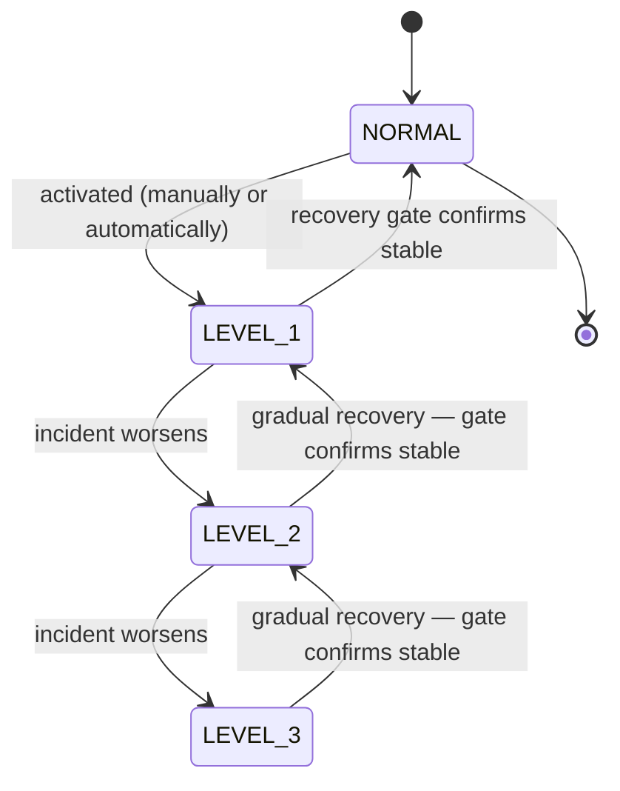

# Emergency Mode

> When your system is under stress, Emergency Mode sheds non-critical traffic in deliberate steps to protect your core operations — and refuses to stand down until the system has actually stabilized.

!!! info "PRO feature"
    Emergency Mode is a PRO-tier feature. It answers the production question that follows every major incident: *"how do I keep the critical path alive when everything is overloaded — and how do I avoid making it worse by recovering too soon?"*

## What is it?

When a service comes under severe stress (a traffic spike, a failing dependency, an overloaded database), the instinct is to keep serving everything and hope it holds. Usually it doesn't: the system tries to do all of its work at once, runs out of headroom, and *everything* degrades, including the requests that matter most.

**Graceful degradation** is the discipline of giving up the right things first. Instead of failing all at once, the system deliberately drops its least important work so the most important work keeps running — like hospital triage that postpones routine check-ups to keep the emergency room open. **Emergency Mode** is Baldur's name for a managed, stepwise version of this: it sorts your traffic into tiers and progressively sheds the lower tiers as the situation worsens, then eases back only when it is safe to do so.

## Why it matters

Without a managed degradation path, an overload is all-or-nothing: either you serve everything (and the critical path drowns along with the rest) or you take the whole service down. Both are bad outcomes during an incident, exactly when you can least afford them.

Emergency Mode replaces that with a deliberate, observable response:

- **Protect the critical path under load.** Non-essential and lower-priority traffic is shed first, preserving capacity for the requests that actually matter (payments, auth, core reads) instead of letting them compete with everything else.
- **Respond in proportion to severity.** Four levels mean a minor incident sheds only the non-essential tier, while a severe one clamps down hard. You are not forced to choose between "do nothing" and "pull the plug."
- **Recover safely, not optimistically.** The most dangerous moment in an incident is the recovery: lift the restrictions too early, the still-fragile system gets slammed again, and you are back where you started, often worse. Emergency Mode gates recovery behind a live stability check and offers a gradual step-down, so you don't trade one outage for two.
- **Every change is attributable.** Activations, escalations, and releases record who (or what)
  triggered them, why, and when: the status view carries the current activation's actor and reason,
  the history view lists the activations and releases that the process serving it has recorded since
  it started, and the full attributed trail lands in the audit log, so the incident timeline is
  reconstructable afterward.
- **Hands-off or hands-on.** It can fire automatically when Baldur detects a serious incident, or be driven manually by an operator from the admin console or REST API. Either way the same levels apply, and a release goes through the same recovery gate.

## How it works in Baldur

Emergency Mode moves your service through four levels. NORMAL is business-as-usual; each higher
level sheds more load by giving every request an **admission allowance** based on its traffic class
— **critical**, **standard**, or **non-essential**. An allowance of *full* admits the whole class; a
fractional allowance admits that share and turns the rest away (the shed requests are rejected with
a `503` and a `Retry-After` header, not queued); *blocked* refuses the class outright. This is
classic load shedding, applied per tier so the shedding always falls on the least important work
first. Per-request enforcement runs in Baldur's HTTP middleware on Django, Flask and FastAPI. On
Django it is one of the middlewares that `configure_baldur()` installs when you call it from your
settings module; the quickstart's `INSTALLED_APPS`-only setup does not add it, so without that call
an emergency level changes nothing about HTTP admission. On Flask `init_flask(app)` installs it, and
on FastAPI it runs inside `BaldurMiddleware`. A route you have not mapped to a tier counts as
non-essential, so LEVEL_1 already turns away every unmapped route: map the routes you need to keep
in the tier registry before you rely on a level (a request from a private network address counts as
critical by default). Where the middleware does not run, or with shedding switched off, the
emergency level still steers the rest of the system, such as batch replays halting, notification
escalation, and throttle tightening.

| Level | Non-essential | Standard | Critical | Meaning |
|-------|---------------|----------|----------|---------|
| **NORMAL** | full | full | full | Normal operation — all traffic allowed |
| **LEVEL_1** | blocked | full | full | Minor incident — non-essential work is dropped |
| **LEVEL_2** | blocked | 10% | full | Moderate incident — standard traffic throttled, critical path intact |
| **LEVEL_3** | blocked | blocked | 50% | Severe incident — only the critical path runs, and even it is throttled; every circuit breaker holds its state |

These are the default allowances; the per-level policy can be overridden through advanced configuration, though the defaults are production-safe.

Levels escalate as an incident worsens and step back down through a **recovery gate** as it clears:

An operator can also activate directly at any level; you don't have to climb through them. That
includes a level below the current one: a lower trigger takes effect at once, without the recovery
gate, so treat it like a forced release. When necessary, an operator can also force a release
straight through the gate.

**Activation** happens one of two ways:

- **Automatic.** When Baldur detects a serious enough problem, it activates emergency mode itself,
  picking a level that matches the severity and attaching a default expiry (thirty minutes unless
  configured otherwise) so a transient blip self-clears without anyone watching the clock. An
  automatic activation never *lowers* or repeats the level the shared state store holds (it
  decides on the stored level, not on the worker's own copy), so it only escalates from there. One
  of these detectors watches the circuit breakers as a fleet: a scheduled
  check reads every breaker's state from the shared store every ten seconds, and when at least 70%
  of the registered breakers (three or more of them) are OPEN on two consecutive checks, it declares
  LEVEL_3 on the grounds that this is no longer one dependency failing but the infrastructure
  collapsing. This lane is off by default and is switched on through an advanced setting that is not
  on the public tunable list yet; it judges the fleet from the shared breaker store (Redis on a
  multi-process deployment), and a store it cannot read declares nothing and logs a warning. It also
  stands aside while a gradual recovery is running, and after a Level 3 ends it waits out the
  stabilization period before declaring again, so breakers get time to leave OPEN. If a gradual
  recovery stops at LEVEL_2 with the dependencies still down, the detector re-declares LEVEL_3 once
  the stabilization period has passed — a periodic fleet probe until they recover.
- **Manual.** An operator activates a chosen level from the admin console or REST API, giving a reason and optionally an auto-expiry duration; without a duration it stays active until released.

**Recovery is gated.** This is the mechanism behind the "recover safely" guarantee. Standing down
from emergency mode is not automatic just because someone asked for it. Before a release or a
recovery step lowers the level, the recovery gate **reads live health metrics (CPU and the error
rate of the protected calls the process serving the request has seen) and compares them against safe
thresholds**. It refuses the exit while either metric is still above its threshold, and if it cannot
read the metrics at all it **fails closed**: it treats the system as not-yet-recovered and keeps
emergency mode on, rather than guessing that things are fine. In that error rate a dependency whose
circuit breaker is open counts as failing for as long as it stays open, in whichever worker it
tripped (the calls the open breaker refuses are failed calls), and a gate that cannot read the
shared breaker store treats the error rate as unmeasured and refuses; a process that has seen no
protected calls, with no breaker open anywhere, reads the rate as zero. From LEVEL_3 the first step
down is the one that lets held breakers probe again, so that step compares CPU and the error rate
over the dependencies the hold does not cover, and names the ones it left out; the next step
measures them for real. If no call has reached a dependency outside the hold in the process running
the walk, that step has nothing to compare and the walk stops at LEVEL_3; a forced release is then
the way out. A release refused on the error rate names the open breakers, and at LEVEL_3 also the
two ways out: the gradual recovery, or a force-close of each breaker. One limitation to know: below
LEVEL_3 the level still sheds traffic, and a dependency that only shed requests reach gets no trial
call, so its breaker stays open and keeps counting as failing — the gradual recovery stops at that
level and names the breaker. To continue, let traffic reach it (raise its tier) or force-close it,
then start the gradual recovery again; a force-close takes effect for the gate in the worker that
received it, and another worker learns of it only once the level has dropped below LEVEL_3 and a
call reaches that name there, so on a multi-worker deployment raise the tier or use force.

A plain release that passes the gate returns the service to NORMAL in one move. When you would
rather ease off, start a **gradual recovery** instead: the level steps down one notch at a time, and
before each step the gate waits out a stabilization window and re-checks the metrics. If a
mid-recovery re-check fails, the descent **stops and holds the current level** rather than
continuing down or snapping straight to NORMAL, so a system that destabilizes halfway through
recovery keeps its remaining protection instead of shedding it at the worst moment. The walk runs in
the process that received the request, and a stop request served by any worker ends it. An
activation made while it runs ends the walk instead of being walked back down. If the walking
process exits without a graceful shutdown, a start the store could not confirm turns out to have
landed (no process walks it), or a step's write ends with an outcome the store could not confirm,
the stored state still says a recovery is running, and a new one is refused until you stop the
recovery. An operator who must exit regardless can **force** the release, deliberately bypassing
the gate. One boundary to know: an
expiry is a hard deadline. When a timed activation lapses, the mode deactivates on the clock without
consulting the recovery gate, so give an activation a duration only when a timed self-clear is
acceptable; leave the duration unset to keep the gate in charge of the exit.

| What you observe | When it happens |
|------------------|-----------------|
| Non-essential, then standard, then part of critical traffic is shed | the level rises from NORMAL toward LEVEL_3 |
| Emergency mode turns on by itself, at a severity-matched level, with an expiry | Baldur auto-detects a serious incident |
| You activate or release a level, with the reason recorded | a manual trigger or release from the admin console or REST API |
| A release is refused until the metrics are back within bounds, and the refusal names the open breakers and the gated exit | the recovery gate blocks a premature exit (force to override) |
| Restrictions ease one level at a time, and stop where they are if the system wobbles | you start a gradual recovery and each step passes the gate |
| The current activation's actor, reason, and expiry, plus the activations and releases the serving process has recorded, with their timestamps | you read the status and history views (the attributed who-and-why for every past change is in the audit log) |
| Automated self-healing actions are held back by the governance gate, and the hold follows the level back down once it drops below the gate's threshold | the level change reaches the gate's emergency check |
| Every circuit breaker stops changing state on its own: nothing trips, probes, or closes until the level drops, while your manual forces still land | LEVEL_3 is active (from any trigger, automatic or manual) |

A level change does not stay inside Emergency Mode. Every transition, whether a manual or automatic
activation, a release, an expiry, or a single step of a gradual recovery, is announced to the rest
of Baldur as an event, and the event reaches the consumers named above (throttle tightening,
notification escalation) in the process that made the change, and in the others only when the event
bus is Redis-backed. The level itself reaches every
process through the state store: each process keeps its own copy of the emergency state and re-reads
the store on the emergency interval (thirty seconds by default), and once that copy is loaded
(`baldur.init()` loads it at startup), reading the level never touches the store. The store is the
one [System Control](../oss/system-control.md) uses: by default Redis when your deployment names
one, otherwise a local file, which only processes reading the same state directory share. Within
that reach, a level change made on one server takes effect everywhere within one interval — HTTP
shedding in every worker, and the [Governance](governance.md) gate, which holds
automated self-healing actions back while the system sits at or above a configured emergency level
(LEVEL_2 by default) and reads that copy directly. **A change the store could not confirm is in force
nowhere**: an activation, release, recovery start or stop from the console or the REST API answers
`503` with `persisted: false`, and an automatic activation logs a warning instead of taking effect;
when the outcome is unknown (`persisted: null` on the API, an outcome-unknown warning for an
automatic activation), the next successful read of the store decides it, and a change that did land
then takes effect everywhere. If the store
cannot be read, each process keeps the level it last read, and the status view reports
`store_reachable: false` with the copy's age.

LEVEL_3 has one more consumer, one that reads the level directly instead of listening for the
announcement: the [circuit breakers](../oss/circuit-breaker.md). While the level sits at LEVEL_3,
every breaker holds whatever state it is in. A CLOSED breaker keeps passing calls as its failure
count crosses the threshold, an OPEN one keeps rejecting after its recovery timeout has run out, and
a HALF_OPEN one lets no trial call through. Only Baldur's automatic decisions are held; an
operator's force-open or force-close lands as it would at any other time, so **force-close is the
exit for a single dependency while the lockdown lasts** — it takes effect for the recovery gate in
the worker that receives it; another worker learns of it only once the level has dropped and a call
reaches that name there, so while LEVEL_3 holds, that worker's gate keeps counting the breaker — and
a gradual recovery is the exit for the level: its first step, to LEVEL_2, lifts the hold in every
worker once the gate lets it through, and the walk then measures what the breakers report. The
reasoning is the same as the recovery gate's: in a fleet-wide incident, dozens of breakers probing
and flipping on their own add load and noise exactly when the system should stand still. Each
breaker reads the level through the same per-process copy described above, so a worker can still
decide a transition in the seconds before it learns of LEVEL_3; what the hold guarantees
is that no new automatic decision is taken once it knows. A worker that cannot reach the state store
keeps the last level it read: it goes on holding if it had learned of LEVEL_3, and stays unheld if
it had not. Failures are still counted during the hold, so once the level drops, the next failure
trips a breaker whose count is already over the threshold.

Emergency Mode also respects Baldur's global [System Control](../oss/system-control.md) kill switch: automatic activation is suppressed while the kill switch is engaged, and a manual activation must explicitly override it — an audited action.

## Configuration

| Env Var | Default | What it controls |
|---------|---------|------------------|
| `BALDUR_EMERGENCY_MODE_SHEDDING_ENABLED` | `true` | whether an active level sheds HTTP requests on Django, Flask and FastAPI; `false` keeps the level steering everything except HTTP admission. It does nothing without an active PRO licence |
| `BALDUR_EMERGENCY_MODE_SHED_RETRY_AFTER_SECONDS` | `30` | the `Retry-After` value, in seconds, on the `503` a shed request receives |

Everything else is operated through the **admin REST API / Web Console**; there is no enable flag
for the mode itself. An ADMIN-level operator triggers a level, releases it, starts or stops a
gradual recovery, and adjusts the recovery-gate thresholds **at runtime** through the admin
endpoints; VIEWER-level access can read the current state, the level definitions, and the change
history. On the built-in admin server behind the Web Console, each of those ADMIN actions also
needs `BALDUR_ADMIN_UNLOCK=1` in the process's environment; without it they answer `403`.

Its internal tuning thresholds — the recovery stabilization window, the CPU and error-rate limits
the gate enforces, the level-decision thresholds — ship with production-safe defaults and are
**advanced / internal**: they are not part of the public operator-tunable environment-variable
allowlist yet. Of these, the recovery-gate parameters (the stabilization window, the CPU and
error-rate limits, the step delays, the rollback behavior, and the switch that turns the metrics
check off) are adjustable at runtime through the admin config endpoint. A change there applies in
the process that serves the call until that process restarts; other workers keep their own settings.
The rules each automatic trigger uses to pick its level remain internal defaults.

Emergency Mode ships with the PRO tier. The admin endpoints work once PRO is active; without it,
every call that reads or changes the emergency state answers with a server error instead, and the
Web Console hides the Emergency panel.

## See also

- [System Control](../oss/system-control.md) — the global kill switch Emergency Mode honors
- [Governance](governance.md) — the pre-action gate that holds automation back while an emergency level is active
- [Circuit Breaker](../oss/circuit-breaker.md) — the breakers that hold their state at LEVEL_3, and the fleet-wide OPEN ratio that can declare it
- [Admin REST API](../../reference/api-admin.md) — the admin surface that drives Emergency Mode
- [Emergency Mode API Reference](../../reference/pro/emergency-mode.md) — full options and signatures
- [Getting Started](../../getting-started/index.md) — set Baldur up
- [Environment Variables](../../reference/env-vars.md) — the complete operator-tunable list
