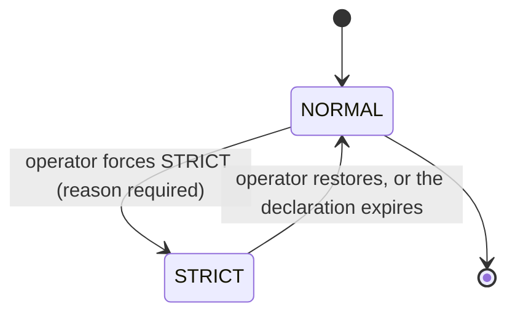

# Governance

> A safety gate that Baldur's automated recovery actions pass before they run — so they hold back at the worst possible moment, and the audit trail shows why.

!!! info "PRO feature"
    Governance is a PRO-tier feature. It answers the question that keeps people from trusting automation in production: *"if I let Baldur take recovery actions on its own, how do I stop it during an incident — and how do I show an auditor exactly why each action was allowed or blocked?"*

## What is it?

Self-healing automation is powerful precisely because it acts without waiting for a human. That is also what makes it dangerous: the moment you most want automation to *stop* (a major incident, a botched deploy, an exhausted error budget) is exactly when un-governed automation keeps firing, sometimes making the situation worse.

**Governance** is Baldur's answer to that. It is a *pre-flight checklist* that runs before an automated recovery action such as a dead-letter replay, a canary step or a runbook: a small, fixed set of safety questions ("is the system globally enabled? is it at a raised emergency level? is the error budget healthy?") that must all pass before the action is allowed. If any answer says "not now," the action is blocked and the reason is recorded. A circuit breaker's own state changes and a call's retries do not pass through it. Think of it as the brake pedal and the flight recorder for your automation, in one layer.

## Why it matters

Without a governance layer, automated recovery is all-or-nothing: either it is running (and you have no single place to halt it) or you have disabled it entirely (and lost the protection). Neither is acceptable in production, and neither survives a compliance review, which wants to see *who could stop automation, how, and what the record shows.*

Governance replaces that with a deliberate, observable control surface:

- **One brake for automation.** A global kill switch and a raised emergency level stop the self-healing actions that check them at this gate, in every process that shares Baldur's state store, within seconds of the flip; you are never hunting for individual toggles during an incident. The kill switch also makes Baldur's own protected calls step aside — see [System Control](../oss/system-control.md) for what that covers.
- **Safety guards that match the moment.** Automation is held back when the system is already at a raised emergency level or, with the error-budget gate switched on, when the error budget is critically low and the right move is to force a human into the loop — not to let robots keep retrying.
- **An answer to "why didn't this run?"** Blocks are written to the audit trail with their reason, so the incident timeline is reconstructable: *"the replay was blocked because the system was in a LEVEL_2 emergency at 14:03."*
- **A controlled escape hatch.** When an operator genuinely must override the guards, a **Break Glass** bypass waves every action through the gate, but the bypass itself is recorded and flagged for a mandatory post-incident review, so the exception is never silent.
- **Dual control for sensitive changes.** A risky governance change can be filed as a request that a second admin must approve (a four-eyes check), so the decision carries two names.

## How it works in Baldur

### The pre-action gate

Before a self-healing action runs, governance evaluates a **fixed sequence of safety checks** and stops at the **first one that fails**. The check that fails determines the block reason the caller sees:

| Order | Check | Blocks when | Reason reported |
|-------|-------|-------------|-----------------|
| 0 | **Break Glass** | engaged | *bypass* — all checks below are skipped |
| 1 | **Kill switch** | Baldur is globally disabled via [System Control](../oss/system-control.md) | `kill_switch` |
| 2 | **Emergency level** | the system is at an emergency level at or above the action's minimum | `emergency_mode` |
| 3 | **Error budget** | the error-budget gate is switched on (it is off by default) and the budget has dropped below its threshold | `error_budget` |

Each action picks which of these checks it runs and the emergency level it yields to. A pending configuration change, for one, skips the kill switch so an operator can still push a fix through.

If every check passes, the action proceeds. If one fails, the caller receives a structured result — `allowed = false`, the machine-readable reason above, and a human-readable message (e.g. *"Kill Switch is active: baldur system is disabled"*) — and, by default, the block is written to the audit trail.

A developer applies the gate without writing the checks by hand. The simplest form is a decorator on the automation method:

```python
@require_governance(check_error_budget=True)
def replay_dead_letters(self):
    ...  # runs only if every governance check passes
```

Narrower decorators — `require_system_enabled`, `require_not_emergency`, `require_error_budget` — each guard a single dimension (Break Glass does not bypass them), and a service class can inherit `GovernanceCheckMixin` to call `check_governance()` or `is_automation_allowed()` inline when it needs the result rather than an all-or-nothing wrapper.

One thing the gate does *not* do: it decides **whether** an action may run now, not whether the action is safe to run twice. Before you put automation like a dead-letter replay behind it, [make the replayed operation idempotent or give it a dedup guard](../oss/idempotency.md) — governance will happily allow a duplicate side effect through a passing check.

### Fail-open by design

Governance is a guard, and a guard must never become the outage. If a check **cannot be evaluated** (its backing subsystem is unreachable or errors out), governance **fails open**: it allows the action rather than blocking it, and raises a **FAILSAFE alert** (rate-limited so it cannot storm) saying that automation is running *without* that guard. Out of the box that alert is printed to the process's standard output as an `[ALERT]` line; it is not sent to Slack or a pager, so it reaches an operator only through whatever watches that output. The default stance is explicit: a broken governance check degrades to "unprotected but running," not to "everything blocked."

So that the gate stays cheap on a hot path, no check reads the shared store itself. The kill-switch and emergency-level checks read this process's copy of that state, which every process re-reads from the store on its own schedule — every five seconds for the kill switch, every emergency interval (thirty seconds by default) for the level — so a flip made on another server is honored within that interval, with no cache of the gate's own in between. The error-budget check reads through a short-lived cache (a configurable time-to-live, thirty seconds by default) that an error-budget threshold crossing clears on the spot in the process that sees it. The error-budget gate keeps a cache of the same length beneath it, so another process honors the crossing within one or two cache lifetimes.

### Operating mode and automatic expiry

Governance also keeps an **operating mode** that an operator can force. **NORMAL** is business as usual; **STRICT** declares heightened caution (a reason is mandatory). Two further values exist, **CAUTIOUS** and **EMERGENCY**, but the NORMAL↔STRICT declaration is the governance lifecycle. Forcing STRICT records *who* set it, *why*, and *when*.

The mode is a declaration for people and for the record, not a brake: the gate above does not read it, so forcing STRICT holds no automation back. To stop automation, flip the kill switch or raise the emergency level. The declaration is saved to Baldur's state store, but each process reads it once and keeps that copy, so a change made in one process does not reach a process that has already read it until that process restarts. That includes the worker running the expiry sweep below and a process serving the status view.

The STRICT declaration is meant to be **self-expiring**, so a forgotten one does not linger:



While STRICT is active, a sweep that runs every fifteen minutes on Celery beat walks an escalating notification timeline and finally retires the declaration (default timings shown; an operator can adjust them):

| Elapsed | What happens |
|---------|--------------|
| 4 hours | A **warning** notification is sent — the emergency has run long enough to need review |
| 6 hours | A **final warning** is sent — automatic expiry is approaching |
| 8 hours | The STRICT declaration **expires automatically** — the emergency record is cleared and a stand-down notification goes out |

Without Celery beat nothing walks this timeline, and with it the sweep sees a declaration only if its worker first read the store after the declaration was made (above). Restore NORMAL by hand when the incident is over rather than counting on the expiry.

### Dual control and the status view

Sensitive governance changes can be put to an **approval workflow**: a request is filed, and a **different** admin must approve it — the system rejects an attempt to approve your own request (the four-eyes principle). A request can cover a configuration change, a mode change, or an emergency action, and it expires on its own if nobody acts on it. An approval records the decision; it does not carry the change out, and the settings endpoint does not ask for one, so applying an approved change is a separate step.

At any time an operator can read a governance **status view**: the current operating mode, whether an emergency is active and why, the expiry countdown, the warning state, and the configured thresholds. It describes the STRICT declaration as that process last read it, not the gate's inputs; the kill switch and the emergency level have their own views.

| What you observe | When it happens |
|------------------|-----------------|
| An automated action is blocked with a reason (`kill_switch`, `emergency_mode`, or `error_budget`) | the first failing check stops it before it runs |
| A FAILSAFE alert warns that automation is running without a guard | a governance check could not be evaluated and failed open |
| An audit entry recording why an action was or wasn't allowed | a block (and a Break Glass bypass) is written to the trail by default |
| Warning, then final warning, then an automatic expiry of the declared emergency | the expiry sweep finds STRICT still declared past 4h / 6h / 8h |
| An approval request that a second admin must clear | a sensitive change is filed for dual control |

## Configuration

Governance is operated at **runtime through the admin surface**, not through environment variables — there is no enable flag to set in the environment. On the built-in admin server, VIEWER-level access reads the governance status view and the approval queue, and an ADMIN-level operator (with `BALDUR_ADMIN_UNLOCK=1` set) adjusts the emergency expiry and warning timings. The Web Console's Governance panel shows the approval queue. Forcing the operating mode and filing or approving change requests ride the REST endpoints Baldur mounts inside a Django application; the Flask and FastAPI integrations mount no governance endpoints.

The gate's **safety semantics are fixed** and not operator-tunable: checks always run in the order above, the gate always stops at the first failure, and an un-evaluable kill-switch or emergency check always fails open. Two parts are decided elsewhere: a calling action can turn off the audit record for its own blocks, and the error-budget check follows its gate's failure policy, which fails open by default. The **Break Glass** bypass is the one deployment-level exception: it is switched on in the deployment configuration (`BALDUR_GOVERNANCE_BREAK_GLASS_ENABLED=true`) rather than through the admin API, and while it is engaged every bypassed gate decision is written to the audit trail (on by default), with a post-incident review expected.

Apart from the Break Glass switch, these controls are **advanced / internal**: governance has no other entries in the public operator-tunable environment-variable allowlist yet. Governance ships with the PRO tier, and its endpoints work only once PRO is active.

## See also

- [Emergency Mode](emergency-mode.md) — the stepwise load-shedding that the emergency-level check consults
- [System Control](../oss/system-control.md) — the global kill switch the gate honors
- [Admin REST API](../../reference/api-admin.md) — the admin surface that drives governance
- [Getting Started](../../getting-started/index.md) — set Baldur up
- [Environment Variables](../../reference/env-vars.md) — the complete operator-tunable list
