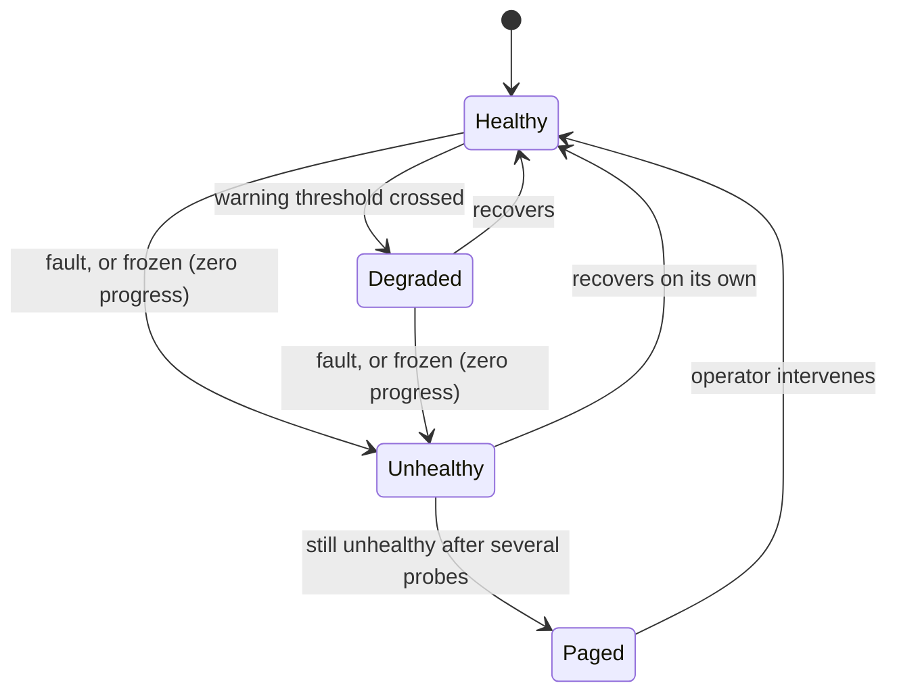

# Meta-Watchdog

> Baldur watches your services. Meta-Watchdog watches Baldur — and pages a human the moment the safety net itself goes quiet.

!!! info "PRO feature"
    Meta-Watchdog is a PRO-tier feature. It answers the question every self-healing system eventually has to face: *"who watches the watchman?"* When the layer that's supposed to protect you silently stops working, nothing tells you — until the incident it was meant to catch reaches production unguarded.

## What is it?

A self-healing framework is itself software, and software fails. The circuit breakers, the dead-letter queue, the recovery workers, the connection to Redis — every piece of Baldur that keeps *your* application healthy can itself stall, freeze, or die, just like anything else running in production.

When that happens *silently*, you end up worse off than if you'd had no safety net at all: you believe you're protected, so you stop watching — and you're not. That false sense of safety is the trap a self-monitoring layer exists to close.

A **watchdog** is a supervisor whose only job is to keep checking that something else is still alive and still making progress, and to sound the alarm when it isn't, the same idea as a hardware watchdog timer that reboots a frozen device. **Meta-Watchdog** is Baldur's watchdog pointed at Baldur: it continuously probes Baldur's own healing subsystems, recognises when one has stopped working — even when it's technically still running — and pages a human.

## Why it matters

The failure this prevents is the quiet one. A crash leaves a stack trace; a stuck system leaves nothing. A recovery worker that's wedged on a lock, a queue that's stopped draining, a circuit breaker frozen open: none of these throw an error, none of them page anyone, and all of them mean your protection is gone while every dashboard still reads green.

Meta-Watchdog turns that silent gap into an explicit, observable signal:

- **It catches "frozen", not just "crashed".** A dead process is easy to spot. The dangerous case is a component that's still up but no longer doing anything: its numbers haven't moved in minutes while errors pile up behind it. Meta-Watchdog treats that *zero-progress* state as a failure in its own right, so a wedged subsystem can't hide behind a live process.
- **It pages once, not once per server.** When the same subsystem is unhealthy across a fleet of workers, you get a single alert for the incident — not one page per process at 3 a.m.
- **It tells the truth about what it did.** The page states which of the two cases you are in: automatic recovery is switched off so nothing was attempted, or it ran and failed. On-call learns from the alert itself whether this is theirs to act on or something the system already tried and could not fix.
- **Every page is on the record.** Each escalation is written to a durable event journal and counted as a metric, so "what failed, and when did we hear about it?" is answerable after the fact instead of reconstructed from memory.
- **It can still reach you when the whole process dies.** A watchdog that lives inside your application shares its fate: if the process crashes, is OOM-killed or hangs, the watchdog dies with it and the page it would have sent is never sent. The optional outbound liveness beacon inverts that signal, so an external service alarms on the *silence*.

## How it works in Baldur

Meta-Watchdog runs as a background loop. On a fixed interval (30 seconds by default) it probes each of Baldur's healing subsystems (the circuit breakers, the dead-letter queue, the recovery pipeline, its own background workers, the Redis connection, the audit system, the chaos scheduler, the notification channels, the precomputed cache, the error-budget gate, canary rollouts, emergency mode, and the adaptive throttle) and grades each one, skipping any subsystem you have disabled so the status view only ever shows what is actually running:

| Status | Meaning |
|--------|---------|
| **Healthy** | Working normally |
| **Degraded** | Still working, but worth attention (e.g. a growing backlog) |
| **Unhealthy** | Broken or frozen — needs intervention |
| **Unknown** | The probe couldn't determine a status |

The overall health is the *worst* status across all subsystems, so a single broken component is never averaged away by the healthy ones.

Each sweep runs under a time budget. The probes run in parallel, and the whole pass must finish inside a wall-clock window derived from the probe interval itself (it is not a separate knob to tune), so one wedged probe can never stall the sweep. A probe that does not finish in time is reported as **Unknown**, with a reason that says so ("pass budget exhausted", or a note that its previous run is still in flight), and a truncated pass logs a warning naming exactly which probes were cut off: the watchdog degrades to "I could not judge this component in time", never to silence.

**The key trick is detecting "stuck".** Beyond asking "is it up?", Meta-Watchdog watches whether each subsystem is actually *making progress*. If a component's key metric stops changing entirely — its variance falls to essentially zero — while its error rate stays high, it is treated as **stuck** even though the process is alive and answering. A queue pinned at exactly 1,000 pending entries that never drains, or a circuit breaker locked open, fits this pattern. So does frozen *business* state: a canary rollout wedged at one stage, an emergency level stuck mid-recovery instead of winding down, or an adaptive throttle whose limit never moves while requests are still being rejected. A component that has simply been unhealthy for too long is flagged the same way. This is what lets the watchdog catch the frozen-but-running failures that ordinary up/down health checks miss.

When a subsystem stays unhealthy across several consecutive probes, Meta-Watchdog escalates — it pages a human through your configured channel (Slack or PagerDuty) with a critical-severity alert titled **`Baldur <component> Failure`**. The alert names the failing component, includes the underlying error, and states that manual intervention is required.

Three rules keep the paging sane:

- **One page per incident.** An ongoing failure escalates **once per episode**, not on every probe. The alert clears internally once a probe pass no longer finds the component unhealthy — so a subsystem that's been broken for an hour doesn't generate an hour of duplicate pages. This holds across every running instance too: a cluster-wide guard ensures one worker pages for a shared failure rather than all of them at once. That guard is a lock in the shared Redis store; where there is no shared store to hold it, each worker falls back to de-duplicating only its own pages.
- **Paging never slows detection down.** The page itself is handed to a dedicated sender and delivered off the detection loop, so a slow or unresponsive notification channel cannot stall the next probe pass. Delivery is at-least-once: if the watchdog shuts down before a page goes out, the undelivered page is still written to the local record, and the accepted worst case is a duplicate page, never a silently lost one.
- **It always records, even if paging fails.** Every escalation is appended to a durable event journal and emitted as a metric. If the external channel itself can't be reached, the alert is written to a local fallback record so the event is never lost. The metric distinguishes a page that actually left this host from one that only reached the local log, which is the state you land in when a channel is misconfigured or has fallen back, so the console's "humans paged" count means people were reached rather than merely that Baldur tried.

**Out of the box, Meta-Watchdog detects and escalates. It repairs nothing.** This is a deliberate choice, not a missing feature. Handing a system the authority to restart its own internals is only safe once its failure modes are well understood, so the shipped default is the part that is unambiguously safe: find the problem, tell a human, let a real person decide what to do.

An automatic-recovery mode does exist, and it ships switched off. Switch it on and a component that has failed several passes in a row gets one bounded repair attempt before anyone is paged. The attempt runs under a time budget, at most once per component in any five-minute window, and it is skipped entirely while a level-3 emergency is in force. Succeed, and nobody is paged. Fail, and the page goes out about three minutes later, saying that recovery was tried. While a component sits in that five-minute window the watchdog neither retries it nor pages for it, so turning recovery on trades a little detection latency for the chance of a fix.

!!! warning "Automatic recovery force-closes a breaker you opened by hand"
    Its circuit-breaker repair treats any breaker that has been open for five minutes as stuck and force-closes it, without asking whether an operator put it there. If you rely on forcing a breaker open to hold a dependency out of rotation during maintenance, leave automatic recovery off. See [which PRO features can lift a manual force, and what you get back instead](../oss/circuit-breaker.md).

**When the watchdog itself dies.** Everything above depends on one thing: the process being alive to send the page. A crash, an OOM kill or a hard hang takes the watchdog down with the application, and an in-process supervisor cannot report its own death. For that case, point `BALDUR_META_WATCHDOG_BEACON_URL` at a dead-man's-switch service (a URL that expects to be pinged regularly) and the watchdog sends an outbound liveness ping to it once per completed probe pass, roughly every probe interval. The external service then pages you on the *absence* of pings — the one signal that still works when the process, the host, or the whole monitoring stack dies together.

The beacon reports process liveness, nothing else. The outcome of a pass only chooses *which* URL is pinged, never *whether* to ping: an unhealthy pass still pings (or hits the optional `BALDUR_META_WATCHDOG_BEACON_FAIL_URL` instead, for providers that accept an explicit fail signal), so silence always means "the watchdog is not running", never "things are degraded". Do not use the beacon as your degradation alert; that job stays with the escalation path above. The ping runs on its own background thread with its own socket timeout (`BALDUR_META_WATCHDOG_BEACON_TIMEOUT_SECONDS`), so a slow or dead beacon endpoint never delays probing or paging. Leaving the URL unset is the off switch (there is no separate enable flag), and a set URL pings for real from any process that runs the watchdog with it, local development included: give each environment its own check, or leave it unset outside production, so a dev machine cannot keep the switch fed while production is down.

**Verifying your alerts before you need them.** Because the worst time to discover a misconfigured webhook is during a real incident, an operator can fire an on-demand self-test — `baldur escalation test` on the command line, or the equivalent admin endpoint — which sends a clearly-labelled test notification through every configured channel and reports, per channel, whether it was delivered. It confirms the channel itself is live — the credential still works and the message arrives — without waiting for something to actually break. On PagerDuty the test also closes the incident it just opened, in the same call, so verifying a channel does not leave a real incident behind for someone to clean up; if that close does not land, the result says so and tells you to close it by hand.

What the self-test deliberately does not check is your PagerDuty notification rules. It is sent as an informational event, so on a service that derives urgency from severity it produces a low-urgency incident and will not exercise the wake-a-human path — use PagerDuty's own test alert to verify on-call schedules, contact methods and urgency.

| What you observe | When it happens |
|------------------|-----------------|
| A critical page titled `Baldur <component> Failure` | a healing subsystem stays unhealthy or frozen across several probes |
| The alert says manual intervention is required and that recovery is disabled, so none was attempted | the shipped default; with automatic recovery switched on, the same page instead says the attempt failed |
| A single alert for one incident, not one per worker | cluster-wide and per-process de-duplication |
| A durable journal entry and a metric increment for each escalation, counted separately depending on whether the page left this host | every time it pages |
| A test alert through every configured channel, with per-channel delivery results — and on PagerDuty an incident that appears and resolves within seconds | you run the escalation self-test |
| A subsystem shown as Unknown with the reason `pass budget exhausted` | its probe could not finish inside the pass's time window, so the sweep moved on instead of stalling |
| Your dead-man's-switch provider alarms because pings stopped | the watchdog process crashed, was OOM-killed, or hung (beacon configured) |

## Configuration

Meta-Watchdog is **on by default** under PRO. The most common knobs:

| Env Var | Default | What it controls |
|---------|---------|------------------|
| `BALDUR_META_WATCHDOG_ENABLED` | `true` | Master switch — set to `false` to silence the watchdog entirely |
| `BALDUR_META_WATCHDOG_ESCALATION_ENABLED` | `true` | Whether detections page a human |
| `BALDUR_META_WATCHDOG_PROBE_INTERVAL_SECONDS` | `30` | How often it probes every subsystem |
| `BALDUR_META_WATCHDOG_SLACK_WEBHOOK_URL` | _(none)_ | Slack incoming-webhook URL pages are delivered to — while unset, pages are logged but nothing is posted |
| `BALDUR_META_WATCHDOG_PAGERDUTY_ROUTING_KEY` | _(none)_ | PagerDuty Events API routing key for critical pages |
| `BALDUR_META_WATCHDOG_BEACON_URL` | _(none)_ | Dead-man's-switch ping target, hit once per completed probe pass — while unset, the beacon is off |

One caution on the webhook URL: a set URL posts for real from any process that loads it, local development included, so leave it unset anywhere that should not page a shared channel.

The full set of tuning options lives in the [environment variable reference](../../reference/env-vars.md).

## See also

- [Unified Notification](unified-notification.md) — the channel layer Meta-Watchdog's pages are delivered through
- [Circuit Breaker](../oss/circuit-breaker.md) — what a manual force guarantees, and how automatic recovery can lift one
- [Audit Trail](audit.md) — where escalation events are durably recorded
- [Getting Started](../../getting-started/index.md) — set Baldur up
- [API Reference](../../reference/index.md) — full options and signatures
- [Environment Variables](../../reference/env-vars.md) — the complete operator-tunable list
